# Стики и удлинители

## Стики-липучки
1Pair V3 M3L Remote Controls Gimbal Stick Ends Anti-slip Rocker Cap Joystick Lever RC Drone Spare Parts for RadioMaster Pocket  
[AliExpress.com](https://vi.aliexpress.com/item/1005007921664959.html)  
[AliExpress.ru](https://aliexpress.ru/item/1005007921664959.html)  
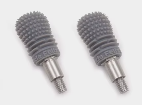  
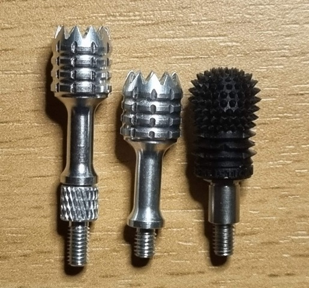  
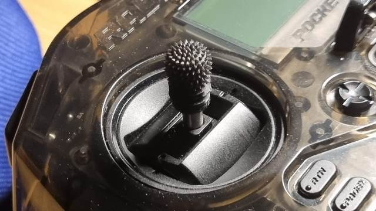  

### Отзыв
Летаю уже неделю. Очень удобно по сравнению со стоковыми. За счет колючек на боковых гранях можно с меньшими усилиями сжимать стики и все равно сцепление пальцев при отклонение стиков происходит комфортно.

## Грибки
`FrSky CNC Alu M3 Gimbal Stick End Lotus Gold`  
Требуются шпильки с резьбой М3. Можно взять болты и спилить шляпку.  
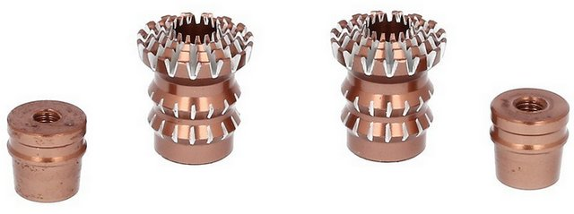  

## Самодельные удлинители
Латунная стойка для печатных плат М3 6 мм подходит по диаметру и резьбе для удлинения стиков.  
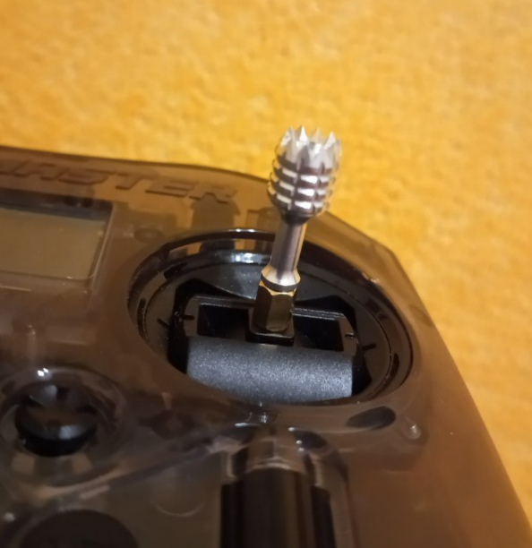  
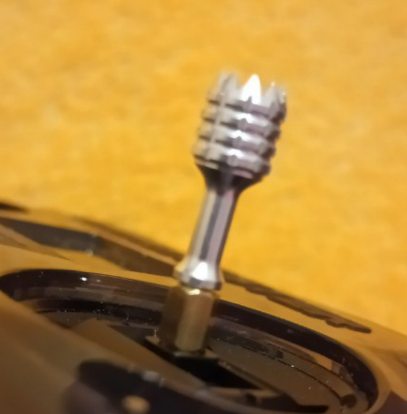  
Это решение позволяет убирать стики в родное место при этом не откручивать стойки.

## Фабричные удлинители
[Pocket Gimbal Stick Extender set](https://www.radiomasterrc.com/products/pocket-gimbal-stick-extender-set)  
[AliExpress.com](https://vi.aliexpress.com/item/1005006011760235.html)

В комплекте две пары удлинителей разной длины.  
Впечатления... непривычные. Конечно чувствительность лучше стала. Но нужно привыкать, приходится сильнее пальцами размахивать 😏

Упаковка   
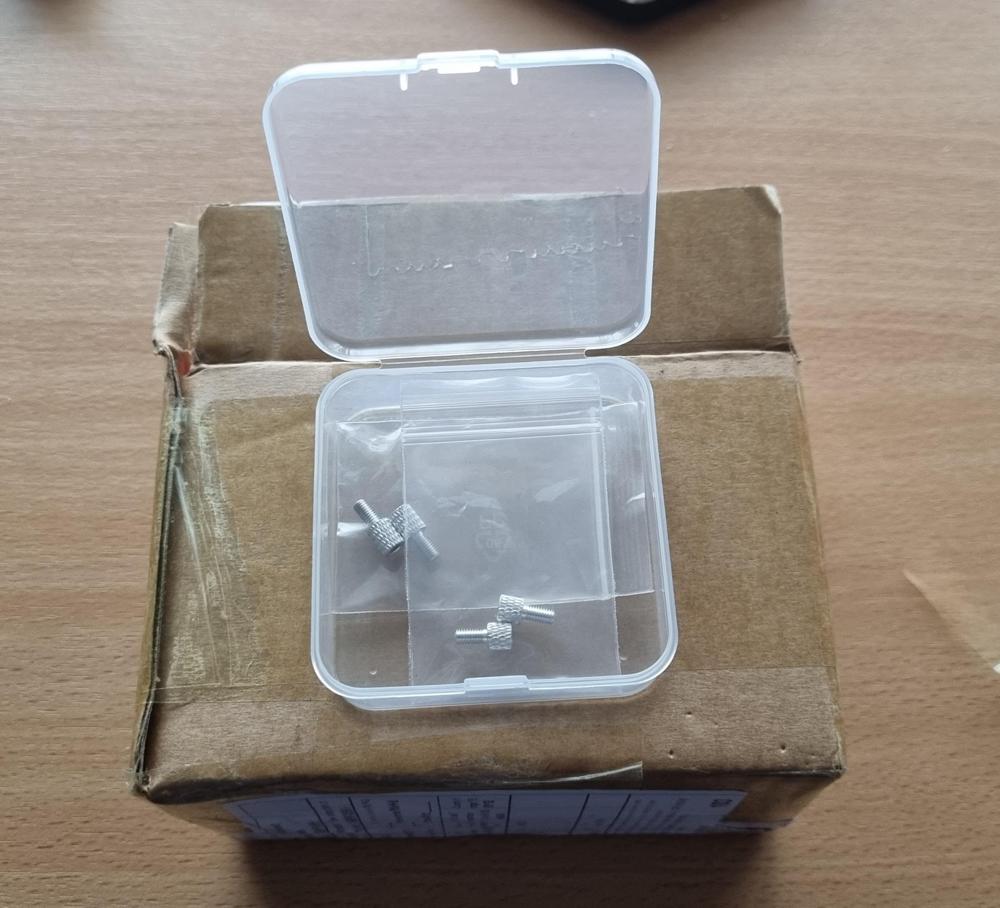  
Внешний вид  
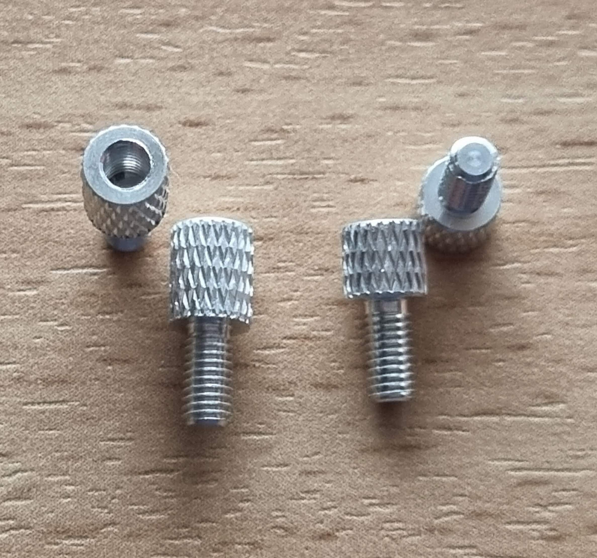  
Сравнение с коротким удлинителем.   
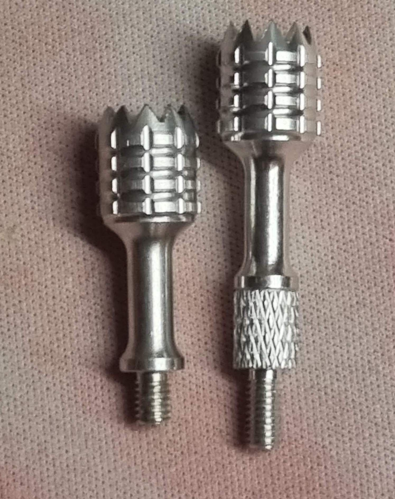  
Сравнение с длинным удлинителем.   
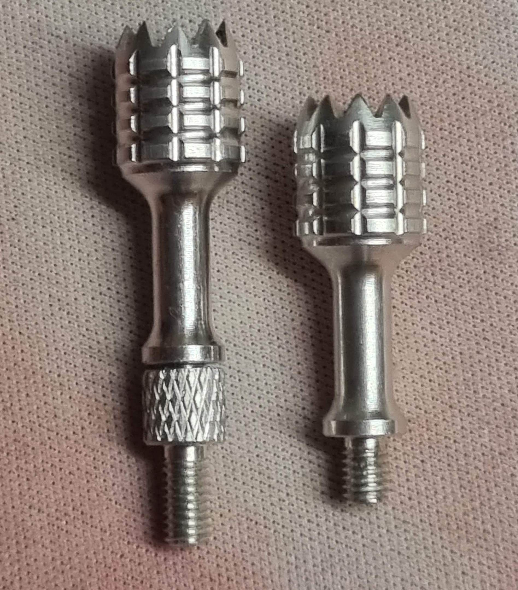  
Сравнение с обоих удлинителей.   
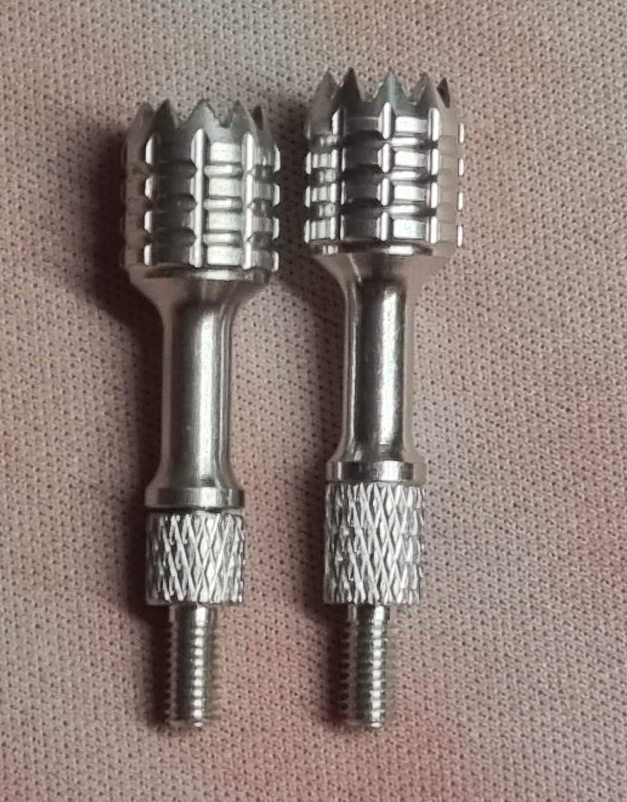  
Внешний вид  
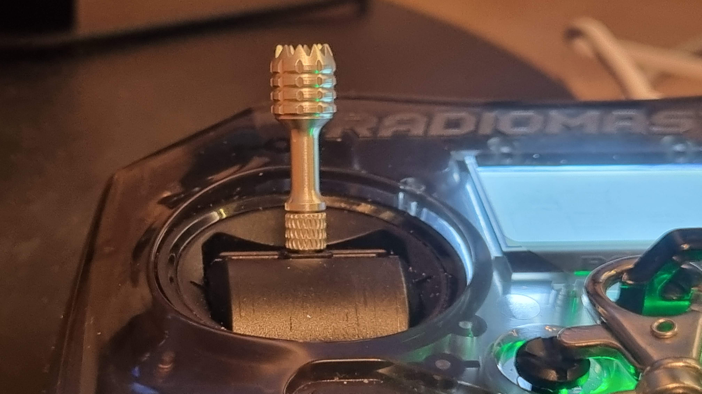  

## AG01 Nano CNC стики
[Апгрейд Radiomaster Pocket: ставим AG01 Nano CNC стики. YouTube: DRONOFLY FPV]()

