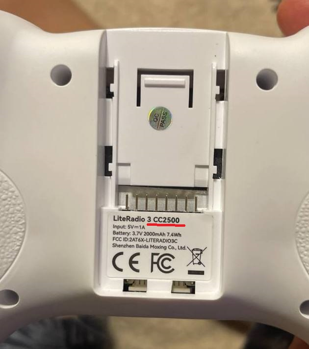
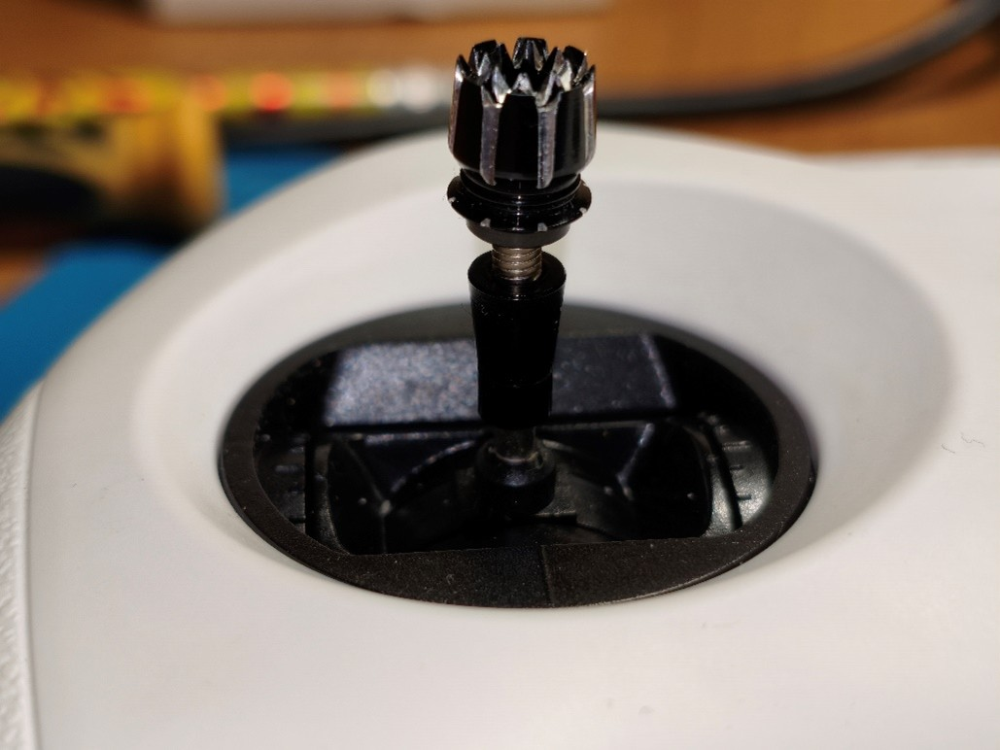

# BETAFPV LiteRadio 2, 2SE, 3

[LiteRadio 2 SE. Страница на сайте производителя](https://betafpv.com/collections/tx/products/literadio-2-se-radio-transmitter)  
[LiteRadio 3. Страница на сайте производителя](https://betafpv.com/collections/tx/products/literadio-3-radio-transmitter)  

[User Manual for LiteRadio 3](LiteRadio_3-User_Manual.pdf)  

[BETAFPV Literadio 2 SE Joystick Calibration. YouTube: 
BETAFPV Hobby](https://www.youtube.com/watch?v=mkDREF-_yOk)  

[LiteRadio ELRS does not work??? Flashing Firmware. 
YouTube: IRONQUAD](https://www.youtube.com/watch?v=5UcZ9E8DDoE)

## Особенности

- На стиках стоят потенциометры (резисторы). Из за этого достаточно быстро появляется дребезг в стиках. У кого-то буквально после недели активного пользования. Приходится или смазывать, или менять на купленные отдельно стики с датчиками Холла. 
- Проприетарная прошивка от производителя. Конфигурирование возможно через программу BETAFPV Configurator. Возможности по настройке значительно уступают аппаратурам на прошивках типа OpenTX или EdgeTX.  
- Минимальное, по сравнению с другими пультами, количество кнопок и переключателей. Два двух-позиционных и два трех-позиционных. Хотя кому-то этого может быть достаточно.  
- Отсутствие экрана, на котором можно было бы видеть дополнительную или диагностическую информацию

Таким образом, данные пульты могут быть хороши только на старте входа в хобби (в виду своей дешевизны и простоты). Но очень скоро аппаратуру приходится ремонтировать или покупать другую, в виду ограниченных возможностей.

## Какая версия передатчика: ELRS или FrSky
На задней стороне снимаем крышку. Там будет наклейка.  
Так выглядит наклейка передатчика с FrSky `CC2500`:
  

## Подключение аппаратуры к компьютеру
!!! Чтобы использовать аппу на компьютере, нужно подключать ее **ВЫКЛЮЧЕННОМ** виде.

### Аппа не определяется компьютером или телефоном

1. Попробуйте поменять кабель. Бывает такое что с одним кабелем работает, а с другим нет.
2. Бывают проблемы с подключением аппы с ELRS 3 к компьютеру на процессоре AMD. Проблему можно устранить, если перепрошить аппу на последнюю версию прошивки от ноября/декабря 2024 или на прошивку с предыдущей версию ELRS 2.  
Ссылки на прошивки в статье ниже в разделе Прошивка.  
Подробнее о проблеме и перепрошивке рассказано в видео [Проблема с Betafpv Aquila. LiteRadio2se не работает с компом и симулятором](https://www.youtube.com/watch?v=1lq6xgl1Efk)

Про более детальную диагностику проблемы можно прочитать [в этой статье](./../../../../20_Simulyatory/20_Podklyuchenie_apparatury_k_simulyatoru.md)

### [Подключение BETAFPV LiteRadio к симулятору — DoggyDog.blog](https://doggydog.blog/setting/podklyuchenie-betafpv-literadio-k-simulyatoru/)

## Прошивка
[Прошивки для Lite Radio 2 SE](https://support.betafpv.com/hc/en-us/articles/4414348908057-Lite-Radio-2-SE)  
[Прошивки для Lite Radio 3](https://support.betafpv.com/hc/en-us/articles/4414348993177-Lite-Radio-3)
 
Подключаем аппу, переключив её в режим прошивки (зажав кнопку сетап и включение). Она в диспетчере устройств определяется COM портом.  
Запускаем BETAFPV Configurator и заливаем прошивку. 

[BETAFPV LiteRadio 3 | Firmware Flashing and Calibration Tutorial. YouTube: BETAFPV Hobby](https://www.youtube.com/watch?v=rsBt4ejfMho)  

**ВАЖНО**: дрон и аппа могут работать только на одной версии ELRS. На обеих должно быть либо ELRS 2.X или 3.X.  
Таким образом, после даунгрейта прошивки в аппе, дрон перестанет биндится. Поэтому надо будет либо даунгрейтить дрон до ELRS 2 либо опять прошивать аппу до ELRS3.

## Подключение аппаратуры к BETAFPV Configurator
Аппы от BETAFPV можно подключить только к программе BETAFPV Configurator. Возможностей по настройке там крайне мало, но иногда это бывает нужно. Вот [скриншот экрана с настройками](RT_1_Setup.png).  
Скачать BETAFPV Configurator можно [здесь](https://github.com/BETAFPV/BETAFPV_Configurator/releases).  
На текущий момент рабочая версия конфигуратора:  
[BETAFPV Configurator V2.0.0](https://github.com/BETAFPV/BETAFPV_Configurator/releases/tag/V2.0.0)  
К ней подключается и аппа и дрон.   
 - Скачиваем программу и устанавливаем.  
 - Подключаем аппу в ВЫКЛЮЧЕННОМ состоянии  
 - Запускаем программу. Если аппа нормально определилась компом, в верхнем правом углу автоматически подставиться COM порт  
 - Внизу посередине нажимаем оранжевую кнопку **Click to Active Configurator for Radio Transmitter**  
 - Нажимаем кнопку **Connect RC** в правом верхнем углу. Если все хорошо, кнопка станет красной **Disconnect**, а экран отобразит настройки аппы. [Пример скриншота](RT_1_Setup.png)  

## Bind
[Перевод пульта в режим Bind](./../../../../60_Bind/62_Rezhim_Bind_pulta_Literadio3.md)  

[Ввод Bind фразы ](./../../../../60_Bind/58_Bind_fraza_pulta_LiteRadio.md)  

[Подключить Betafpv LiteRadio3 к UART ExpressLRS (Meteor75). YouTube Petrokey](https://www.youtube.com/watch?v=r3wsgmIChx0)

## [Калибровка стиков](15_Kalibrovka_stikov.md)

## Регулировка длины стиков
Родные стики можно **регулировать по высоте**, ослабив верхнюю часть против часовой стрелки, и зафиксировав нижней «гайкой».  
  

## Проблемы со стиками
[Проблема с дрожанием стиков на потенциометрах](02_Remont_stikov.md)  

[Ремонт BetaFPV LiteRadio 3 после падения](https://dzen.ru/a/Zaz-SmWVr2TlJhph)

### Проблема при большом значении газа LiteRadio 3
**Проблема:** дрон армится и пока на холостых все хорошо, когда пытаюсь взлететь он резко набирает обороты, сам на месте закручивается, переворачивается и выключает моторы.

**Причина:** когда увеличиваешь газ, провод между платой и левым стиком натягиваются до такой степени, что замыкаются соседние контакты. Помимо газа срабатывает еще и yaw. Это косяк сборки. При этом могут еще и провода оборваться и придется паять.

**Решение:** нужно разобрать аппу, снять стик, перевернуть его на 180 градусов и поставить назад. В настройках инвертировать газ и yaw.  После этого действия хода провода останется с запасом.  
