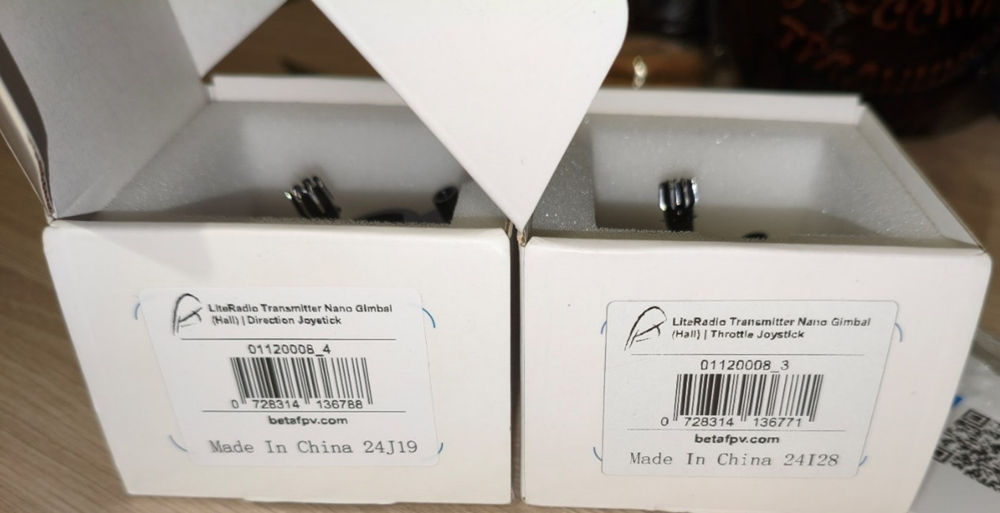
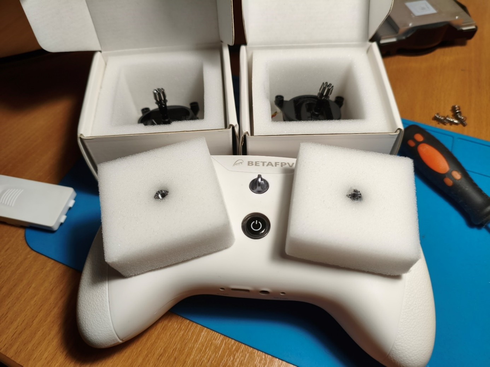
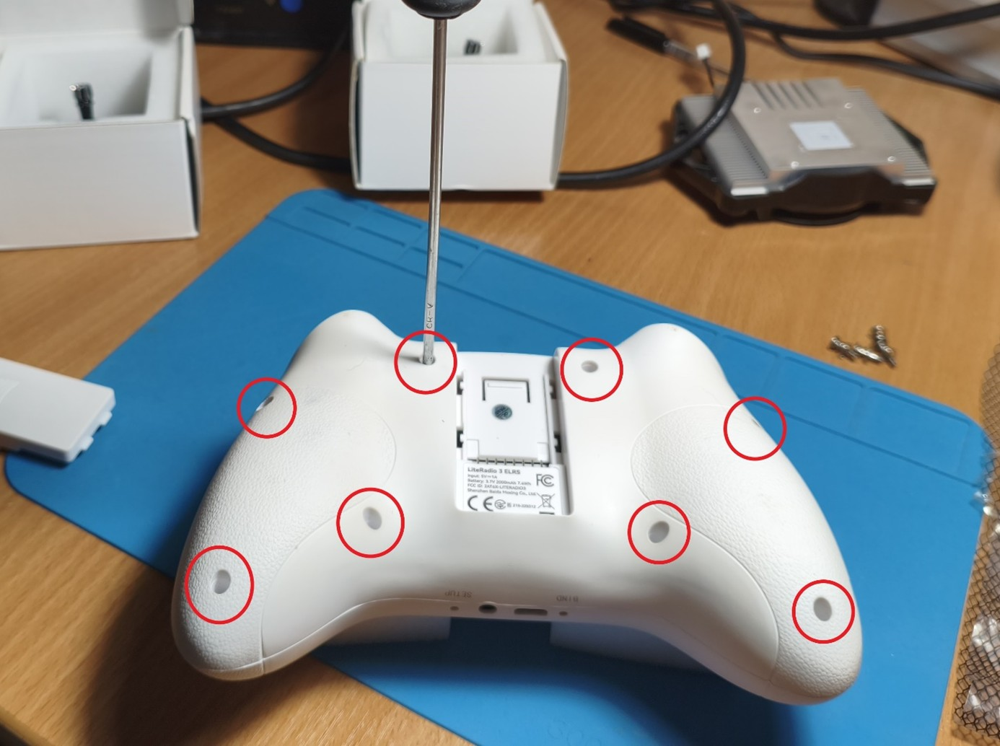
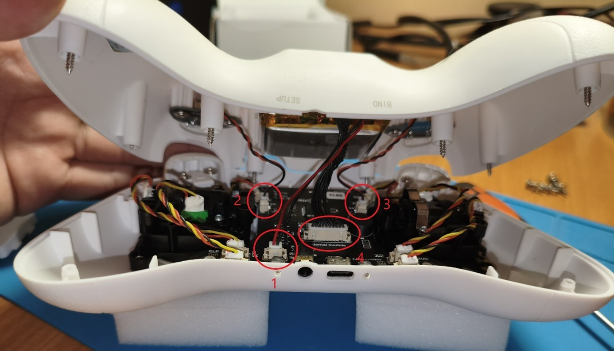
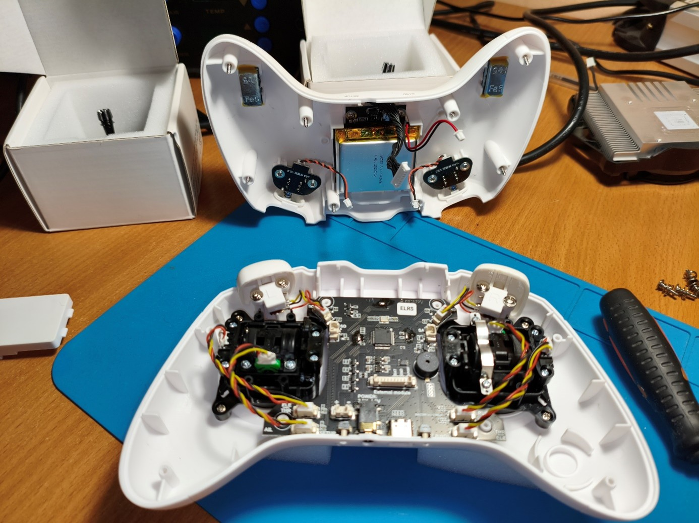
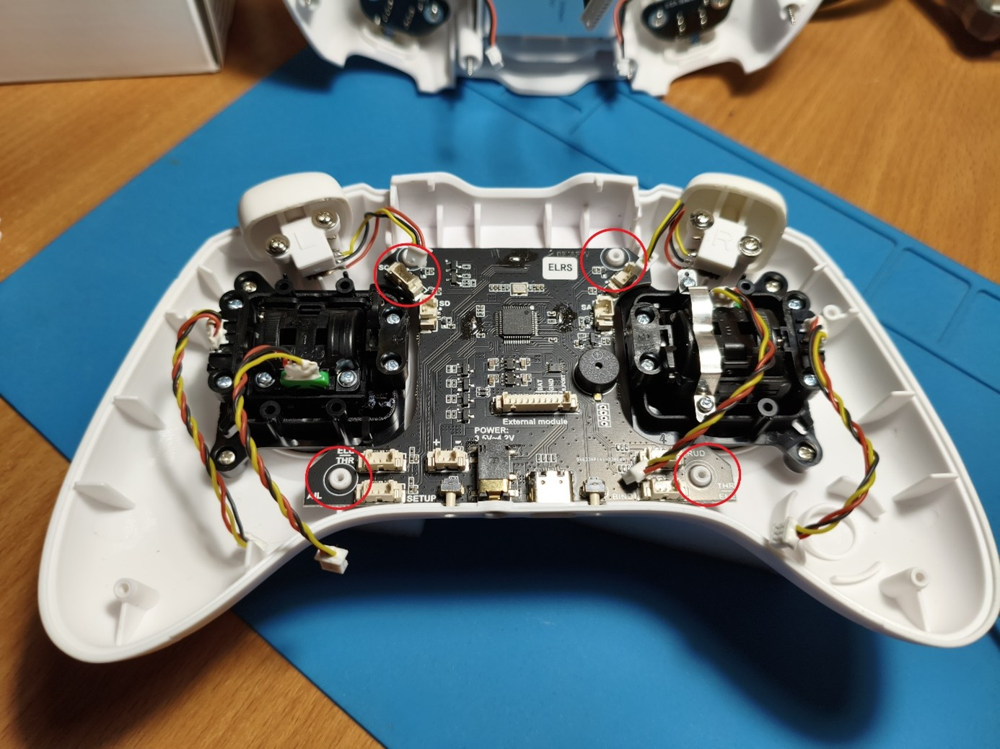
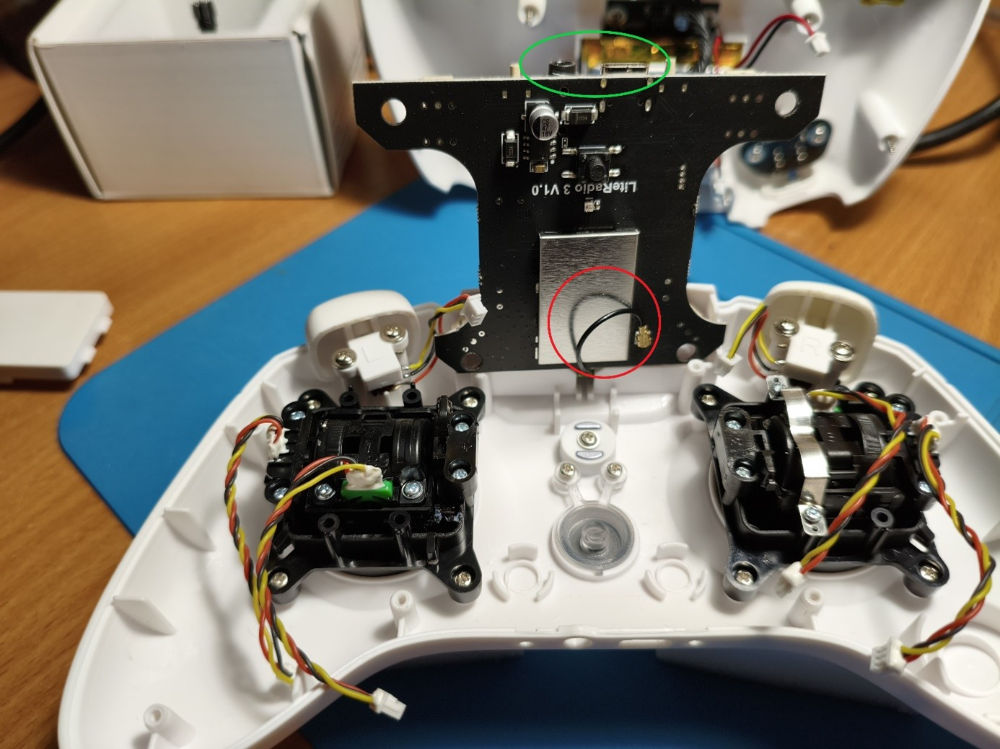
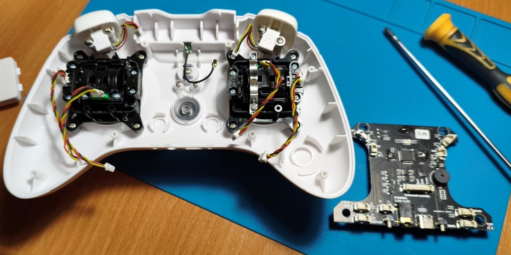
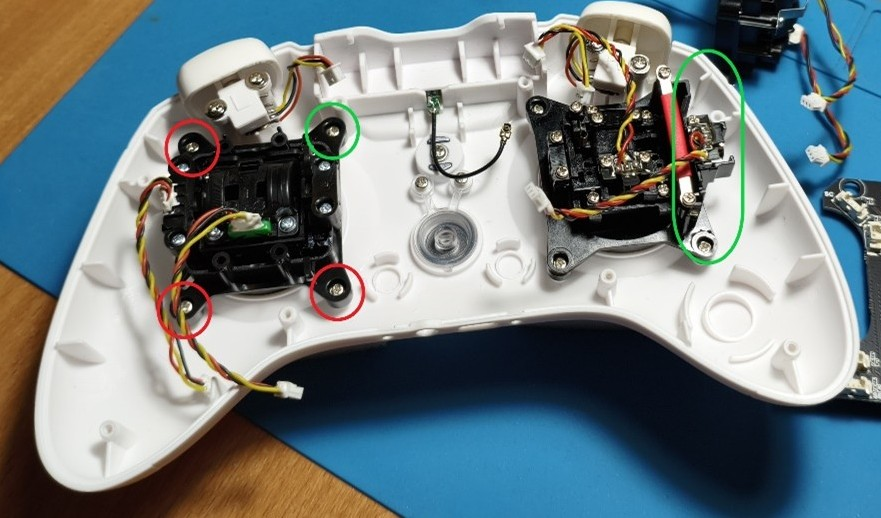

# Стики на датчиках Холла
[На сайте производителя](https://betafpv.com/products/literadio-transmitter-nano-gimbal-for-literadio-3-and-2-se?variant=39660701581446)  
[На Aliexpress.ru](https://aliexpress.ru/item/1005003887984537.html?sku_id=12000029019645305)  
[YouTube: BETAFPV LiteRadio 2. I How to Replace the Gimbals](https://www.youtube.com/watch?v=JtDGNqkaiJ8)  

## Отзыв после замены стиков от [Maksim Klipa](https://t.me/petrokeyfpv/130633)
> Поменял стики на аппе Literadio 3 с потенциометрами, на стики с датчиками холла. 
Никаких проблем при замене нет. Никаких прошивок обновлять не нужно. 
Заменил, откалибровал - полетел. 

> НО! Подключил к симулятору и понимаю, что нужно снова нарабатывать навык полета в гонках. 
Очень сильно повысилась отзывчивость стиков, стало заметно мягче и четче. Ощутимо приятней 👍🏻 О замене не жалею.

## Инструкция по замене стиков
Стики приходят в отдельных коробочках.  
  
  

1.	Открутить 8 винтов корпуса длинной крестовой отверткой.  
  

2.	Отключить 4 штекера крышки и снять крышку в сторону.
  
  

3.	Отключаем оставшиеся штекера стиков и кнопок, откручиваем 4 болта держащие плату.  
  

4.	Снимаем плату, ей мешает разъем зарядки и 3,5 можно чуть отогнуть корпус
И **ВНИМАНИЕ!** На обратной стороне штекер антенны!!! Не дергаем, а аккуратно поддеваем его.  
  
  

5.	Открутить 4 винта стика и снять его, на его место поставить новый. На фото справа новый на холлах, видно какой стороной установлен.
 Старый резисторный слева.  
  

6.	Заменить стики, произвести сборку в обратном порядке.  

7.	Особенность стиков о которой как оказалось не все знают что их можно **регулировать по высоте**, ослабив против часовой стрелки, и фиксируется нижней «гайкой».  
  

8. После замены стиков рекомендуется произвести [калибровку стиков](15_Kalibrovka_stikov.md)

