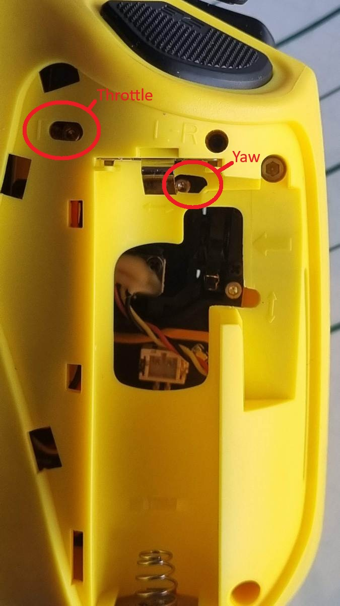
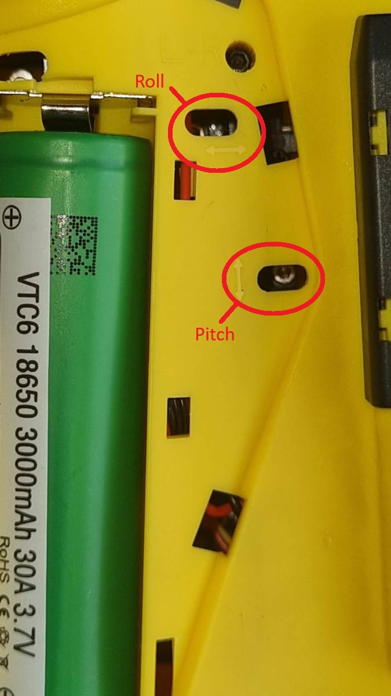
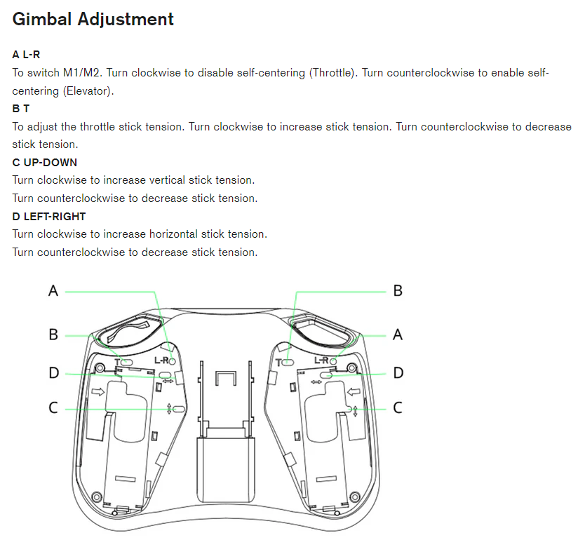
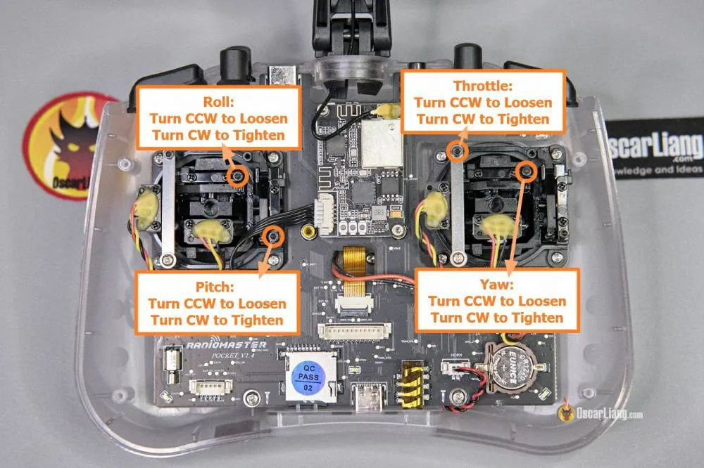

# Регулировка и замена пружин на стиках

## Регулировка пружин
Используется шестигранник на 1.6мм 

В правой части:  
**Throttle**: Горизонтальная продолговатая прорезь с буквой Т ближе к левому краю на полоске металла.  
**Yaw**: ПОД аккумулятором вверху.  

В левой части:  
**Pitch**: Горизонтальная продолговатая прорезь справа от батареи на уровне 2/3. Возле нее вертикальная стрелка вверх-вниз.  
**Roll**: Горизонтальная продолговатая прорезь справа от батареи на уровне верхнего контакта. Возле нее горизонтальная стрелка вверх-вниз.  

Официальные фото:  
  

## Разборка, регулировка пружин
[Radiomaster Pocket - How To - Change Gimbal Tension Springs. YouTube: 
gliZzy FPV](https://www.youtube.com/watch?v=F338i3RLih4)
