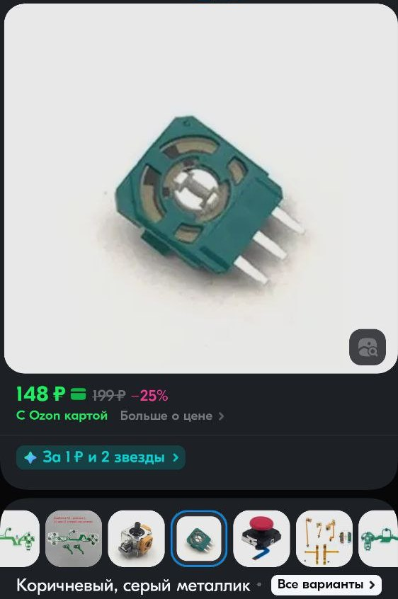
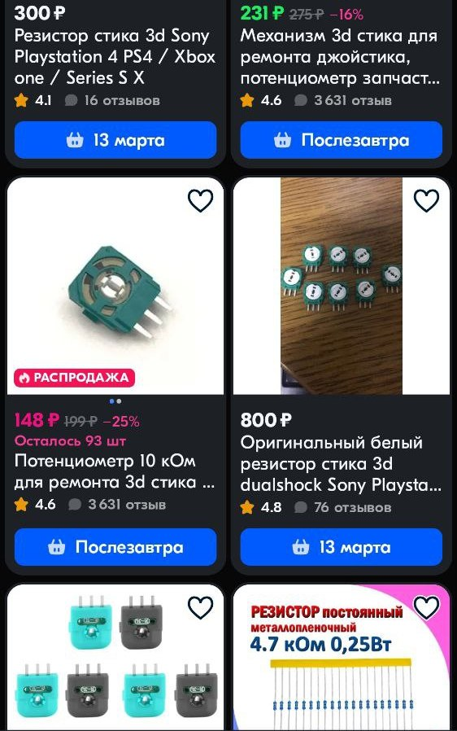

# Замена резистора на стике

Покупается резистор стика для геймпада Sony Playstation 4. Из него вынимается центральный контакт с втулкой.  С родного резистора ставится этот контакт с втулкой, и впаивается резюк на место родного. Итого 200 р + 10 минут времени.  
Центральную часть отщелкнуть и поставить с родного, куда ось входит.  
После замены - откалибровать.

  
  
