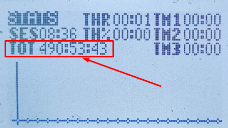

# Вопросы и решения для пультов с прошивкой EdgeTX

## [EdgeTX User Manual](https://manual.edgetx.org/)

## Настройка аппаратуры на Edge TX 

### Кратко
От @Konstantin_Gr  
1. Выбираешь модель: фпв дрон.  
2. Включаешь внутренний приёмник  
3. Покетрейт на 250 Гц без букв спереди  
4. ADC фильтр отключить  

### **Видео от Валентины.**    
[Гайд для начинающих: как настроить аппаратуру на EdgeTx [Radiomaster Boxer ELRS]. YouTube: PropWash Service](https://www.youtube.com/watch?v=wU67j2G5Ibg)

### [EdgeTX - Complete Beginner Guide. YouTube: Joshua Bardwell](https://www.youtube.com/watch?v=CrXZO9HMGko&list=PLwoDb7WF6c8lhlzE6_iA2X50bk3pIYcbb)

### [Повний курс по всім налаштуванням радіопередавача на EdgeTX/OpenTX/FreedomTX. YouTube: SMAKADRON (укр.)](https://www.youtube.com/watch?v=Hu2xjAXTtSA)

## На каком протоколе передатчик?
В аппаратуре присутствует встроенный передатчик. Так же может быть присоединен внешний. Они могут быть на разных протоколах.  
То, какой передатчик активен в данный момент времени, можно увидеть в настройки текущей модели.  
Нажимаем кнопку `MODEL`. Попадаем в список моделей.  
Нажимаем кнопку `PAGE >` и попадаем на страницу `SETUP` текущей модели.   
Скроллим колесом до раздела `Internal RF`. Если там в строке `Mode` стоит `CRSF 5.25M`, значит это ELRS модуль.  
Если в модели выбран внешний модуль, то в `Internal RF` будет стоять `OFF` и тогда нужно смотреть в разделе `External RF`.

Также можно косвенно понять что активный в данный момент передатчик на ELRS.  
Нажимаем кнопку `SYS`. Попадаем на первый экран `TOOLS`. Есть есть строчка `ExpressLRS`, то в аппе присутствует LUA скрипт для настройки ELRS передатчика. Скорее всего в аппе и стоит ELRS передатчик. Можно нажать на `ExpressLRS`. Если скрипт загрузится и будет доступно меню настройки, то в самом низу можно посмотреть версию прошивки ELRS.

## Прошивка ELRS передатчика
[ExpressLRS.RU](https://expresslrs.ru/Manuals/Firmware/Transmitters/Flashing-internal-tx/)  
[Updating Internal ExpressLRS Module](https://oscarliang.com/setup-radiomaster-pocket/#Updating-Internal-ExpressLRS-Module)

## Голосовые сообщения при нажатии кнопок
Разберем на примере привязки голосовой озвучки при нажатии кнопки `ARM` (SA).  
 - Нажимаем кнопку `MODEL`. Попадаем в список моделей. Допустим мы хотим это настроить на активной модели.  
 - Кнопкой `PAGEDOWN` листаем на экран `SPECIAL FUNCTIONS (9/11)`  
 - Выбираем пустую строку и нажимаем на ролик.  
 - Нажимаем кнопку `ARM`. На экране отобразится значок `SA↓` (со стрелкой вниз). Нажимаем на ролик.  
 - переходим роликом в следующее поле и нажимаем на ролик.   
 - прокручиваем до `Play Track` и нажимаем на ролик.   
 - переходим в следующее поле и нажимаем на ролик.   
 - прокручиваем до `armed` и нажимаем на ролик. 
 - нажимаем несколько раз кнопку ARM и наслаждаемся звуком :)

Для `DISARM` нужно выбрать `SA↑` и трек `disarm`

## Пульт не включается при долгом нажатии на кнопку питания
Села внутри батарейка CMOS. Нужно разобрать пульт и поменять батарейку. Сначала попробовать вытащить батарейку на 30 секунд и вставить назад.

## Отключение кнопки триммирования стиков (trim)
Иногда можно случайно задеть кнопки трима, тем самым сбив настройку стиков.  
Реакцию на кнопки можно отключить:  
- Нажимаем кнопку `MODEL`  
- Переходим на экран 3/11 `FLIGHT MODES`  
- Заходим в `FM0`
- Переходим в Trims. Там стоит `:0:0:0:0` 
- Выставляем `:--:--:--:--`  

## Калибровка стиков 
Нажимаем кнопку `SYS`  
Листаем кнопкой `PAGE` до 5/6 `HARDWARE`  
Выбираем `Calibration` и нажимаем на колесо  
Следуем инструкции

[RadioMaster Boxer How to calibrate the gimbals in EdgeTX. YouTube: Bill Clark](https://www.youtube.com/watch?v=MWF1pVhdQIs)

[You're calibrating your gimbals wrong (solves Tango 2 THROTTLE warning). YouTube: Joshua Bardwell](https://www.youtube.com/watch?v=I6n_Ak860lA)

[Як калібрувати стіки на пульті для FPV дрона(укр). YouTube: Є-Дрон](https://www.youtube.com/watch?v=RCaF2GHLe8g)

[Як активувати тубмлери та кнопки на пульті (EdgeTX). YouTube: Жвавий Дрон](https://www.youtube.com/watch?v=LybG0QXf7pU)  
 
## Использовние логических свичей (`Logical Switch`)
[Логические свитчи или как настроить ARM на кнопку без фиксации (ARM on momentary switch). YouTube: ZhukoRama FPVlog (ZRFPV)](https://www.youtube.com/watch?v=y9OvhpLNMMs)

[Озвучивание на пульте низкого заряда батареи на дроне](Ozvuchka_nizkogo_napryazheniya.md)  

[Режим черепахи на кнопку SE](./10_Modeli/10_Radiomaster/01_Pocket/05_Cherepaha_na_SE.md)  

## Прошивка для аппаратуры EdgeTX
[Официальный сайт](https://edgetx.org/)

[GitHub репозиторий EdgeTX проекта](https://github.com/EdgeTX/edgetx)

[GitHub репозиторий EdgeTX SD Card Contents. Содержимое SD карты](https://github.com/EdgeTX/edgetx-sdcard)

[Прошивки (Firmware) и содержимое SD карты для аппаратур RadioMaster](https://www.radiomasterrc.com/pages/firmware-updates)

[How to Update EdgeTX in your Radio](https://oscarliang.com/flash-edgetx/)

[User Manual for Monochrome Screen Radios with EdgeTX](https://github.com/EdgeTX/edgetx-user-manual/tree/2.7/b-and-w-radios)

[Manual for OpenTX 2.2](https://doc.open-tx.org/manual-for-opentx-2-2)  

[Оновлення прошивки Edge TX Centurion 2.10.6 на Radiomaster Boxer. YouTube: Жвавий Дрон (укр.)](https://www.youtube.com/watch?v=tTAflDUA30M)

## [Как настроить профили ELRS в EdgeTX. YouTube: DRONOFLY FPV](https://www.youtube.com/watch?v=CExl7LSWQbc)

## Изменение голосовой озвучки

### Русский язык
[Adding sounds to your EdgeTX SD Card / No sounds after upgrading to EdgeTX](https://www.youtube.com/watch?v=jZ29qmtMSyU)  

Здесь много языковых файлов:  
[EdgeTX-edgetx-sdcard-sounds- Sound packs for EdgeTX](https://github.com/EdgeTX/edgetx-sdcard-sounds)

Можно подготовить свои голосовые файлы:  
Заходим на сайт с нейронкой, например, [play.ht](https://play.ht/), выбираеv голос, пишешь фразу и сохраняешь, потом конвертируеv в 32 килогерца 16 бит, моно и сохраняем.  
Имя файла нужно дать такое как и у того файла, озвучку которого заменяем.

### [Українізація OpenTX - EDGE - FreedomTX 13:08](https://youtu.be/4y8Xvei-NMk?si=_DWQJWdCbDi6c_b2&t=788)
[Посилання на Google Disk](https://drive.google.com/drive/folders/1qzFfbYw4vBnAh9kmXtYUbzmgwg7lizD0)

## Как посмотреть общее время пользования аппаратурой
Находясь на главном экране просто долго жмем на колесико (Enter).  
Появляется меню. Переходим в `Statistics`.  
Количество часов будет в поле `TOT`.   

Чтобы сбросить этот таймер надо на этом экране нажать и подержать колесико
