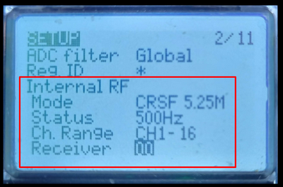

# Пульт зависает при попытке зайти в ExpressLRS скрипты
Такое зависание происходит если в модели отключены оба передатчика (внутренний и внешний).

Вот как включить внутренний передатчик:  
 - Нажимаешь кнопку `Model`.  
 - Кнопкой `Page Down` переходишь на экран 2 (SETUP).  
 - Листаешь колесиком вниз до пункта `Internal RF`.  
 - И там включаешь.  
  
Также во вкладке `Hardware` должен быть выставлен `Internal CRSF` вместо `Multi` (для внутреннего передатчика)

