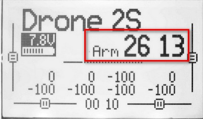
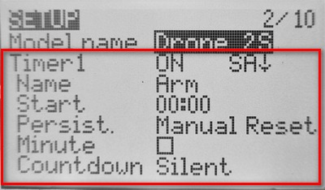

# Таймер использования пульта

Иногда интересно увидеть статистику в часах/минутах использования пульта для полетов на дроне.  
Аппаратура на прошивке EdgeTX имеет возможность установить таймер, который будет производить отсчет времени по событию.  
Например, можно выставить таймер, который будет считать время когда дрон заармлен.  

Настраивается это на экране `SETUP` модели.  

Ключевые настройки:

- Таймер включен при активации переключателя `SA`.
- Имя на экране `Arm`.
- Таймер сбрасывается только вручную.