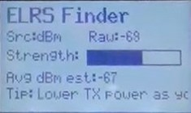

# Поиск дрона по значению RSSI

## Телеметрия
Если на аппаратуре [настроить телеметрию](40_Nastrojka_telemetrii.md) и вывести значение 1RSS, то можно искать дрон, ориентируясь по значению. Как в игре "холодно, горячо".  
Подробнее можно узнать в видео [Never lose a model again with this ExpressLRS trick (so long as you're getting telemetry!)](https://www.youtube.com/watch?v=ARJ7Vomnczw) 

## Model Locator by RSSI
Официальный LUA-скрипт `ModelLocator`. Позволяющее делать поиск дрона по значению RSSI.  

Скрипт можно скачать из [официального GitHub репозитория с содержимым SD карт](https://github.com/EdgeTX/edgetx-sdcard).  
Например, для пультов с ЧБ экраном типа RadioMaster Pocket [отсюда](https://github.com/EdgeTX/edgetx-sdcard/tree/master/sdcard/bw128x64/SCRIPTS/TOOLS) нужно скачать файлы `ModelLocator.lua`, `modloc.wav` и положить по тому же пути `SCRIPTS\TOOLS` на карту в пульте.

Для запуска нужно нажать кнопку `SYS` и выбрать `ModelLocator`. 

Рекомендуется установить мощность передатчика на уровень 25mW.

Есть два способа использовать скрипт:  
1. Простой способ:  
- идите разные стороны, по мере приближения к дрону, сигналы будут становиться чаще и с более высоким тоном (и появится визуальный индикатор в виде гистограммы)

2. Более точный способ:  
-  покрутитесь вокруг себя, пока не найдете направление с самый низким значением RSSI. Это обозначает самый сильный сигнал. Заметьте направление.  
-  теперь идите в сторону (не к модели), снова найдите самое низкое значение — это тоже направление на модель.  
-  постройте две линии и определите точку пересечения — там и будет ваша модель 🙂

## ELRS Finder
Еще одно решение в виде LUA скрипта, позволяющее делать поиск дрона по значению RSSI.  

Скрипт можно скачать с репозитория [EdgeTX Lua Scripts (B/W Screen Optimized)](https://github.com/iamsunilchahal/edgetx-lua-scripts-bw) 

Установка и использование такое же как и в предыдущем решении

