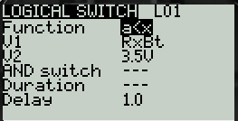
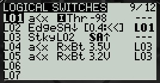
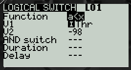
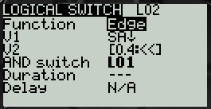
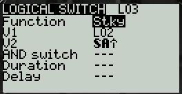
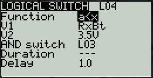
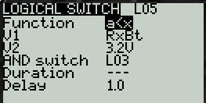
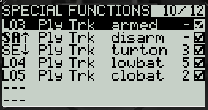

# Озвучивание на пульте низкого заряда батареи на дроне

## Простой вариант
Проговаривать голосом будет если напряжение ниже порогового.  
Недостаток: голосовое уведомление будет срабатывать при подключении дрона к компьютеру.  
1. Заходим в меню `MODEL`
2. Переходим на страницу `TELEMETRY (10 из 11)`, листаем сенсоры. Напряжение батареи - это `RxBt`. Легко проверить, если вытащить аккум - быстро пойдет вниз до .07в.
2. Переходим на страницу `LOGICAL SWITCHES (8 из 11)` - добавляем логически ключ L1 со значением `a<x`. Заходим в редактирование условия, подставляет перебором готовых переменных `RxBt < 3.5` (к примеру). Можно выставить задержку в 1 сек  
  
3. Переходим на страницу `SPECIAL FUNCTIONS (9 из 11)`, Создаем функцию и выбираем L01 (это наш логический ключ) - и действие: играть трек. Трек выбираем сами в соотв. поле, а-ля "low battery". Можно указать, через сколько секунд будет повторяться проигрывание трека.

## Расширенный вариант
Будет голосовое сообщение о низком заряде батареи только если дрон заармлен.  
При этом дрон будет заармлен только при опущенном вниз стике газа.  

Заходим в меню `MODEL`.  
Делаем копию модели.  

### `LOGICAL SWITCHES`
Переходим `LOGICAL SWITCHES` в  и настраиваем логические переключатели, как на фото:  

#### `L01`
Срабатывает, когда опущен стик газа.  
А точнее когда газ ниже -98.  

#### `L02`
Срабатывает если **зажата** кнопка `SA`(мой `ARM`) больше 0.4 сек и активен `L01` (опущен стик газа).  

#### `L03`
Фиксирует состояние `L02`. То есть теперь, если стик газа будет двигаться, все равно ключ в состоянии `истина`.  и включится Play Track `armed`.  
Условие для перехода в состояние `ложь`: когда кнопка `SA`(мой `ARM`) будет **отжата**.  
  
На этот ключ сработает Play Track `armed`.  

#### `L04`
Срабатывает через 1 сек если напряжение батки меньше 3.5В и активен `L03`.  
  
На этот ключ сработает Play Track `lowbat`.  
Уточнение: чтобы в значении был значок напряжения батареи нужно выбрать `telemetry` и крутить вправо.  

#### `L05`
Срабатывает через 1 сек если напряжение батки меньше 3.2В и активен `L03`.  
  
На этот ключ сработает Play Track `сlowbat`.  

### `SPECIAL FUNCTIONS`
Переходим `SPECIAL FUNCTIONS` в  и настраиваем голосовую озвучку, как на фото:  

- При активации ключа `L03` сработает Play Track `armed`.  
- При отжатии кнопки `SA`(мой `ARM`) сработает Play Track `disarm`.  
- При нажатии кнопки `SE`(мой режим черепахи) сработает Play Track `turton` и будет проигрываться каждые 3 секунды, пока кнопку не отожмут.  
- При активации ключа `L04` (напряжение ниже 3.5в) сработает Play Track `lowbat` и будет проигрываться каждые 5 секунд.  
- При активации ключа `L05` (напряжение ниже 3.2в) сработает Play Track `сlowbat` и будет проигрываться каждые 2 секунды.  

**Примечание**: данный способ основан на идее от **Pavel Gavrilov** aka `reeson2003`. 

## Другие статью
[Taranis: настраиваем правильное уведомление о низком заряде аккумулятора](https://rcdetails.info/taranis-nastraivaem-pravilnoe-uvedomlenie-o-nizkom-zaryade-akkumulyatora/)