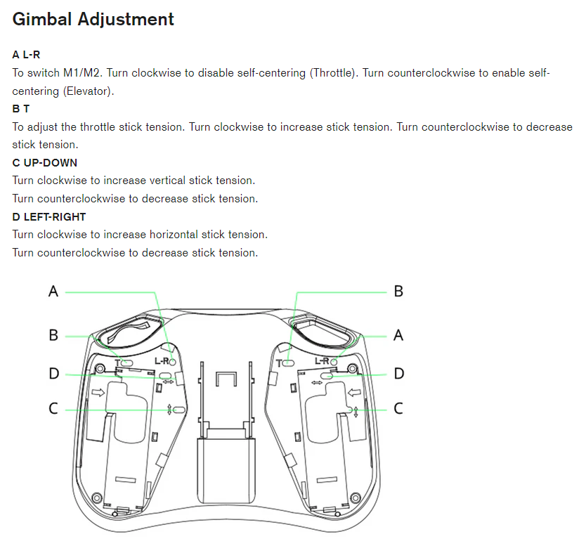
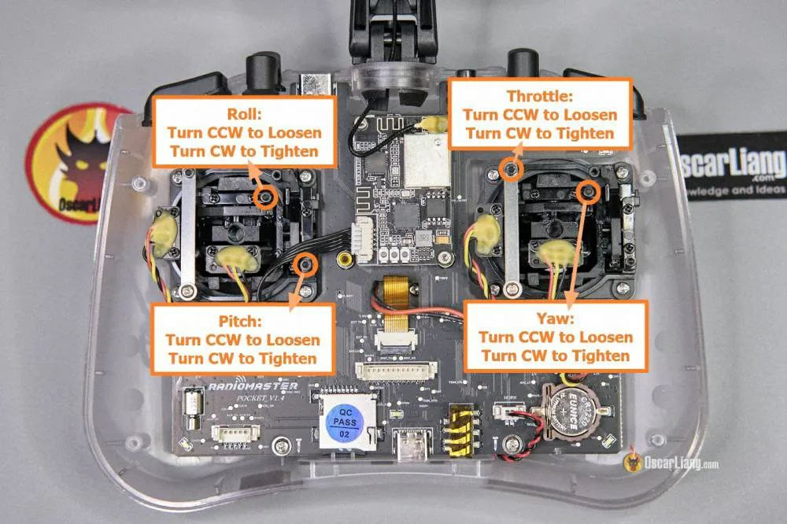

# RadioMaster Pocket

[Страница на сайте производителя](https://www.radiomasterrc.com/products/pocket-radio-controller-m2)

[How to Setup Radiomaster Pocket Radio | Upgrades, Tips and Tricks](https://oscarliang.com/setup-radiomaster-pocket/)

[User Manual](Pocket_User_Manual.pdf)

## Обзоры
[Radiomaster Pocket - карманная аппаратура. Обзор. от ZhukoRama FPVlog (ZRFPV)](https://www.youtube.com/watch?v=wqdwZkqQtCA)   
[Radiomaster Pocket - обзор, разбор, пейр от Петрокей](https://www.youtube.com/watch?v=xYzz5JtX9GE)  
[Огляд Radiomaster Pocket. Для кого він? + тестовий політ от Є-Дрон](https://www.youtube.com/watch?v=H7OgTsX0HKI) 

## Bind
[Перевод пульта в режим Bind](./../../../../60_Bind/60_Режим_Bind_пульта_EdgeTX.md)

[Указание Bind фразы](./../../../../60_Bind/56_Bind_фраза_пульта_EdgeTX.md)

[Я забыл BIND-фразу ELRS ! Что делать ? YouTube: ZhukoRama FPVlog (ZRFPV)](https://www.youtube.com/watch?v=c6mdZVzCn58)  

[Аппаратура не биндится с Meteor85][bind_meteor85]

## Регулировка пружин на стиках
Используется шестигранник на 1.6мм

Регулировка Yaw находится ПОД аккумулятором.

## [Оригинальные запчасти на AliExpress](https://aliexpress.com/item/1005006011760235.html)

## Кнопки и каналы
Aux1 SA (2-х позиционный)  
Aux2 SB (3-х позиционный)  
Aux3 SC (3-х позиционный)  
Aux4 SD (2-х позиционный)  
Aux5 SE (не фиксируется)  
Aux6 SI (колесо)  

## При вращении колеса не раздается звуковой сигнал
В модели на странице `SETUP 2/11` нужно выставить в поле `Ctr Beep` значение `RETA1`. Причем именно так как на фото ниже.  
