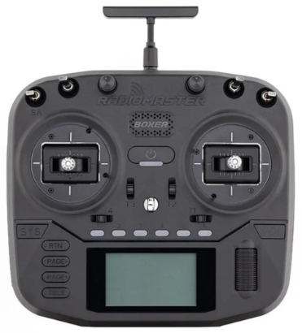
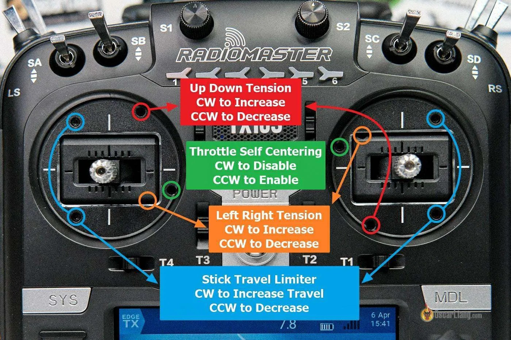

# Radiomaster Boxer

[На сайте производителя](https://radiomasterrc.com/products/boxer-radio-controller-m2)

[Quick Start Guide](Quick_Start_Guide_BOXER_1.pdf)

[Review: Radiomaster Boxer Radio Controller (https://oscarliang.com/)](https://oscarliang.com/radiomaster-boxer/)  
[How to Setup Radiomaster Boxer | Upgrades, Tips and Tricks (https://oscarliang.com/)](https://oscarliang.com/setup-radiomaster-boxer/)

## Натяжение пружин, регулировка хода стиков

## Регулировка высоты стиков

## Обзоры и полезные видео

[Новая аппаратура - квадрат для всех! Radiomaster Boxer. YouTube: Anik FPV](https://www.youtube.com/watch?v=6LudCCqMBGM)

[Гайд для начинающих: как настроить аппаратуру на EdgeTx Radiomaster Boxer ELRS: YouTube: PropWash Service](https://www.youtube.com/watch?v=wU67j2G5Ibg)  

[Огляд Radiomaster BOXER. Топова апаратура для FPV? Порівняння з TX12. YouTube: Є-Дрон (укр.)](https://www.youtube.com/watch?v=MGj__6v4Aw4)  

[I can't believe how good this radio feels // RADIOMASTER BOXER REVIEWю YouTube: Joshua Bardwell](https://www.youtube.com/watch?v=5Fi9csa-wP8)  

[RadioMaster Boxer Quick Start Guide (EdgeTX). YouTube: Rotor Riot Workbench](https://www.youtube.com/watch?v=V2kYjWx9Sa4)  

[МЕНЯЕМ ПРУЖИНЫ В АППАРАТУРЕ radiomaster boxer. Разборка передатчика. Апгрейд. Настройка. YouTube: ALWARE PHOTO VIDEO](https://www.youtube.com/watch?v=k5VLHov4x4A)

[Installing radiomaster boxer led mod. YouTube: crumbjunk](https://www.youtube.com/watch?v=gxHGiLwusq0)

[RADIOMASTER BOXER FOLDING ANTENNA MOD. YouTube: Seii-FPV](https://www.youtube.com/watch?v=WbScubajNMg)

