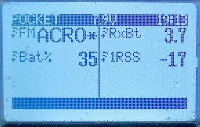
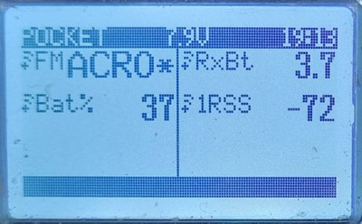

# Настройка значений на экране телеметрии

Уровень сигнала и и некоторые параметры телеметрии отображаются на апе даже с выключенной в Betaflight тилеметрией. А для того чтобы отображались именно сенсоры по типу уровня батки - нужно в Betaflight включить её.

[Общий перечень сенсоров (оригинальная документация)](https://manual.edgetx.org/bw-radios/model-select/telemetry/common-telemetry-sensors)

Описано [здесь с 26:02 (укр.)](https://youtu.be/US8rYxZ1YHw?si=-y3HEkaY1MGl_jWG&t=1562).

Нажимаем `MDL`. 
Переходим на экран `TELEMETRY` при помощи `PGUP/PGDN`.  
В разделе `Sensors  - Discover new`  
Найдет все доступные сенсоры и покажет их значения.  
Переходим на страницу `DISPLAY`.  
В скрине в режиме `Nums` есть возможность указать 8 датчиков.  

Я отобразил:  
`FM` - режим полета  
`RxBt` - Напряжение батареи  
`Bat%` - процент заряда батареи  
`1RSS` - сила сигнала от приемника дрона. Удобно при поиске упавшего дрона. Подробнее можно узнать в видео [Never lose a model again with this ExpressLRS trick (so long as you're getting telemetry!)](https://www.youtube.com/watch?v=ARJ7Vomnczw)

Пример экрана телеметрии, когда дрон рядом с пультом:  
`1RSS = -17`  
  

Пример экрана телеметрии, когда дрон далеко от пульта:  
`1RSS = -72`  
  

## Сенсоры со знаками + и -
Когда смотришь сенсоры телеметрии, многие из них идут в  виде трех похожих сенсоров.  
Например: `RxBt`, `RxBt+`, `RxBt-`

Объяснение: Каждый сенсор имеет два автосгенерированных сенсора для хранения максимального и минимального значений в течении **данного полета**.