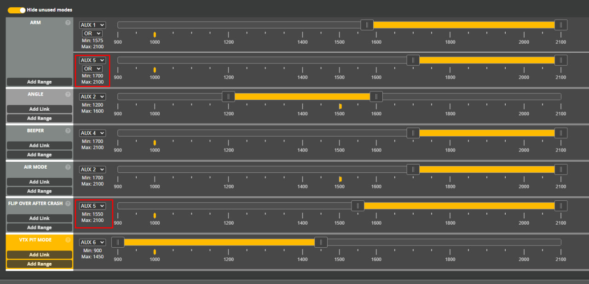

# Режим черепахи на кнопку SE

## Введение
Как известно, если дрон падает вверх ногами, его можно перевернуть, активировав режим "черепахи" (`FLIP OVER AFTER CRASH`).  
Для этого нужно:  
1. задизармить дрон (если он вдруг в арме)  
2. войти в режим "черепахи", нажав кнопку, закрепленную за этим режимом  
3. заармить дрон  
4. правым стиком перевернуть дрон
5. задизармить дрон   
6. выйти из режима черепахи  

Только после этого можно армить дрон и взлетать.
Выполняемые шаги нужно делать именно в такой последовательности (кроме 5 и 6), иначе не получиться. Все это может вызывать сложности и потерю времени. Это особенно критично во время гонки.

## Решение
Пользователь с ником `Bond_ss` предложил следующее:  
Повесить и черепаху и арм на одну и ту же кнопку. Тогда нажав ее, сразу выполнятся пункты 2 и 3. А отжав, пункты 5 и 6.  
С точки зрения безопасности, было бы правильно чтобы это была кнопка без фиксации. Тогда можно не бояться что случайно ее нажал и оставил нажатой.

На аппаратуре RadioMaster Pocket как раз есть такая кнопка `SE` слева внизу на задней стороне. Она отлично подходит для такого решения.

В Betaflight это может выглядеть так:  
  
Таким образом, дрон может армиться и кнопкой SA (для обычных полетов) и кнопкой SE. При этом нажав SE, одновременно активируется и режим "черепахи".

 