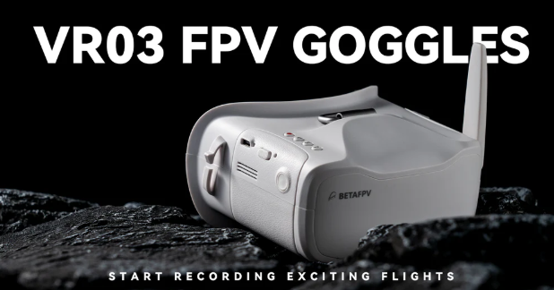
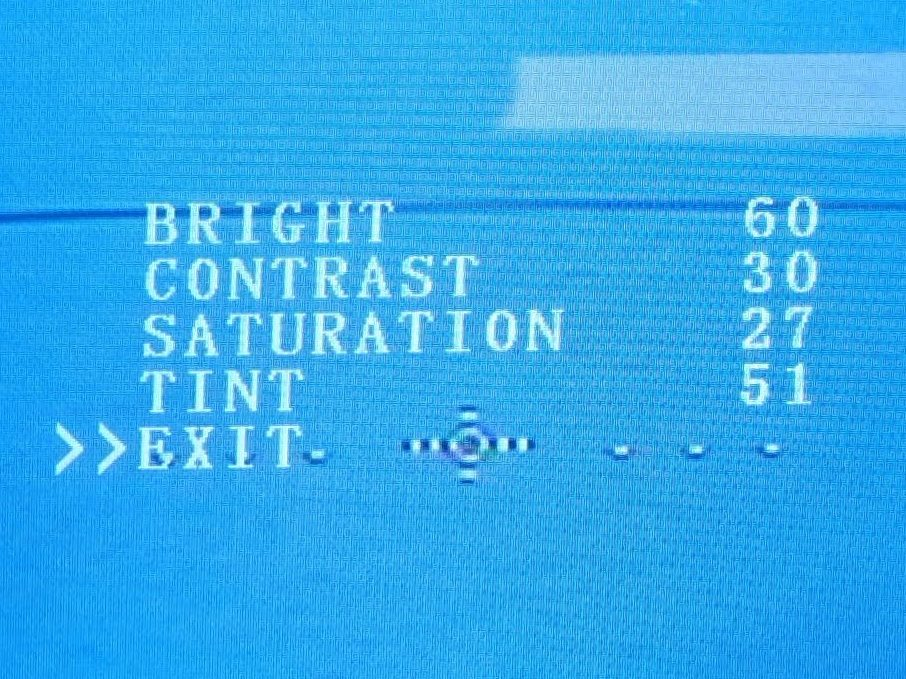
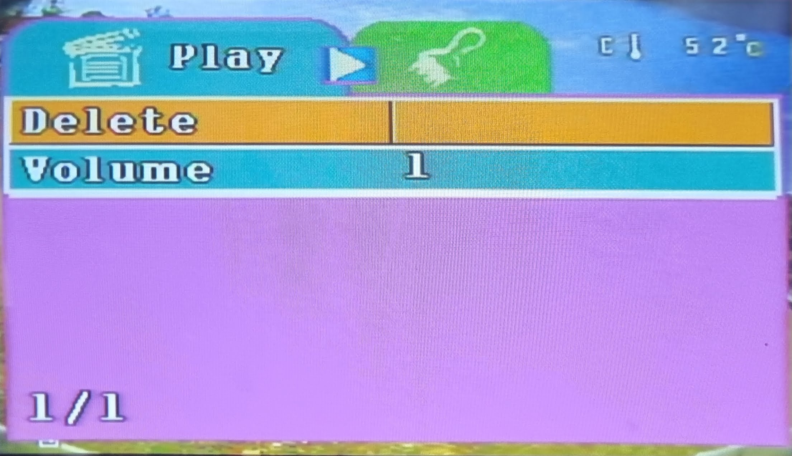
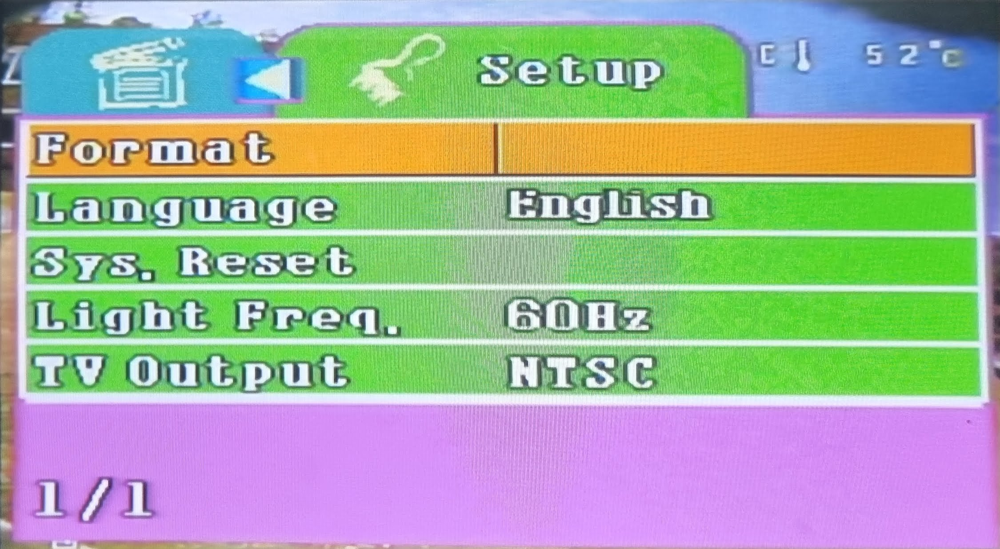
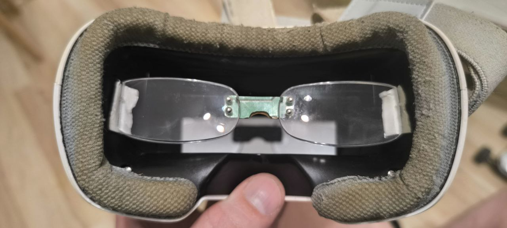
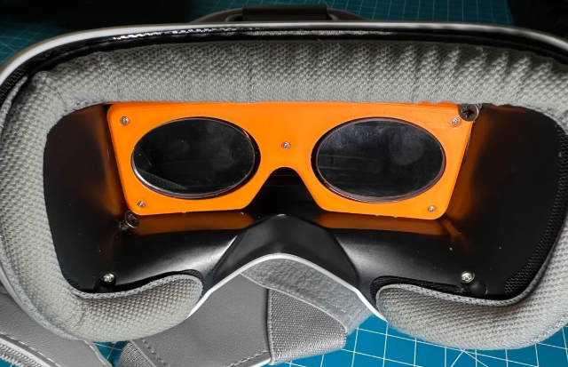
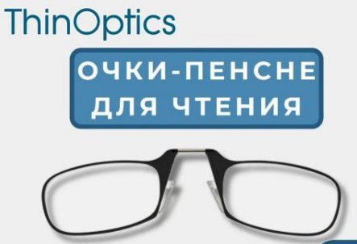

# Шлем BETAFPV VR03 FPV Goggles

[На сайте производителя](https://betafpv.com/collections/goggle-antennas/products/vr03-fpv-goggles)

## Особенности пропорций
DVR пишет только 4х3. Но на экран показывает в пропорции 16х9.  
Если камера выдает 4х3 - изображение в шлеме будет растянуто, но писать в нормальных пропорциях.  
А если камера выдает 16х9, то в шлеме будет красивое, но запишется сплюснутое

## Подключение к дрону

[Підключення шолома до дрона. (укр.) YouTube: A1r_adventures](https://www.youtube.com/shorts/HhG-bThiLRI)

## Обзоры 
[Betafpv VR03 аналоговый FPV шлем VR03. Управление, нюансы, разбор, 32Gb+, таблица каналов. YouTube: Петрокей](https://www.youtube.com/watch?v=Mr_60Ws1X58)

[Fpv шолом VR03 Goggles від Betafpv. YouTube: Несправжній Інженер (укр.)](https://www.youtube.com/watch?v=CNZFdl2wPMk)

## Меню изображения
При включенном шлеме и наличии сигнала с дрона зажать на несколько секунд крайнюю кнопку, противоположную от красной. Если изображения с дрона не будет и видны только помехи, то меню появится, но его трудно будет разглядеть.  

Выскочит меню настройки изображения.  
Кнопка S переход по пунктам.  
стрелки - изменение значений.  

Значения по умолчанию:  
Bright 		60  
Contrast	30  
Saturation 	25  
Tint		50  

## Меню воспроизведения
Зажимаем на включенном шлеме красную кнопку. Появится меню просмотра записанного видео.  
Стрелки - перебор видео.  
S - воспроизведение.  
Во время воспроизведения стрелками увеличиваем скорость просмотра вперед или назад

Красная кнопка - вход в меню.  
Стрелки - хождение по пунктам вверх вниз.  
S - вход в пункт.  

Красная кнопка - переключение между закладками.  

В меню Setup можно отформатировать флешку

## Использование с очками

[Lenses holder for BetaFPV VR03 FPV Goggles (3D print)](https://www.printables.com/model/699606-lenses-holder-for-betafpv-vr03-fpv-goggles)  

## Разборка шлема

[Розбірка та чистка FPV шолома BetaFPV VR-O3. YouTube: Повітряні пригоди (укр.)](https://www.youtube.com/watch?v=3QnGNiWsDJo)
