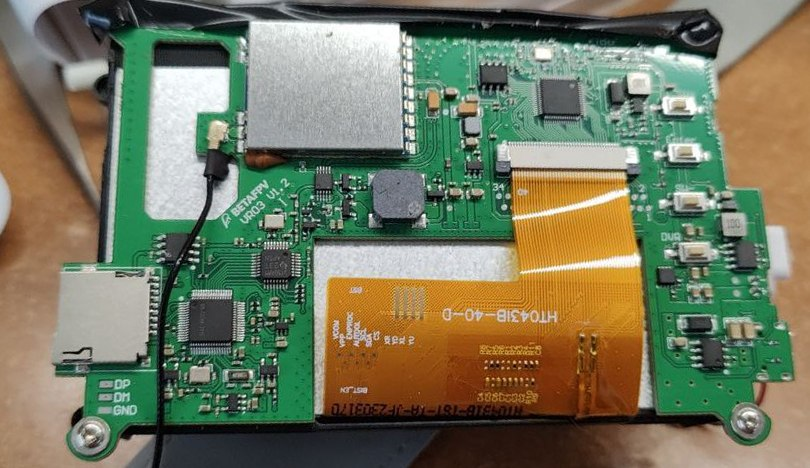
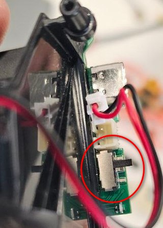
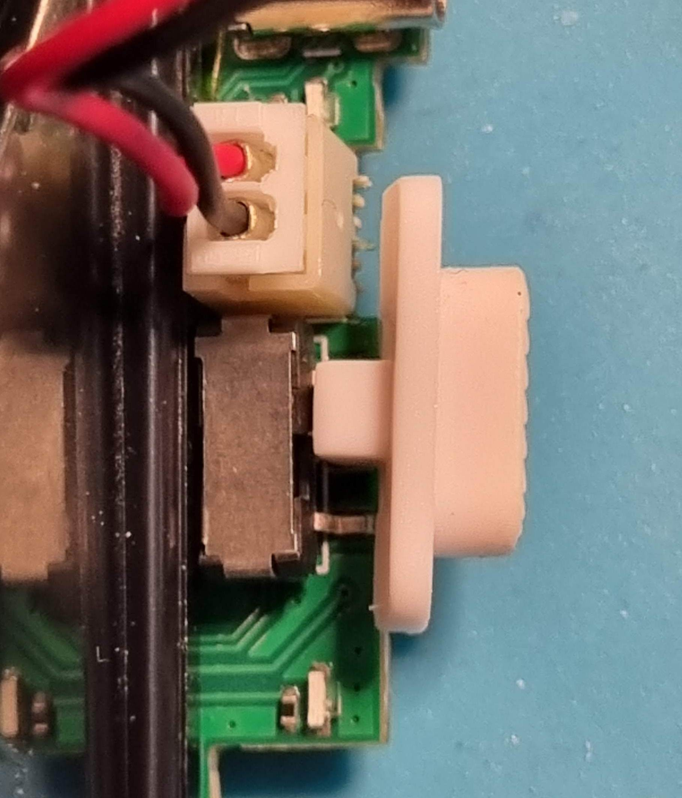
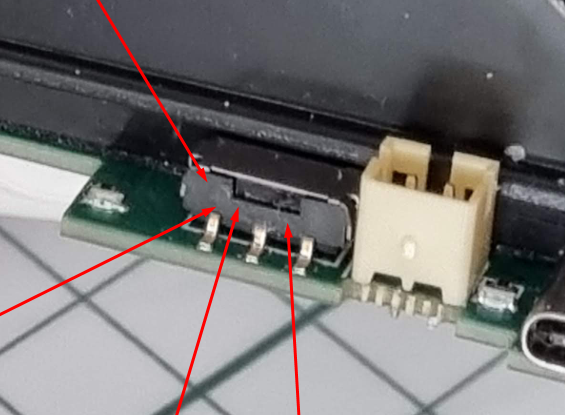
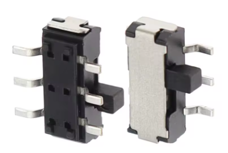
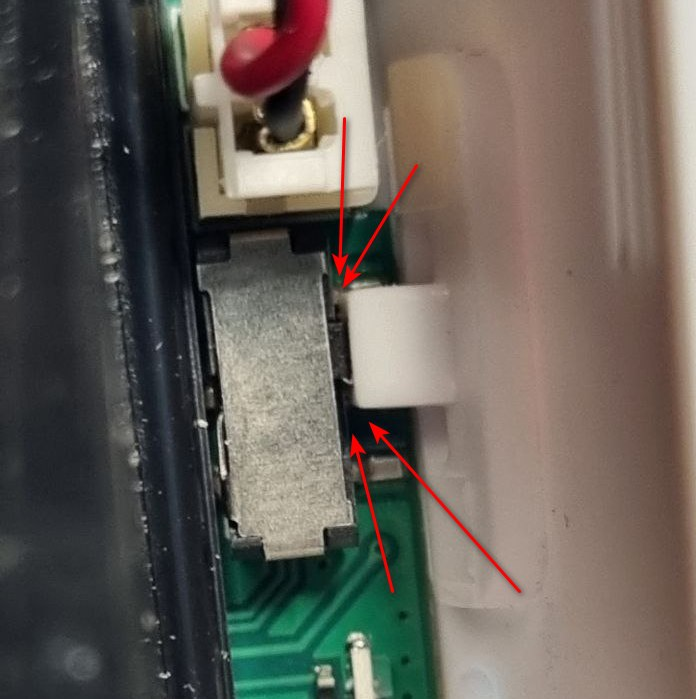
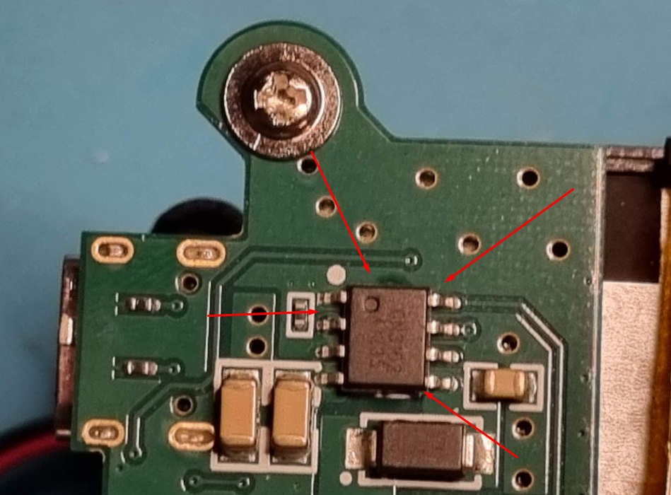
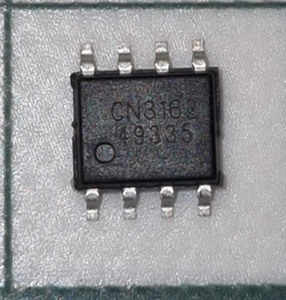
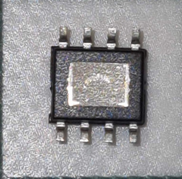

# Разборка и ремонт шлема BETAFPV VR03

## Разборка шлема

Плата изнутри:  

[Розбірка та чистка FPV шолома BetaFPV VR-O3. YouTube: Повітряні пригоди (укр.)](https://www.youtube.com/watch?v=3QnGNiWsDJo)

**ВНИМАНИЕ**:  
При финальном вытаскивании платы из корпуса обращайте внимание на слайдер питания (белого цвета). В него вставлен хвостик от выключателя на плати. При неосторожном движении хвостик ломается под корень и тогда придется либо менять sdtcm выключатель, либо включать/выключать шлем острым предметом.

## Замена переключателя питания
Переключатель питания выглядит так.  
  

Как было написано выше, при неосторожной разборке можно сломать хвостик питания.  

В службе поддержки BETAFPV модель кнопки обозначили как:  
`SW|拨动开关|9.1*3.5*3.5mm|6PIN|卧贴|柄长4mm|国产|编带`  
что в переводе:  
`SW | Тумблерный переключатель | 9,1*3,5*3,5 мм | 6 контактов | Горизонтальный поверхностный монтаж | Длина ручки 4 мм |`

Это 1p2t переключатель для поверхностного монтажа, правый, с удлиненным толкателем, он же 3-pin slide switch

На Aliexpress удалось найти такой же но с толкателем 2мм.  
[10PCS MSK-22D27 SMD Sideslip Toggle Switch 6Pin Microswitch 1P2T Slide Switch](https://www.aliexpress.com/item/1005001517398513.html)  

Поскольку выключателю полностью прилегает к самому слайдеру, вставляемому в корпус шлема, 2мм вполне достаточно.  

Так что замена является эквивалентной.  

Замена требует полной разборки и перепайки.

Если отломанный толкатель остался внутри слайдера, его можно вытащить:  
 - раскалить на горящей спичке или зажигалку кончик иголки  
 - воткнуть его в отломанный хвостик  
 - подождать пока иголка остынет  
 - вытащить хвостик, потянув за иголку

## Замена чипа управления питанием `CN3162`
Если подключить включенный шлем к зарядке, через примерно минуту выходит из строя чип управления питанием.  
Такое предостережение есть даже в инструкции, но кто ж ее читает :))  

Симптомы при подключении к блоку питания:  
- Пластик на шлеме очень сильно нагревается в районе гнезда питания.  
- Нагревается сам кабель ближе к коннектору в шлеме.  
- Перестает гореть синий светодиод, указывающий на то что идет зарядка.    

Чип управления находится на плате:  
  

Полное название `1A Lithium Battery Charger IC CN3162`  
[Даташит на него](CN3162.pdf)

На Aliexpress нашел тут:  
[5-10PCS CN3058E CN3162 CN3163 CN3304 CN3768 CN5711 SMD SOP8 Battery Charge Management Chip](https://www.aliexpress.com/item/1005007924717398.htm)  

  

Модель: `CN3162`

**ВНИМАНИЕ: **  
Чип нельзя просто перепаять паяльником, так как снизу на чипе полигон.  
Так что нужен фен.
