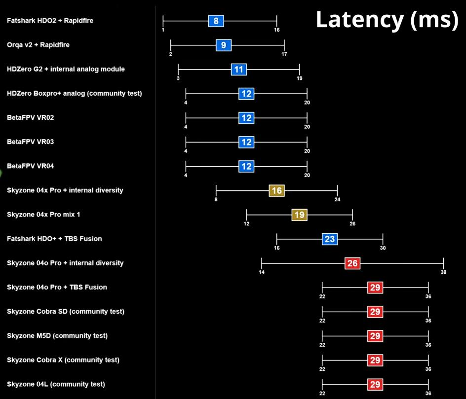
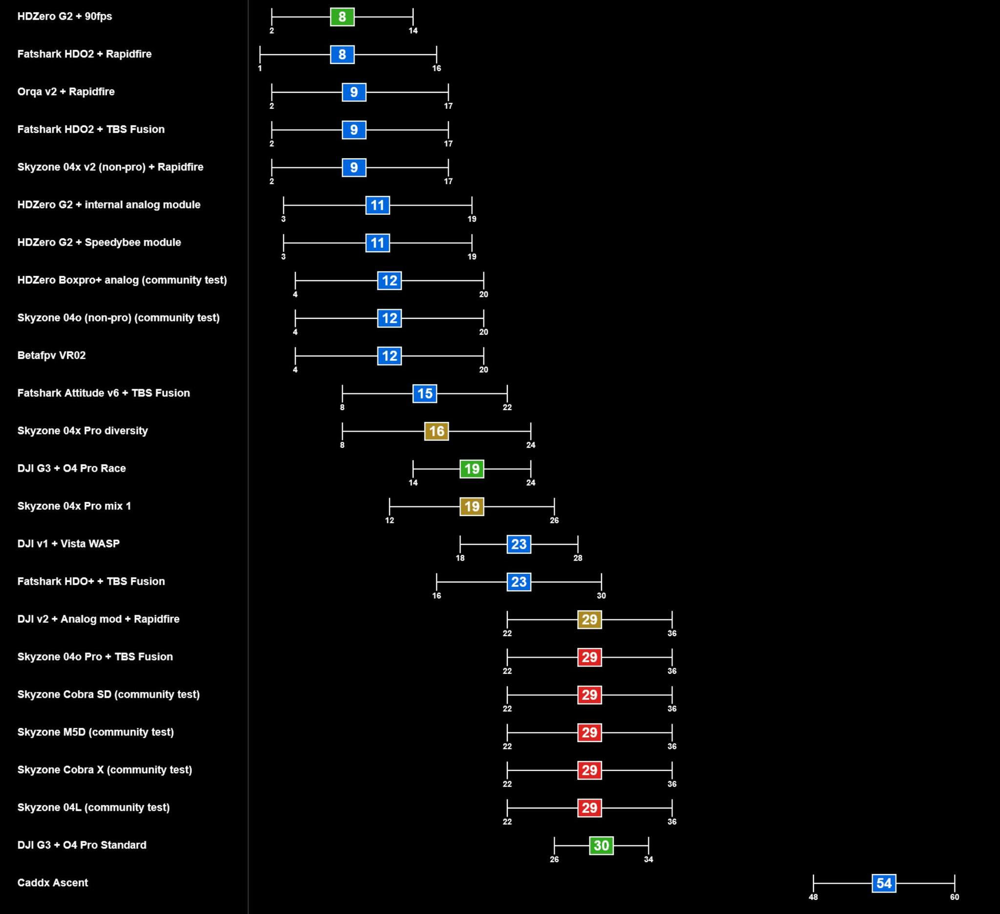

# Задержки (Latency) в очках/шлеме 

ФПВ пилот и блогер [Nils Vo](https://www.youtube.com/@nils_vo/) проводил тестирование задержики изображения в очках и шлемах. 

[Why Analog FPV is evolving backwards (Fatshark HDO+ review). YouTube: nils vo](https://youtu.be/vAcksueVb34?si=4bPgM5TIIPw7IBsS)

У него получились такие диаграммы:

  
  

Источник картинок [пост в Facebook](https://www.facebook.com/groups/hdzero/posts/1279600130734612/)

## Тестирование 
Запускаем на компьютере какое-нибудь часто меняющееся изображение. Направляем камеру дрона на изображение.  
Видим в очках/шлеме изображение, но уже с задержкой.  
Записываем на камеру телефона так, чтобы было видно и изображение на экране компьютера и на экране очков/шлема.   
Загружаем в релактор видео и смотрим покадрово разницу в появлении сменяющегося изображения на экране и в очках.  

Пример изображения доступен на сайте [latency-tester.thezonefpv.com](https://latency-tester.thezonefpv.com/)  
[Локальная версия страницы](latency-tester.thezonefpv.com.html)

