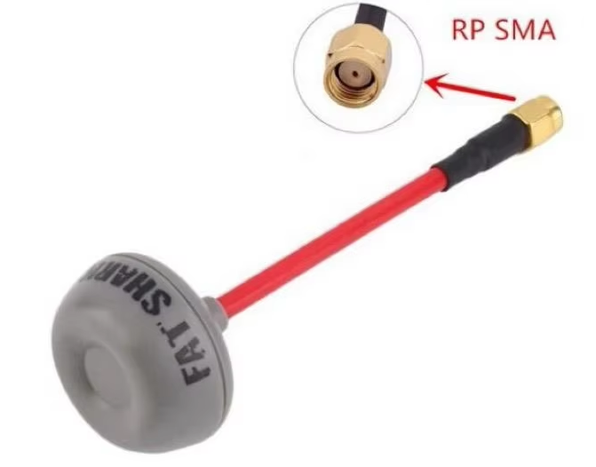

# Антенны на шлем/очки с аналоговым видео

## Виды коннекторов

## Антенны с круговой поляризацией (Lollipop)
Одним из плюсов таких антенн является снижение помех от отраженного сигнала.  
Бывают антенны с правой(RHCP) и левой(LHCP) поляризацией. 

Если и на дроне и на очках/шлеме стоят такие антенны: на них обоих должна быть одна и та же поляризация. Принято на ставить антенны с **правой поляризацией (RHCP) на аналоговые видеосистемы**.  

В случае если сменить антенну только на дроне или очках, связка работает конечно, но не так хорошо как хотелось бы. 

### [Lollipop 4 Smaller and lighter 5.8G 2.5dBi Gain RHCP](https://www.aliexpress.com/item/1005003744368958.html).  
Брать нужно 100mm или 140mm  
RHCP  
Для шлема BETAFPV VR03 нужно брать `L RPSMA`, то есть угловой коннектор  
цвет на выбор.  
  
  

### Fatshark ImmersionRC SpiroNet 5.8GHz Circular Polarized  
[aliexpress.ru](https://aliexpress.ru/item/1005007576203785.html?sku_id=12000041361234282)  
[aliexpress.com](https://aliexpress.com/item/1005007576203785.html?sku_id=12000041361234282)  
  

Отзыв: прошла испытание на шлеме BETAFPV VR03.
Всё отлично. Антенна гнётся и можно направить вертикально вверх.   
Но в штатный кейс вместе с антенной шлем не лезет.   
  

### [Foxeer Lollipop 4 Plus 4+ FPV Antenna 5.8G 2.6Dbi Omni Mini Antenna](https://vi.aliexpress.com/item/1005007675970891.html)
На очки RHCP RPSMA, не менее 15 см. Для шлема BETAFPV VR03 нужно брать угловой.  
