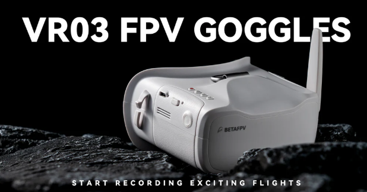

# Шлем BETAFPV VR03 FPV Goggles

[На сайте производителя](https://betafpv.com/collections/goggle-antennas/products/vr03-fpv-goggles)

## Особенности пропорций
DVR пишет только 4х3. Но на экран показывает в пропорции 16х9.  
Если камера выдает 4х3 - изображение в шлеме будет растянуто, но писать в нормальных пропорциях.  
А если камера выдает 16х9, то в шлеме будет красивое, но запишется сплюснутое

## Меню шлема
Зажимаем на включенном шлеме крайнюю кнопку, противоположную от красной. Выскочит меню.  
Значения по умолчанию:  
Bright 		60  
Contrast	30  
Saturation 	25  
Tint		50  

## Обзоры 
[Betafpv VR03 аналоговый FPV шлем VR03. Управление, нюансы, разбор, 32Gb+, таблица каналов. YouTube: Петрокей](https://www.youtube.com/watch?v=Mr_60Ws1X58)

[Fpv шолом VR03 Goggles від Betafpv. YouTube: Несправжній Інженер (укр.)](https://www.youtube.com/watch?v=CNZFdl2wPMk)

## Использование с очками

## Разборка шлема
