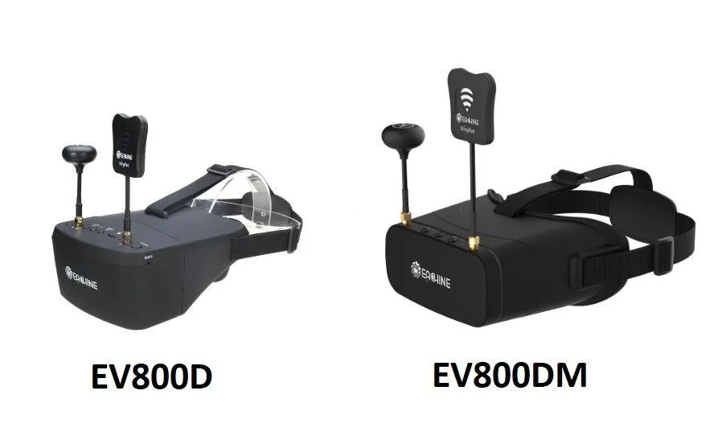
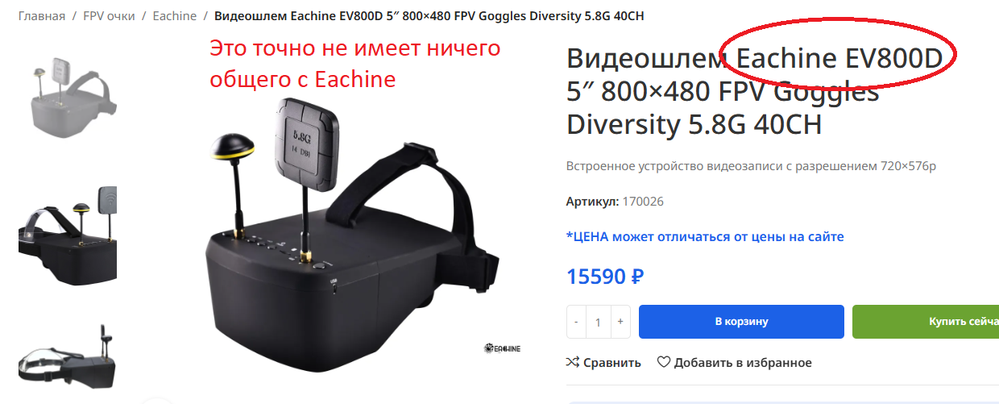
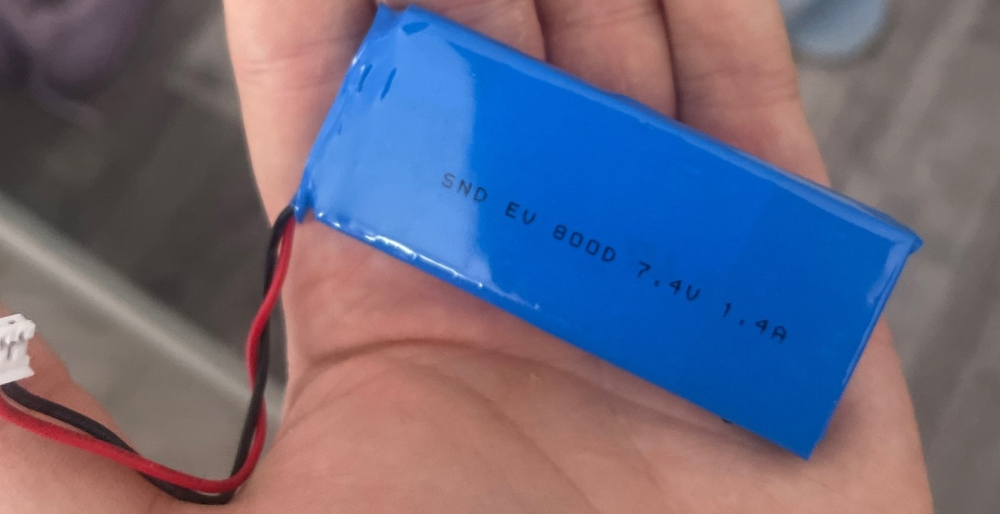
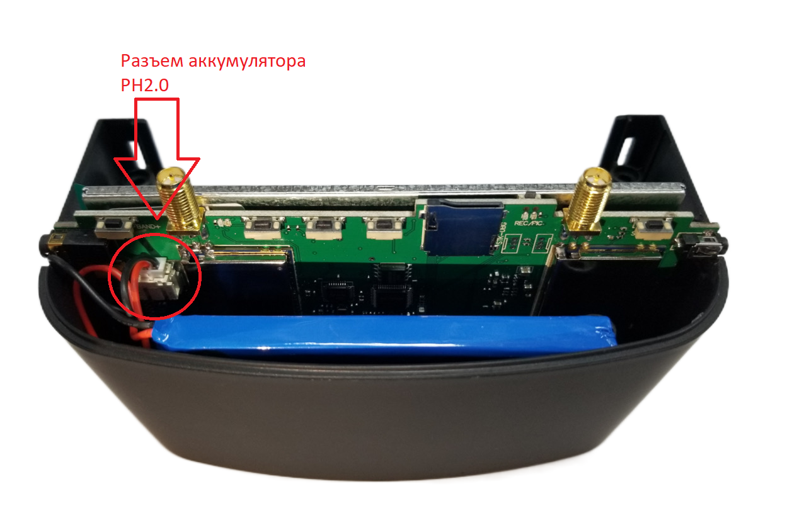
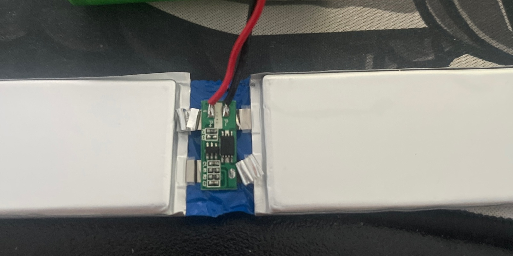
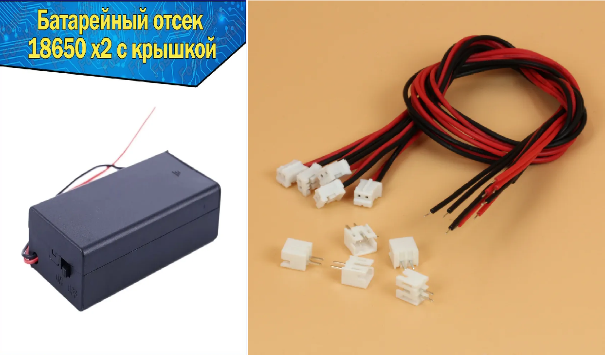

# Шлем Eachine EV800D(M)

[Обзор Eachine ev800dm - аналоговый FPV шлем. Разбор и тест. YouTube: Петрокей](https://www.youtube.com/watch?v=fZJstIVF4nI)

## Обзор от пользователя `@y0ul0la`

### Введение
Шлем `Eachine ev800d`, отличительной особенностью от младшего собрата(ev800) является наличие антенн двух типов (линейной и круговой поляризации, "diversity") что дает гораздо более четкий и стабильный сигнал, а так же увеличенный радиус действия. Имеет аккумулятор 1400mah 7,4v (2s).  
Так же есть версия ev800dm которая имеет регулируемое фокусное расстояние, а так же аккумулятор 2000mah 1s 3,7v (1s).  
  

Считается «народным» шлемом и по праву является лучшим среди бюджетных и доступных шлемов. Цена примерно от 100 до 130$. Важно при покупке не наткнуться на подделку(ну только если вы не нацеленно покупаете ее, но тогда и цена должна быть меньше) Сейчас на разных маркетплейсах(OZON,AliExpress) и даже крупных онлайн магазинах продаются именно подделки этих шлемов даже без логотипов Eachine хотя магазины позиционируют их как шлема eachine. На оригинальном шлеме должны быть надписи Eachine спереди на шлеме, сзади на фиксаторе на затылке и так же на антенне. Так же одной из основных отличительных черт является круглый порт зарядки 2.5x0.7mm. На подделках же всегда type c или им подобные.  
  

Одним из основных минусов этих шлемов (именно ev800d, ведь в dm уже 2000mah!) является время их автономной работы, так как в них стоит аккумулятор 1200mah. Если вы хотите увеличить время автономной работы или же у вас просто сдох аккум то далее будет мини инструкция по замене аккумулятора. 

Очень важной аннотацией я считаю то что если у вас шлем ev800d то вам доступна зарядка только лишь от блока питания у которого выход от 12v!!! Заряжать просто через кабель USB которые продаются на озоне по 200р не выйдет).Но если у вас шлем ev800dm, то тогда у вас уже появляется такая возможность например заряжать шлем в поле от повербанка. 

### Инструкция по замене аккумулятора
Разъединяем шлем на 2 части, откручиваем снизу 4 винта и снимаем верхнюю крышку. Перед нами открывается вид на плату и аккумулятор, отключаем фишку аккумулятора от гнезда на плате и достаем аккумулятор(он несильно приклеен поэтому подденьте его чем нибудь в местах крепления клея и аккуратно надавите) Достаем аккумулятор и смотрим на его маркировку: 7.4v 1200mah, он состоит из двух банок соединенных платой для зарядки и защиты.  
  
  

Далее вам доступны 2 пути: 

**Первый** это самостоятельно спаять 2 аккумулятора 18650 и припаять их к этой плате получив готовый аккумулятор 2S с весьма солидной емкостью.  
  

**Второй** же путь это покупка готового аккумулятора. Ищете любой на который у вас упадет глаз и который подходит вам по характеристикам и размеру чтобы влезть в шлем. Главное что вам нужно это чтоб он был 2S (напряжение 7.4v) и чтобы в нем ОБЯЗАТЕЛЬНО БЫЛА ПЛАТА ЗАРЯДКИ/ЗАЩИТЫ). Имейте ввиду что разъем для подключения в шлем должен быть PH2.0 и готовых аккумуляторов с таким разъемом я найти не смог) Может вам повезет больше!)  
  

В таком случае просто покупаем аккум который вы выбрали( я взял вот такой емкостью 2500mah,но вы можете взять любой другой лишь бы влезли в шлем) и отрезаем кусочек проводов с не подходящей нам фишкой(в моем случае XH2.54) с нового аккума, далее отрезаем провода от платы снятой с аккума со шлема(на них нужная нам фишка PH2.0) и методом скрутки и пайки соединяем их. Таким образом мы получаем готовый аккум с нужным нам разъемом PH2.0 ,далее просто подключаем его в шлем и все готово!)

Так же вам доступен вот такой вариант: Выкидываем батку которая там стоит с завода, покупаем  кабель с разъемом PH2.0, подключаем в порт в шлеме, делаем отверстие в шлеме, выводим провода наружу, спаиваем их с проводами например бокса для двух аккумулятор 18650 и крепим бокс где нам будет удобно на шлеме, и бум!  
  

Получаем шлем с автономной работой часов 5, ведь там же будут два аккума 18650 например по 3000mah. Нам будет удобно их доставать чтобы заряжать, а так же можно просто брать с собой заряженные 18650 и менять их с разряженными), и таким макаром летать хоть круглые сутки.

Все выше сказанное актуально для шлема EV800D, потому что в EV800DM уже используется однобаночный аккумулятор 2000mah 3,7v, соответственно если вы хотите заменить его то вам надо будет покупать именно такой аккум, весь остальной алгоритм же остается неизменным.

### ВИДЕО:
[FPV ШОЛОМ Eachine EV800D | Заміна батареї | РЕМОНТ НЕ ПИШЕ ВІДЕО ФПВ. YouTube: 
DRONTOM (укр.)](https://www.youtube.com/watch?v=yacO0YyAjao)  

[Разборка видеошлема Eachine EV800Dю YouTube: Деревенский Киберпанк](https://www.youtube.com/watch?v=-R8S4xmMZ9A)  

[Доработка чтобы питаться от внешнего акб. YouTube: Dron RC](https://www.youtube.com/watch?v=AX1V_Q4AeYE)  
