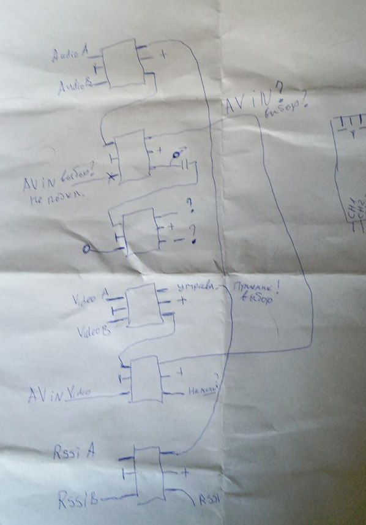
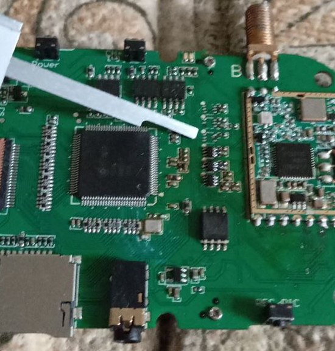
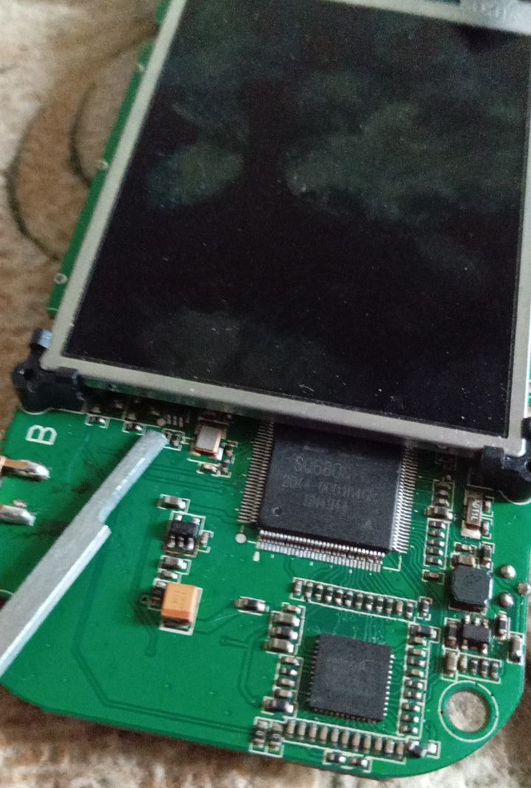
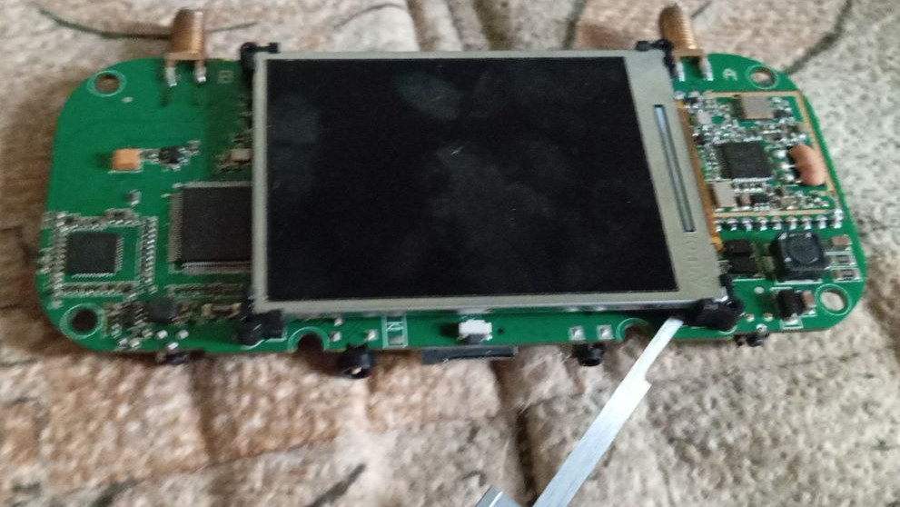
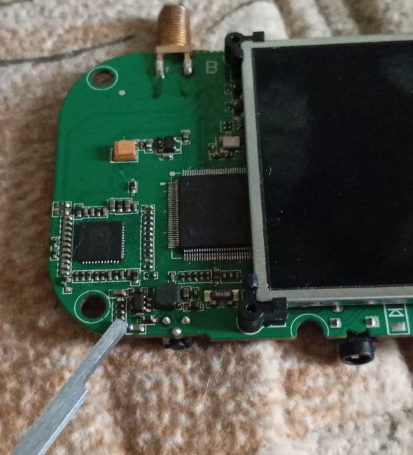

# Ремонт и внутреннее устройство 

Статья от пользователя [Aleksey-G](https://t.me/Leshka200).

Купил как-то ev800dm после переплюсовки. Человек внедрял другой разъем и индикатор заряда в корпус и по всей видимости воткнул аккумулятор не той стороной. Но, возможно, подал питание зарядки. Об этом история умалчивает.  
Имеем сгоревшие: микросхему зарядки cn3761, микросхему питания контроллеров шлема 1,8 вольта m3406-adj и пробило 7 аналоговых коммутаторов sgm3157. 

Если положить плату вверх разъемами - то 6 коммутаторов в ряд вертикально. Верхний - коммутация звука между приемниками, следующий - переключение звука на разъем av, далее - отключение звука вовсе, потом - коммутатор переключения видеосигналов между приемниками, следующий - включения av видео, и нижний - переключение сигналов rssi приемников.  
Коммутация этих сигналов наводит на мысль, что режим диверсити в этом шлеме сделан весьма глупо. Я могу и ошибаться, но похоже логика работы такая: дождаться когда сигнал на этом приемнике будет совсем плохой, переключиться на второй приемник - вдруг он принимает лучше?)  Решение, мягко говоря спорное.

Ну и немного фото:  

Мои зарисовки по коммутаторам. Хотел облагородить, но лень  

Вот они 6 коммутаторов, я впаял пока 3. Аудио коммутацию я не восстанавливал, по-этому трех верхних - нет     

Вот 7-й коммутатор. Он переключает видео между двр и шлемом  

Микросхема зарядки тут под экраном  

Микросхема питания 1,8 вольта  

**После этих манипуляций шлем ожил**