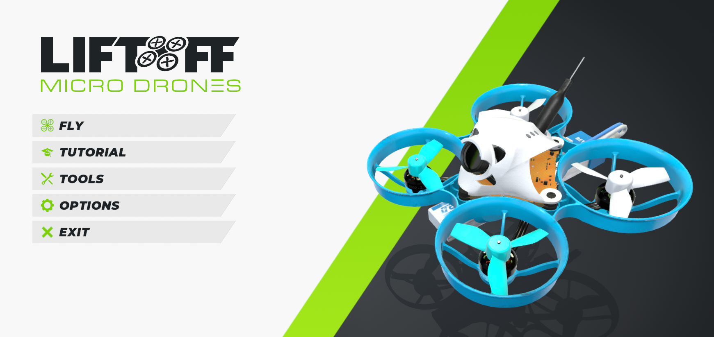

# Liftoff®: Micro Drones

[Liftoff®: Micro Drones](https://store.steampowered.com/app/1432320/Liftoff_Micro_Drones/) - до того, как я узнал про Velocidrone - считал его лучшим симом для вупом.  
Много карт в помещениях. 
Выбор вупов неочень большой, но в принципе и этого достаточно.  
Отлично можно и погонять и пофристайлить.  
Есть мультиплеер.

## Мнение
Очень хороший симулятор с точки зрения наработки навыков полетов в тесных помещениях.  
Но поначалу, когда нет базовых рефлексов управления в акро, будет излишне сложно.  
А ещё там есть жутко бесячий режим: сбивать шарики. Нужно ну очень четко владеть дроном, чтобы получалось.

Ещё в Liftoff Microdrones есть карта, где нужно летать низко над водой.  
Чуть коснулся и конец игры. Это бесит, но заставляет учится чётче контролировать свою высоту. Ведь как обычно, если дома летаешь, упал и поехал :)  
Карту с полетами над водой рекомендую уже попозже. Так сказать для оттачивания отдельных навыков.  

Первая карта (спортзал), третья трасса гонок (гонки в холле).  
Там стоят колечки и можно отрабатывать развороты и пролеты в маленькие колечки.

