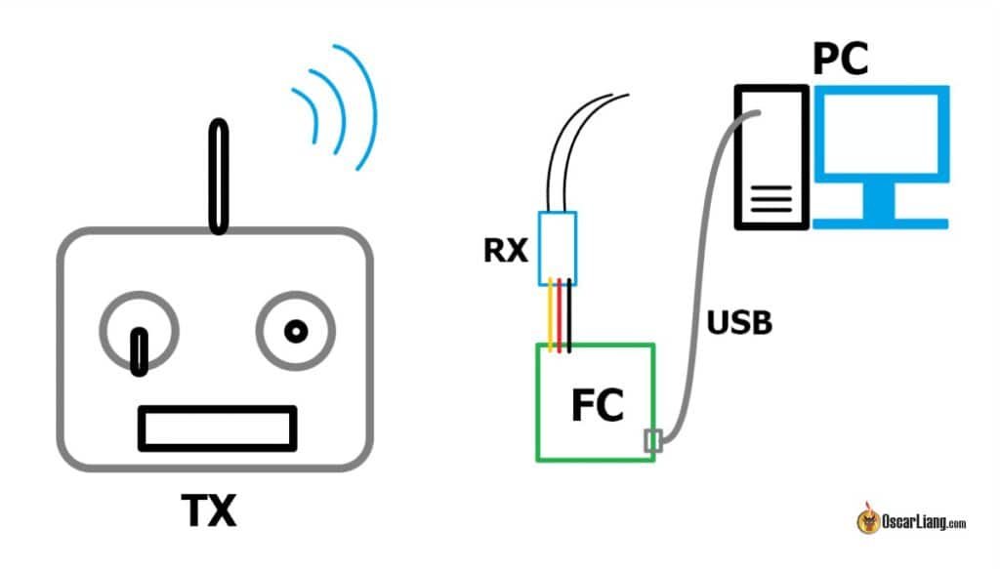

# Общие вопросы по симуляторам

## Как подключить любой пульт к симулятору через дрон
[How to Connect Any Radio to FPV Simulators – Betaflight HID, ELRS Bluetooth & Dongles](https://oscarliang.com/betaflight-fc-fpv-simulator/)  

[Как отключить режим Betaflight HID, если дрон перестал быть видимым в Betaflight](https://www.youtube.com/watch?v=Xr_wb-qtntU)

## Знает ли кто про какие нибудь онлайн соревнования в симуляторе?
Если тебе прям совсем онлайн, все стартуют в одно время и гоняются на призы - то такое вроде есть в симуляторах:  
DCL - The Game  
The Drone Racing League Simulator  

Если тебе погонять онлайн с соперниками, практически в любом официально купленном симе есть Multiplayer.  

В Vilocidrone есть ежедневные соревнования (VDT - Velocidrone daily track). Почитать [можно здесь](Velocidrone.md) 
