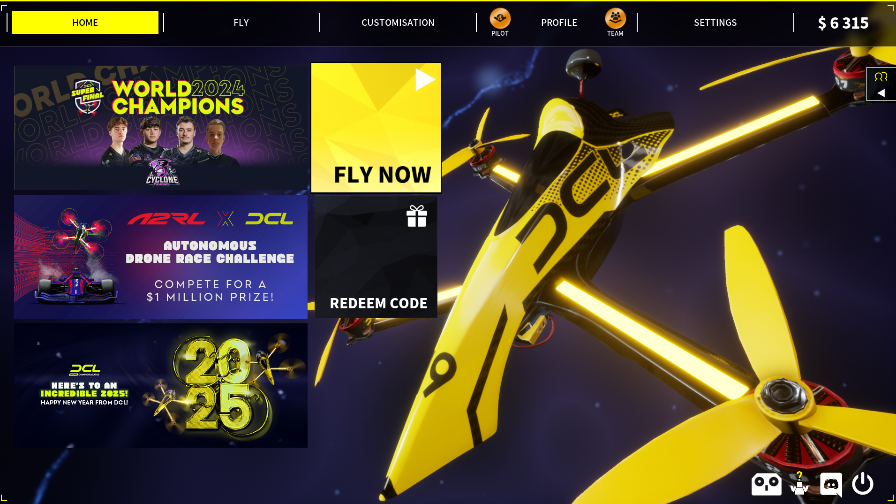

# DCL - The Game

## DCL (Drone Champions League)
Это международная профессиональная лига по FPV-дрон-гонкам, в которой пилоты и команды соревнуются на высокоскоростных трассах. DCL считается одной из самых престижных лиг в мире дрон-рейсинга.

Tрассы DCL впечатляют своей сложностью и красотой, с элементами, которые требуют высокой скорости реакции и мастерства пилотирования.

[Официальный сайт](dronechampionsleague.com)

## Симулятор DCL - The Game
[DCL - The Game](https://store.steampowered.com/app/964570/DCL__The_Game/) 
  
Это популярная платформа для тренировки и участия в виртуальных гонках, доступная для ПК и игровых консолей. Она используется для оттачивания навыков и участия в официальных квалификациях.

## Отзыв
Карт и трасс много, разной сложности.  
Есть серия обучающих трасс, доступных в меню `Fly - Events - DCL 25 training`.

Timer attack нужно зарабатывать пропеллеры, чтобы двигаться дальше. Угол 50+

Дрона всего три: легкий (400гр) средний (800гр) и тяжелый (1.2кг)
Дрон очень инерционный, нужен большой угол полета.  

Можно пофристайлить. На одной карте с городом есть медленно летящий вертолет. Можно вокруг него покрутиться.

Есть мультиплеер.

