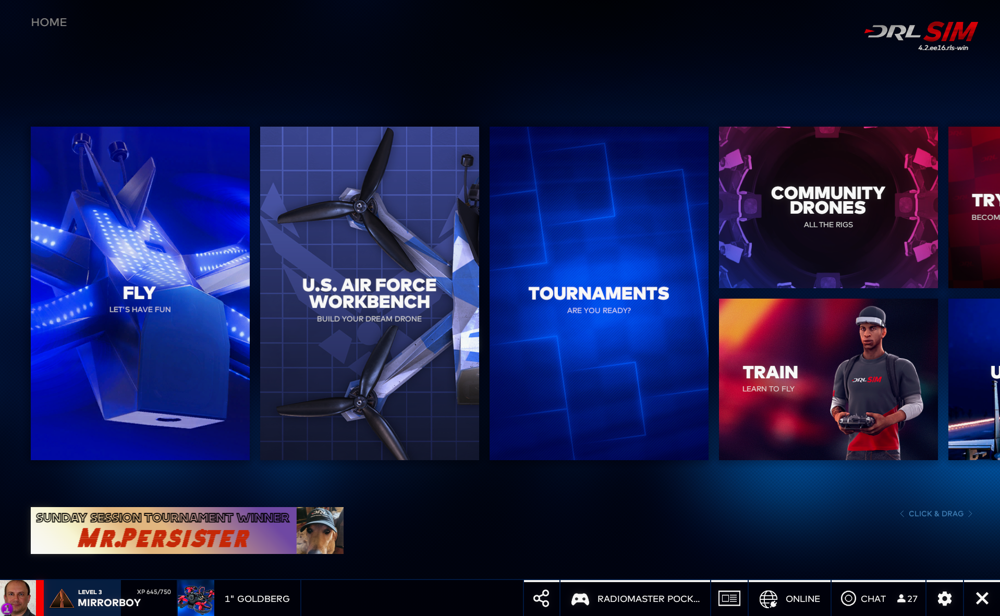

# The Drone Racing League Simulator

## DRL (Drone Racing League)
"то профессиональная гоночная лига FPV-дронов, известная своими зрелищными трассами и высокотехнологичными гонками. DRL делает дрон-гонки более доступными для широкой аудитории, сочетая соревнования, развлечения и инновации.  
В DRL используются специально разработанные гоночные дроны (например, DRL Racer X или Racer4).
Эти дроны способны разгоняться до невероятных скоростей (более 150 км/ч) и оснащены высококачественными FPV-камерами.

Лига проводит гонки на уникальных трассах, расположенных в знаковых местах (стадионы, фабрики, городские пространства).  
Каждый сезон включает несколько этапов, а пилоты соревнуются за титул чемпиона мира DRL.  
Гонки транслируются на популярных телеканалах (ESPN, NBC) и в интернете, что делает их доступными для миллионов зрителей по всему миру.

[Официальный сайт](https://thedroneracingleague.com)

## The Drone Racing League Simulator
[The Drone Racing League Simulator](https://store.steampowered.com/app/641780/The_Drone_Racing_League_Simulator/)  
  
DRL разработала собственный симулятор, DRL SIM, позволяющий пилотам тренироваться на виртуальных копиях реальных трасс.  
Симулятор также используется для проведения квалификаций и поиска новых пилотов.

## Мнение
Гоночный симулятор на разных дронах. Есть 200 граммовый, поведение близко к вупу.  
Много карт. Есть дом для вупа.  
Можно фристайлить.  
Есть режим лопать шарики.   
Есть мультиплеер
  
