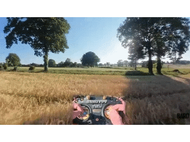
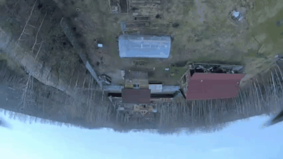
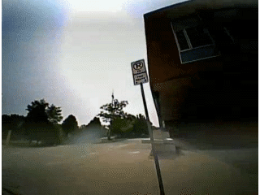
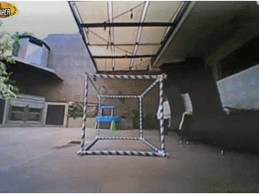

# Каталог трюков

## Базовые трюки

### Roll 180/360  

### Flip 180/360

Делается движением Pitch на себя или от себя.

### Inverted Loopback

Pitch от себя 180, летим вверх ногами, опять Pitch от себя 180

### Flat Yaw
Выравниваемся дрон параллельно земле, yaw 180/360  

### Yaw Spin

Нужно одновременно смещать и Yaw и Roll для того чтобы оставаться в том же положении горизонта.

## Трюки в два движения

### Split-S

Roll 180, Pitch на себя  

### Half Matty (Reverse Split-S)

Roll 180, Pitch от себя  

### Juicy Flick

Pitch от себя 180, Roll 180  
  
  
### Snapback (Look Back juicy или Immelmann Turn)

Pitch на себя 180, Roll 180  

  
## На открытом пространстве

### Dive

- Взлетаем вверх, опускаем нос вниз и летим к земле. У земли плавно выходим.
- Можно дайвить вдоль стены или столба.
- Можно в процессе дайва крутиться по роллу, делая штопор.  
- Можно в колодец. Roll поможет держаться в центре
- подлетаем вверху, питч от себя, смотрим вниз, полуфлип от себя, летим задом к земле, плавно выходим от стены и поверлуп.

### Dolphin Dive
Stall, в верхней точке Pitch от себя 180, и дайвим  

### Inverted Yaw Spin
Half flip или roll, 360 Yaw, Half flip или roll в ту же сторону  
  

### Inverted Uh-Uh
Half flip или roll, покачать Yaw в обе стороны, Half flip или roll в ту же сторону  

### Rubik's Cube
Half flip, 360 Roll, Half flip  

### Cubik's Rube
Half roll, Flip 360, Half roll

### Corkscrew (Freestyle Version)
   

### Trebuchet
  

### Moonwalk
  
 Yaw 180, Pitch на себя 180, летим задом и верх ногами, Pitch от себя 180 выравниваемся.  
[How To MOONWALK - FPV TRICK TUTORIAL. YouTube: Max Beamer](https://www.youtube.com/watch?v=kwZDB4bY6kw)

### Slingshot

### Inverse HalfCube
Yaw 360, Pitch от себя на 180, Roll 180.  

## Power Loop

### Вокруг горизонтальной балки  

- Вокруг горизонтальной балки  
  

- Перед стеной/деревом  
- В верхней точке вверх ногами: Yaw360/Flip/Roll, заканчиваем маневр   

### Maverick Loop, Beginner Switch  
В верхней точке вверх ногами: Pitch от себя 180, дайв под преграду. Получается что как челноком гуляем.  
  

### Перед стеной/деревом  

### В верхней точке вверх ногами: Yaw360/Flip/Roll, заканчиваем маневр   

### Switchback

## Мост, столб

### Фокус на опоре/столбе

### Yaw 360 с фокусом на опоре/столбе

### Split-S
НАД препятствием, Roll 180, плавно Pitch на себя, пролетаем ПОД препятствием.  

### Split-S Rewind
   

### Split-S + Yaw
   
   

### Juicy Moonwalk
Это Split-S, но  когда выворачиваем питчем, сильнее задираем нос и тогда дрон летит ЗАДОМ. То есть это не смена направления

### Half Matty (Reverse Split-S)
Roll 180, плавно Pitch от себя и задом пролетаем под преградой.

### Juicy Flick
Pitch от себя на 180, Roll 180  
  
Можно пролетая над объектом плавно Pitch от себя, чтобы следить как объект проходит снизу, пока не перевернемся вверх ногами. И тогда Roll 180  

### Juicy Flick с роллом
Pitch от себя на 180, Roll 720  

### Juicy Flick с Yaw
  
  

### Snapback (Look Back juicy)
Pitch на себя на 180 (смотрим назад), Roll 180  

### Snapback rewind

  
### Vortex
Pitch на себя на 180 (смотрим назад), Roll 360+180  

### Vortex Rewind

### Vanny Roll
Пролетаем мимо столба, Yaw 180 (смотрим назад), Roll +360, Yaw 180  

### Vanny Cube 
Пролетаем мимо столба, Yaw 180 (смотрим назад), Roll +180, Pitch от себя 180, летим дальше  

### Immelmann Turn
Плавно Pitch на себя, Roll 180 и мы летим в другую сторону.  
  
Эффектно залететь на этаж выше.

### Matty Flip
Вроде как PowerLoop, но наоборот носом вниз.  
Летим над преградой, ЗА ней ныряем носом 360, плавно задом пролетаем ПОД преградой.  
  

Вариация без кувырка носом вперед: летим над преградой, за ней Pitch на себя, тормозим опускаясь вниз и летим спиной под преградой.   

### Side Loop (Barrel Loop)
Боковой луп вокруг горизонтальной балки.  
  

Вариация: боковая качелька без лупа

### Jump Rope 

### Cinnamon Roll
  

### Burrito Roll

### Corkscrew (Race version)
Летим в ворота, внутри разворачиваемся боком, даем газ, держа угол ворот в центре, перелетаем через верх и залетаем в ворота рядом.  
   

### Пролет под мостом с разворотом на 360

## У столба

### Orbit
Орбита, это когда мы облетаем столб по кругу не теряя его из вида. Столб можно держать:  

- В центре экрана.  
- ближе к левому или правому краю. Причем если летим по часовой стрелке и столб правее, это просто `Orbit`. Если столб левее центра, это называется `Reverse Orbit`. При Reverse Orbit дрон сильнее кренится под углом к столбу.

Во время кручения орбиты оба стики будут смотреть в одну сторону (влево или вправо).  

Есть два способа начать крутить орбиту:  

1. Пролетая мимо столба с одной из сторон, чуть не долетев смещаем оба стика в сторону столба, и начнется кручение..  
2. Зависаем ровно перед столбом. Слегка дергаем ролл в одну из сторон. Дрон начнет движение и тут же смешаем оба стика в противоположную сторону, и начнется кручение.

### Orbit Rewind
Крутим орбиту, резко меняем направление орбиты на противоположное.  
  

### Орбита вокруг одного столба, переключаемся на орбиту вокруг другого столба

### Cradle (Candle)  
Качелька вокруг столба  
Залетаем слева, задираем нос, чтобы видеть столб, уходим вправо, возвращаемся и на оборот.  
  
После захода, можно перейти в Inverted Orbit.  

### Pole Dance (Boomerang)
  
Идущий один за одним Snapback (Look Back juicy) и Reverse Split-S.  
Подлетаем к столбу и залетая за него делаем Snapback, но продолжаем крутить roll, входя в Reverse Split-S.  
То есть: Pitch на себя (носом вверх) 180, Roll 360, Pitch от себя.
Можно сначала потренировать отдельно каждый из триков.

### Infinite Boomerang
Перед столбом Reverse Split-S. Выйдя из него оказываешься опять лицом к столбу и снова Reverse Split-S в туже сторону. И так до бесконечности.  

### Trippy Spin (Inverted Orbit)
  

Можно крутить не вокруг столба, а возле столба. Или ориентируясь на точке на потолке.
Или подлетев к углу здания возле угла

### Side Rewind

### Rewind Hot Spot

## У стены

### Stall (Backwards Dive)
Летим на стену/столб, перед ним нос на 90 и взлетаем. Pitch на себя, падаем спиной вниз и отлетаем назад  
  
Варианты в верхней точке:  

- отскок  
- Roll 360  
- Yaw 180 и дайв вниз  
- Powerloop  

От `dronarchy.fpv`  

### Подъем с раскачкой

Поднимаемся вдоль стены качаясь влево/вправо

Поднимаемся вдоль стены качаясь носом вперед/назад
### Wall Tap (Wall bonk)
Подлетаем к стене, контакт, выравниваемся  

### Wall Ride
Пролетаем вдоль стены и касаемся   

Летя вдоль можно развернутся Yaw и лететь задом, боком. Можно флип

## У потолка

### Trippy Spin (Inverted Orbit)
  
Можно крутить не вокруг столба, а ориентируясь на точке на потолке.

### Ceiling bonk
Взлетаем к потолку, передним Roll 180 или Pitch 180, контакт об потолок.   
Далее можно Pitch назад/вперед и дайв

## Колодец, куб
Залёт в колодец и вылет вправо, влево, назад.  

### Cube Ejects from [FPVSkittles](https://www.youtube.com/@FPVSkittles)
Standard Cube Eject  
  

Backflip Cube Eject  
  

Roll Cube Eject  
  

Backflip+Roll Cube Eject  
  

Ceiling Tap Cube Eject  
  

### Backwards Dive
Подлетаем к колодцу, Pitch на себя и падаем спиной.

## Другое

### Matty Stall Rewind

На этот трик похож изобретенный `Frogi@` трик с Matty Flip перед стеной `Frogi Flip`  

### Hallway Turn from [Dinglez](https://www.youtube.com/@Dinglez44)

### Спираль вверх/вниз от `dronarchy.fpv`

### Knife Edge
Пролетаем в узкий вертикальный пролет, перед ним roll 90, чтобы пройти через него  

### Полет только правым стиком
[Learn to Fly an FPV Drone - Lesson 20 - Flying Without Throttle?. YouTube: Joshua Bardwell](https://www.youtube.com/watch?v=WTVtpSrlXgs)

### Slides / Grinds
Скользим по земле, по перилам

### Perches
Коснуться земли или чего-то, подпрыгнуть.  
Сесть на высокую платформу, соскользнуть вниз

## Источники
Большая часть анимационных GIF файлов взято с сайта [prowhooper.com - Tricktionary](https://prowhooper.com/all-tricks/), скопирована из YouTube роликов или записана самостоятельно.  
