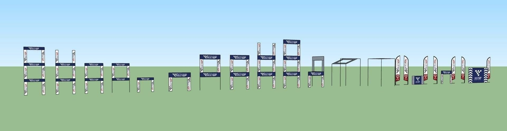

# Общие вопросы

[Виды фигур (препятствий) по стандарту MultiGP Drone Race](https://www.multigp.com/multigp-drone-race-course-obstacles/)  

## Добавляем таймер на DVR
Видео о том, как добавлять таймер на свои ДВР в программе Davinci Resolve на канале [X9 FPV](https://t.me/x9fpv/66)

## Учет времени круга (FPV Lap Timer)

### RotorHazard

[RotorHazard FPV Race Timing](https://rotorhazard.com/)  
[Available Plugins · RotorHazard_RotorHazard Wiki](https://github.com/RotorHazard/RotorHazard/wiki/Available-Plugins)  

[GitHub: RotorHazard_RotorHazard_ FPV race timing and event management](https://github.com/RotorHazard/RotorHazard)  
[Software Setup Instructions](https://github.com/RotorHazard/RotorHazard/blob/v4.2.1/doc/Software%20Setup.md)  

[RotorHazard Beginner Setup & Use Guide // WHY A BUCKET? YouTube: Joshua Bardwell](https://www.youtube.com/watch?v=eSmX7xy_a5Y)

[2025 RotorHazard - NuclearHazard - Быстрый запуск. YouTube: Cubed FPV](https://www.youtube.com/watch?v=50RWv3Q3xLY)  

[ТЫ ВСЕ ЕЩЕ ЛЕТАЕШЬ БЕЗ ТАЙМЕРА? КАК РАБОТАЕТ ROTORHAZARD : CИСТЕМА ХРОНОМЕТРАЖА ДЛЯ FPV. YouTube: Chief Fpv](https://www.youtube.com/watch?v=MSodtrSUCbw)  

[**RH Cloud-Link**](https://rhcloudlink.com/about)  
[RHCloudlink-plugin
](https://github.com/vikibaarathi/RHCloudlink-plugin)

### NuclearHazard
[NuclearHazard (RotorHazard) - Installation. YouTube: Cubed FPV](https://www.youtube.com/watch?v=7BDnbNmhNhg)  

### [FPV Scores](https://fpvscores.com/)

### [Tiny View Plus](https://github.com/t-asano/tinyviewplus)