# IGOW (International Game of WHOOP)  

**IGOW** — это онлайн-лига для FPV-дронов, где пилоты соревнуются в выполнении трюков.  

## 🔥 Основная информация  
- **Полное название**: International Game of WHOOP  
- **Формат**: Онлайн-соревнования с еженедельными заданиями  
- **Целевые дроны**: Изначально Tiny Whoop, позже — другие FPV-дроны  

## 🎯 Как участвовать?  
1. **Задания**: Каждую неделю публикуются новые трюки.  
2. **Видео-отчеты**: Участники снимают свои попытки и загружают их.  
3. **Оценка**: Судьи или сообщество голосуют за лучшие выполнения.  
4. **Выбывание**: В некоторых сезонах слабейшие покидают турнир.  

## ✨ Особенности  
- **Сезонность**: Нумерация по годам (IGOW3, IGOW4 и т. д.).  
- **Уровень участников**: От новичков до профессионалов.  
- **Призы**: Компоненты для дронов, мерч и спонсорская поддержка.  

## 🔗 Полезные ссылки  
- [Официальный сайт](https://www.internationalgameofwhoop.com/)  
- [YouTube канал IGOW: International Game of WHOOP](https://www.youtube.com/@FPVSkittles/)

## IGOW5
**FPVSkittles** открыл регистрацию на [IGOW5](https://www.internationalgameofwhoop.com/).  
- Каждую неделю публикуется новое задание, и у пилотов есть больше недели, чтобы его повторить и отправить видео.  
- После дедлайна проводится прямой эфир, где видео просматриваются и оцениваются — участники либо проходят, либо получают букву. Если наберешь 4 буквы I.G.O.W. и проиграл.  
- В 5-м сезоне доступна необязательная 8-недельная предсезонная тренировка без риска вылета — особенно полезна для новичков.  
- Опытные пилоты могут пропустить предсезонные задания, чтобы не перегореть во время основного сезона.  
- Первый официальный челлендж сезона IGOW 5 начнётся 1 июня; всего будет 12 заданий, после которых останется 32 пилота для плей-офф.  
- В конце сезона соревнование становится серьёзным, победитель получает титул чемпиона IGOW 5.  
- В течение сезона будет разыграно более $30,000 в виде призов и денег.   

[IGOW5 Basic Overview - Registration is OPEN NOW!](https://www.youtube.com/watch?v=rxAz9S6DrBY)

[Регистрация тут](https://docs.google.com/forms/d/e/1FAIpQLSdYRaHYyD5K8a4agzNA4DkbpwWwu-vnOILIGNzA_ekEvV13Ug/viewform)  
[Список участников тут](https://bit.ly/IGOW5Players)

### Training Ground Challenge #0
[IGOW5 Preseason Training Grounds Challenge #0](https://www.youtube.com/watch?v=WkIlK5aMJpU)  

[Beginner](https://www.youtube.com/shorts/xKC_Qjs3fKg)  
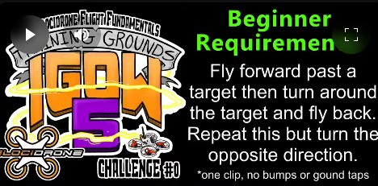

[Intermediate](https://www.youtube.com/shorts/sg_jjx3Jblw)  
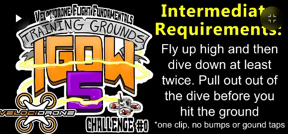

[Advanced](https://www.youtube.com/shorts/Mf7GHdbpOiQ)  
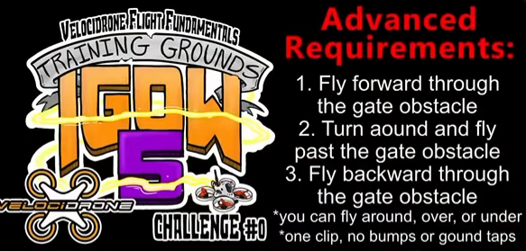

### Training Ground Challenge #1
[IGOW5 Preseason Training Grounds Challenge #1](https://www.youtube.com/watch?v=6QYzsyfZjNM)  

[Beginner](https://www.youtube.com/shorts/jQUpjdQxzNM)  
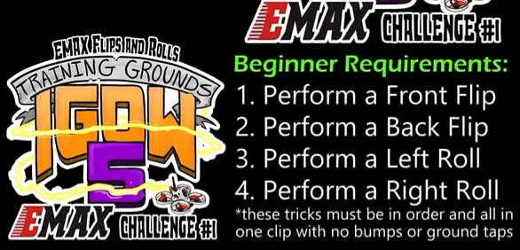

[Intermediate](https://www.youtube.com/shorts/Aq9FV3X-4-0)  
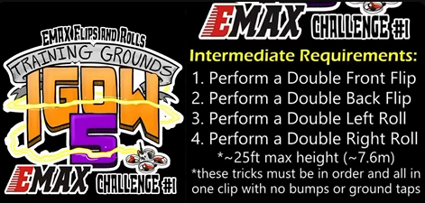

[Advanced](https://www.youtube.com/shorts/eW1aKY9XZI4)  
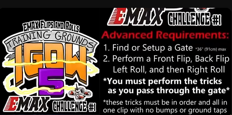

### Training Ground Challenge #2
[IGOW5 Preseason Training Grounds Challenge #2](https://www.youtube.com/watch?v=1_BIrUA2g1c)  

[Beginner](https://www.youtube.com/shorts/eJdQvWuXHcE)  
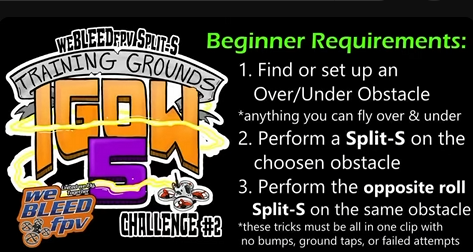

[Intermediate](https://www.youtube.com/shorts/FlCkrsTnLbY)  
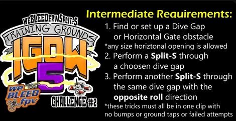

[Advanced](https://www.youtube.com/shorts/dEKlGknFd44)  
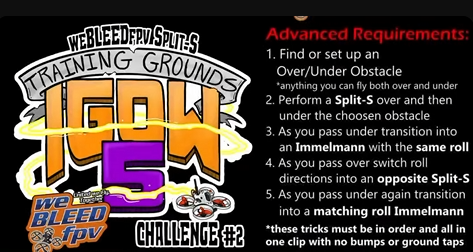

### Training Ground Challenge #3
[Beginner](https://www.youtube.com/shorts/aqc03ejHS34)  
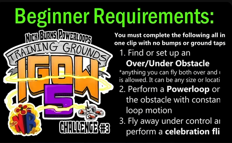

[Intermediate](https://www.youtube.com/shorts/B3BJ_tAECZ4)  
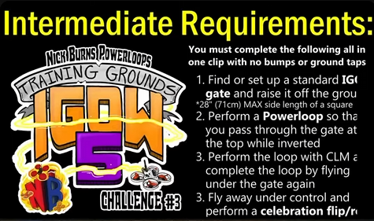

[Advanced](https://www.youtube.com/shorts/VwyVdXg7XJE)  
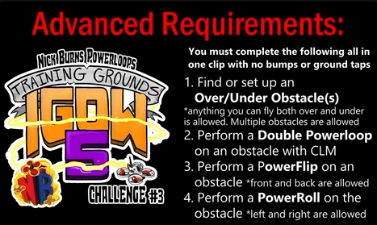

### Training Ground Challenge #4
[Beginner](https://www.youtube.com/shorts/7FkKd9QnmpE)  
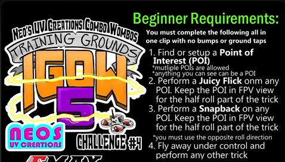

[Intermediate](https://www.youtube.com/shorts/3mhypVmMCcg)  
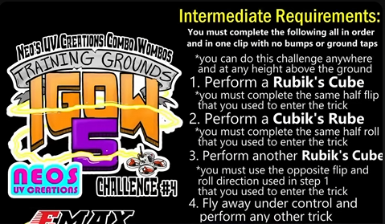

[Advanced](https://www.youtube.com/shorts/PZnyjs0xyFA)  
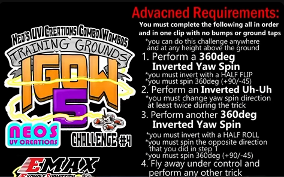

### Training Ground Challenge #5
[Beginner](https://www.youtube.com/shorts/AgZGN-JXcAk)  
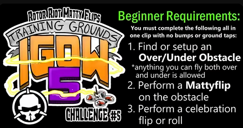

[Intermediate](https://www.youtube.com/shorts/BkaIfOcX3c8)  
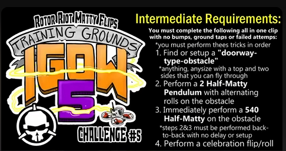

[Advanced](https://www.youtube.com/shorts/LrKNQR1SRUo)  
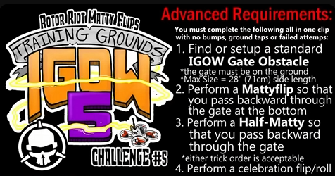

