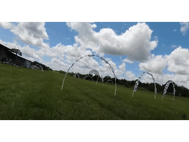

# FPV Freestyle трюки
[**Энциклопедия трюков** с поиском и анимированными GIF](https://prowhooper.com/all-tricks/)  

[216 TRICKS! ULTIMATE FPV Tricktionary 2025. YouTube: Phantom ](https://www.youtube.com/watch?v=NpLIhHIBO24)  
[96 Tricks! ULTIMATE FPV Tricktionary. Freestyle Bible](https://www.youtube.com/watch?v=hIbHrO-VBu8)  
[100+ FPV Freestyle Tricks // DRL Simulator](https://www.youtube.com/watch?v=GVi42YUs7Vs)

[FPV Freestyle Tricktionary. YouTube: Rotor Riot](https://www.youtube.com/watch?v=n6RX8iI6gcQ)

[Fpv Freestyle - 14 TRICKS IN 10 min. YouTube: Bard Fpv](https://www.youtube.com/watch?v=H0kxJqmjbgE)  
[Fpv Freestyle - 11 FPV TRICKS Vol 2. YouTube: Bard Fpv](https://www.youtube.com/watch?v=2mZuCbVaWpc)  
[Ultimate Compilation Fpv Freestyle Tricks Débutant. YouTube: Bard Fpv](https://www.youtube.com/watch?v=MjvcWIFAg9o)

[+70 Freestyle tricks ( Simulator ) 2019. YouTube: AuxPlumes](https://www.youtube.com/watch?v=yVmR9wyIrpc)

[FPV Freestyle Tricks - 3 Levels of Rewinds. YouTube: FlowPV](https://www.youtube.com/watch?v=GHwKQtJ5w5E)

[I Asked ChatGPT for the 10 Most Difficult FPV Drone Tricks, YouTube: 
Patrick Watkins](https://www.youtube.com/watch?v=vYaq1cCAjTs)  
- Corkscrew  
- Death Spiral  
- Superman Flip  
- Khalifa Loop  

[𝐋𝐄𝐀𝐑𝐍 𝐀 𝐌𝐎𝐕𝐄 - FPV tricks compilation ( 2022 - 2024 ). YouTube: AuxPlumes](https://www.youtube.com/watch?v=bkwwmS8Mc3o)  
- The Vortex or Toilet Flush  
- The Ellipse  
- The Inward Flip  
- The Bhop  
- The 360 Flip  
- Maverick to Matty  
- Drunk Slalom  
- Roll backwards  
- Trippy Rewind  
- Ladder Climb  
- Coin Flip  
- Backward Climb  

## [YouTube канал headmazta](https://www.youtube.com/@headmazta)   
Большое количество коротких роликов с подробным пошаговым обучением различных трюков.  
Все трюки сгруппированы в плейлисты:  
[FPV Trick Tutorials](https://www.youtube.com/playlist?list=PLj23ZLg5V56oNLTC4bNI4TndtTEvK-UoT)  
[FPV Trick Tutorials - BEGINNER](https://www.youtube.com/playlist?list=PLj23ZLg5V56prLy-r3-GVd_9wBU4iVC7H)  
[FPV Trick Tutorials - INTERMEDIATE](https://www.youtube.com/playlist?list=PLj23ZLg5V56qvExRVYQkBq6bUsJjwHQqZ)  
[FPV Trick Tutorials - ADVANCED](https://www.youtube.com/playlist?list=PLj23ZLg5V56q99molL1nY1XVa0j42cnzl)  

## [Telegram channel 'FPV Tricks'](https://t.me/fpv_tricks)

## Отдельные трюки

#### Matty Flip (backwards powerloop)
[Learn to Fly an FPV Drone - Lesson 19 - Matty Flip. YouTube: Joshua Bardwell](https://www.youtube.com/watch?v=v25IwLExF80)  
[How To: Matty Flip | FPV Tutorial](https://www.youtube.com/watch?v=mZVjPSQHm9Y)  
[how to MATTYFLIP (backwards powerloop)](https://www.youtube.com/watch?v=625wUUsPqwk&list=WL&index=10&t=268s)  
[I Can't Matty Flip! FPV Freestyle Tutorial and Practice](https://www.youtube.com/watch?v=REaUgDKeFXs)  
[Mattyflip with MattyStuntz - Trick Series](https://www.youtube.com/watch?v=Twcj_8k_-vk)    

#### Orbit
[How To Do FPV Orbits (as made famous by Mr. Steele)](https://www.youtube.com/watch?v=qycbKimdr_I)  
[Розбираємо Орбіту. YouTube: FlyingCat (укр.)](https://www.youtube.com/watch?v=iTOF2Rq_ZGU)

#### Powerloop
[How to Powerloop Obstacles SAFELY | FPV Trick Tutorial](https://www.youtube.com/watch?v=Ip7JBqRNDzg)  
[How To Powerloop an FPV Drone For Beginner and Advanced Pilots](https://www.youtube.com/watch?v=LTl0780qgCE)  
[FPV Tricks - Split S & Reverse Split S](https://www.youtube.com/watch?v=Iu7Q4SHjpjQ)

#### Split-S
[FPV freestyle уроки. Split-S. (3)](https://www.youtube.com/watch?v=7A_mpyqKZyo)  
[How To Perfect Split-S | FPV Trick Tutorial](https://www.youtube.com/watch?v=gepPp2OyXUQ)  

#### Split S Rewind
   
[Apprends le Split S Rewind - Tuto BARD - Fpv Freestyle. YouTube: Bard Fpv](https://www.youtube.com/watch?v=YZnMHTyD5TE)  

#### Reverse Split-S (Half Matty)
[FPV Trick Tutorial | REVERSE SPLIT-S. YouTube: Patrick Watkins](https://www.youtube.com/watch?v=IoBxHBNK5j4)

#### Inverted Yaw Spin
[FPV Trick Tutorial | INVERTED YAW SPIN. YouTube: Patrick Watkins](https://www.youtube.com/watch?v=02x7HyC2U1E)

#### Trippy Spin (Inverted Orbit):
[Trippy spin или обратная орбита. Научиться за один вечер?](https://www.youtube.com/watch?v=Lk9EkWkudN0)  
[FPV freestyle уроки. Trippy spin или обратная орбита. (2)](https://www.youtube.com/watch?v=knTYPUcpjL8)  
[I Can't Trippy Spin! or Inverted Orbit? 🤔 FPV Freestyle Tutorial](https://www.youtube.com/watch?v=M5YY4iC5z1o)  
[How to Inverted Orbit (Trippy Spin) | FPV Trick Tutorial](https://www.youtube.com/watch?v=HbUVa1IUfFs)  
[Trippy Spin Tutorial (Inverted Orbit) - Understand The Trippy](https://www.youtube.com/watch?v=-TxgEsk8T5I)  
[I learned to trippy spin, and so can you.](https://www.youtube.com/watch?v=2cInhs27EXs)  

#### Juicy Flick
[How To Juicy Flick an FPV Drone For Beginner and Advanced Pilots, An In-Depth Look](https://www.youtube.com/watch?v=tbem8fUPPxU)  

#### Dolphin Dive
[FPV Trick Tutorial - DOLPHIN DIVE. YouTube: Patrick Watkins](https://www.youtube.com/watch?v=WuSz_mIioqE)  
[Which level can you reach?. YouTube: Patrick Watkins](https://www.youtube.com/shorts/GCQNPSjebIE)  
[Apprends le Dolphin Dive - Fpv Freestyle. YouTube: Bard Fpv](https://www.youtube.com/watch?v=X3eSvNI12HE)  

#### Barani
[FPV Trick Tutorial - BARANI. YouTube: Patrick Watkins](https://www.youtube.com/watch?v=guEXMMV3TSo)

#### Rubik's Cube
[Як робити Rubik's Cube. YouTube: FlyingCat](https://www.youtube.com/shorts/Ioo8-RNfXy0)

#### Corkscrew (Freestyle Version)
   
[How To: Corkscrew (Freestyle Version) | FPV Tutorial. YouTube: headmazta](https://www.youtube.com/watch?v=ti8pGuEvwbM)

#### Corkscrew (Race version)
   
[Racing with the DJI FPV Drone! - How to Corkscrew. Youtube: Rotor Riot](https://www.youtube.com/watch?v=TNr8TydRE7A)

#### Side Rewind
[Side Rewind - You're Doing it WRONG! FPV Drone Trick Tutorial. YouTube: Patrick Watkins](https://www.youtube.com/watch?v=wG-9BXBt3hU)

#### Boomerang
Boomerang, Wide boomerang, Infinite Boomerang  
[Apprends le Boomerang - Tuto BARD 08 - Fpv Freestyle. YouTube: Bard Fpv](https://www.youtube.com/watch?v=O7_SbN4PV5M)

#### Reverse Wall Ride
[FPV Trick Tutorial - REVERSE WALL RIDE. YouTube: Patrick Watkins](https://www.youtube.com/watch?v=RsqibmwzpqA)

#### Inverse HalfCube
[Apprends le Inverse HalfCube - Fpv Freestyle - Tuto Bard. YouTube: Bard Fpv](https://www.youtube.com/watch?v=Biedurj49EA)

#### Pile ou Face
[Apprends le "Pile ou Face" - Fpv Freestyle - Tuto Bard. YouTube: Bard Fpv](https://www.youtube.com/watch?v=nTWmShjMhP8)

### [20 routines to improve your looρ abilities. YouTube: AuxPlumes](https://www.youtube.com/watch?v=tA7XWwtBn0Q)