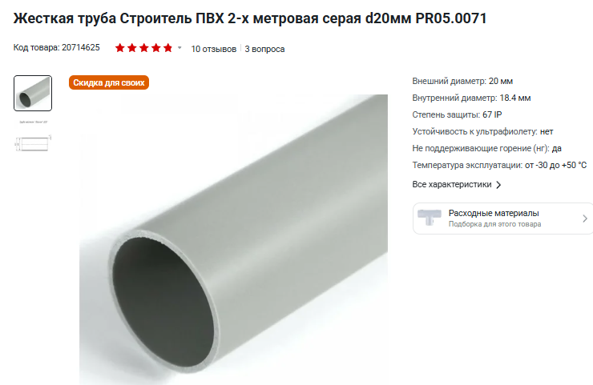
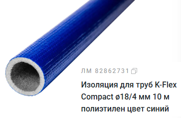
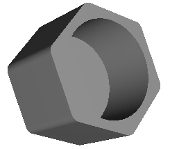
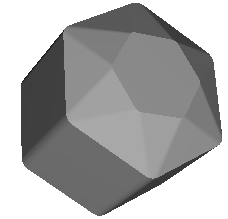
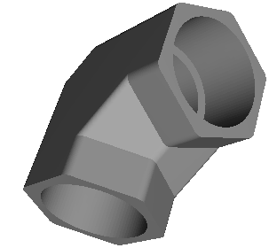
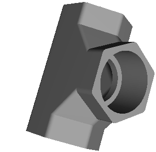
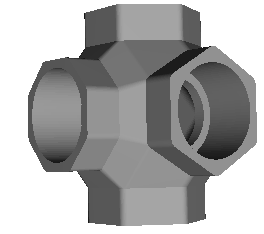
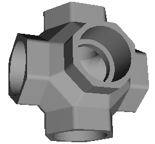

# Изготовление трассы для вупов

## Что нужно для трассы
1. Трубы, дешевле всего кабель-канал 20мм типа такой:  
  

Резать нужно по 61см (+-2см роли не сыграют).  
Палок надо 20 шт, то есть где-то 7 двух метровых труб должно хватить, может и меньше так как на ножки можно пустить и по 30см палки).  

2. Фиттинги для этих труб все отстойные, лучше всего печатать их, подобрав нужный масштаб печати под трубу получается очень плотное соединение и ворота не провисают, файлы печати ниже.  
В регламенте для трассы [RaceGOW3](./../30_Гонки_или_соревнования/IGOW_RaceGOW.md) заявлены следующие рекомендуемые фиттинги: 4 двойных, 6 тройных (Т), 2 четверных, 5 пятерных.  
 
3. Утеплитель чтобы сделать ворота цветными и более мягкими брать тут 18мм синий и красный, типа такого:  

## Модели фиттингов для 3Д принтера
Фиттинги для соединения для 20мм полипропиленовые труб: 
 

  
[1-ways](1-ways_fitting.stl)  

  
[2-ways](2-ways_fitting.stl)  

  
[3-ways](3-ways_fitting.stl)  

  
[4-ways](4-ways_fitting.stl)  

  
[5-ways](5-ways_fitting.stl)  

[Посмотреть модельки онлайн можно здесь](https://www.viewstl.com/)

