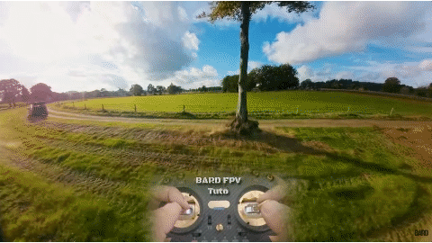
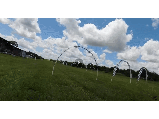

# Каталог трюков

## Базовые трюки
### Roll 180/360  

### Flip 180/360  

### Yaw Spin  

## На открытом пространстве

### Dive
- Взлетаем вверх, опускаем нос вниз и летим к земле. У земли плавно выходим.   
- Можно дайвить вдоль стены или столба.   
- Можно в процессе дайва крутиться по роллу, делая штопор.  
- Можно в колодец. Roll поможет держаться в центре

### Dolphin Dive
Летим на скорости, задираем нос вверх (stall), в верхней точке Pitch от себя 180, и дайвим.

### Inverted Yaw Spin
Roll 180, 360 Yaw, Roll 180 в туже сторону  
  

### Rubik's Cube
Pitch от себя на 180, 360 Roll, Pitch от себя 180  

### Back Rubik's Cube
Pitch на себя на 180 пока не увидим объект сзади, Roll 360, и Pitch на себя 180  

### Corkscrew (Freestyle Version)
   

### Trebuchet
  

## Power Loop

### Вокруг горизонтальной балки  
  

### Упрощенный. Beginner Switch  
В верхней точке вверх ногами: Pitch от себя 180, дайв под преграду. Получается что как челноком гуляем.  
  

### Перед стеной/деревом  

### В верхней точке вверх ногами: Yaw360/Flip/Roll, заканчиваем маневр   

## Мост, столб

### Split-S
НАД препятствием, Roll 180, плавно Pitch на себя, пролетаем ПОД препятствием.  

### Split S Rewind
   

### Half Matty (Reverse Split-S)
Roll 180, плавно Pitch от себя и задом пролетаем под преградой.

### Juicy Flick
Pitch от себя на 180, Roll 180  
  
Можно пролетая над объектом плавно Pitch от себя, чтобы следить как объект проходит снизу, пока не перевернемся вверх ногами. И тогда Roll 180  

### Snapback (Look Back juicy)
Pitch на себя на 180 (смотрим назад), Roll 180  

  
### Vortex
Pitch на себя на 180 (смотрим назад), Roll 360+180  

### Vortex Rewind

### Vanny Roll
Пролетаем мимо столба, Yaw 180 (смотрим назад), Roll +360, Yaw 180  

### Vanny Cube 
Пролетаем мимо столба, Yaw 180 (смотрим назад), Roll +180, Pitch от себя 180, летим дальше 

### Immelmann Turn
Плавно Pitch на себя, Roll 180 и мы летим в другую сторону.  
  
Эффектно залететь на этаж выше.

### Matty Flip
Вроде как PowerLoop, но наоборот носом вниз.  
Летим над преградой, ЗА ней ныряем носом 360, плавно задом пролетаем ПОД преградой.  
  

Вариация без кувырка носом вперед: летим над преградой, за ней Pitch на себя, тормозим опускаясь вниз и летим спиной под преградой.   

### Side Loop (Barrel Loop)
  
Варианты:  
- Просто качелька влево/вправо под балкой  

### Jump Rope 

### Cinnamon Roll
  

### Burrito Roll

### Corkscrew (Race version)
Летим в ворота, внутри разворачиваемся боком, даем газ, держа угол ворот в центре, перелетаем через верх и залетаем в ворота рядом.  
   

## У столба

### Orbit
- Орбита вокруг столба, в разные стороны.  
Во время кручения орбиты оба стики будут смотреть в одну сторону (влево или вправо).  
Во время кручения проще держать столб не в центре а чуть ближе к той стороне в которую крутимся.  
Есть два способа начать крутить орбиту:  
1. Пролитая мимо столба с одной из сторон, чуть не долетев смещаем оба стика в сторону столба, и начнется кручение.. 
2. Зависаем ровно перед столбом. Слегка дергаем ролл в одну из сторон. Дрон начнет движение и тут же смешаем оба стика в противоположную сторону, и начнется кручение.

### Orbit Rewind
Крутим орбиту, резко меняем направление орбиты на противоположное.  
  

### Орбита вокруг одного столба, переключаемся на орбиту вокруг другого столба.  

### Cradle (Candle)  
Качелька вокруг столба  
Залетаем слева, задираем нос, чтобы видеть столб, уходим вправо, возвращаемся и на оборот.  
  
После захода, можно перейти в Inverted Orbit.  

### Pole Dance 

### Trippy Spin (Inverted Orbit)
  

Можно крутить не вокруг столба, а ориентируясь на точке на потолке.

### Side Rewind

## У стены

### Stall (Backwards Dive)
Летим на стену/столб, перед ним нос на 90 и взлетаем. Pitch на себя, падаем спиной вниз и отлетаем назад  
  
Варианты в верхней точке:  
- отскок  
- Roll 360  
- Yaw 180 и дайв вниз  
- Powerloop  

### Wall Tap (Wall bonk)
Подлетаем к стене, контакт, выравниваемся  

### Wall Ride
Пролетаем вдоль стены и касаемся   

## У потолка

### Trippy Spin (Inverted Orbit)
  
Можно крутить не вокруг столба, а ориентируясь на точке на потолке.

### Ceiling bonk
Взлетаем к потолку, передним Roll 180 или Pitch 180, контакт об потолок.   
Далее можно Pitch назад/вперед и дайв

## Колодец
Залёт в колодец и вылет вправо, влево, назад.  
Залёт в колодец и вылет задом.  

## Полет только правым стиком
[Learn to Fly an FPV Drone - Lesson 20 - Flying Without Throttle?. YouTube: Joshua Bardwell](https://www.youtube.com/watch?v=WTVtpSrlXgs)

## Источники
Большая часть анимационных GIF файлов взято с сайта [prowhooper.com - Tricktionary](https://prowhooper.com/all-tricks/)  
