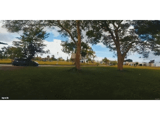

# Тренировка

## Базовые трюки
### Roll 180/360  

### Flip 180/360  

### Yaw Spin  

## На открытом пространстве

### Dive
- Взлетаем вверх, опускаем нос вниз и летим к земле. У земли плавно выходим.   
- Можно дайвить вдоль стены или столба.   
- Можно в процессе дайва крутиться по роллу, делая штопор.  
- Можно в колодец. Roll поможет держаться в центре

### Rubik's Cube
Pitch от себя на 180, 360 Roll, Pitch от себя 180  

### Back Rubik's Cube
Pitch на себя на 180 пока не увидим объект сзади, Roll 360, и Pitch на себя 180  

### Inverted Yaw Spin
Half-flip forward, 360 Yaw, Half-flip forward  
  

### Juicy Flick
Летим вперед. Резко Half-flip forward, плавно half-roll (P+180, R180)  

### Dolphin Dive
Stall, в верхней точке Pitch от себя 180, и дайвим

## Power Loop

### Вокруг горизонтальной балки  
  

### Упрощенный. Beginner Switch  
В верхней точке вверх ногами: Pitch от себя 180, дайв под преграду. Получается что как челноком гуляем.  
  

### Перед стеной/деревом  

### В верхней точке вверх ногами: Yaw360/Flip/Roll, заканчиваем маневр   

## У столба

### Orbit
- Орбита вокруг столба, в разные стороны.  
- Rewind: крутим орбиту, резко меняем направление орбиты на противоположное. [Пример тут](https://www.youtube.com/watch?v=Ov_zztsRmUk)  
- Орбита вокруг одного столба,переключаемся на орбиту вокруг другого столба.
### Cradle (Candle)
Качеля вокруг столба  
Залетаем слева, задираем нос, чтобы видеть столб, уходим вправо, возвращаемся и на оборот.  
  
После захода, можно перейти в Inverted Orbit.  

### Pole Dance 

### Trippy Spin (Inverted Orbit)
  

Можно крутить не вокруг столба, а ориентируясь на точке на потолке.
  
### Vanny Roll
Пролетаем мимо столба, Yaw 180 (смотрим назад), Roll +360, Yaw 180  

## У стены

### Stall (Backwards Dive)
Летим на стену/столб, перед ним нос на 90 и взлетаем. Pitch на себя, падаем спиной вниз и отлетаем назад  
  
Варианты в верхней точке:  
- отскок
- Roll 360
- Yaw 180 и дайв вниз
- Powerloop

### Wall Tap (Wall bonk)
Подлетаем к стене, контакт, выравниваемся  

### Wall Ride
Пролетаем вдоль стены и касаемся   

## У горизонтальной балки или моста

### Split-S
пролетаем НАД препятствием, Roll 180, плавно Pitch на себя, пролетаем ПОД препятствием.  

### Immelmann Turn
Полулуп на себя, Roll 180 и мы летим в другую сторону.  
  
Эффектно залететь на этаж выше.

### Matty Flip
Вроде как PowerLoop, но наоборот носом вниз.  
Летим над преградой, ЗА ней ныряем носом 360, плавно задом пролетаем ПОД преградой.  
  

Вариация без кувырка носом вперед: летим над преградой, за ней Pitch на себя, тормозим опускаясь вниз и летим спиной под преградой.   

### Half Matty (Reverse Split-S)
Перед проемом Roll 180, плавно Pitch от себя и задом пролетаем под преградой.

### Side Roll (Barrel Loop)
  
Варианты: 
- Просто качелька влево/вправо под балкой  
- боковая качелька без лупа

## У потолка

### Trippy Spin (Inverted Orbit)
  
Можно крутить не вокруг столба, а ориентируясь на точке на потолке.

### Ceiling bonk
Взлетаем к потолку, передним Roll 180 или Pitch 180, контакт об потолок.   
Далее можно Pitch назад/вперед и дайв

## Колодец
Залёт в колодец и вылет вправо, влево, назад.  
Залёт в колодец и вылет задом.  

