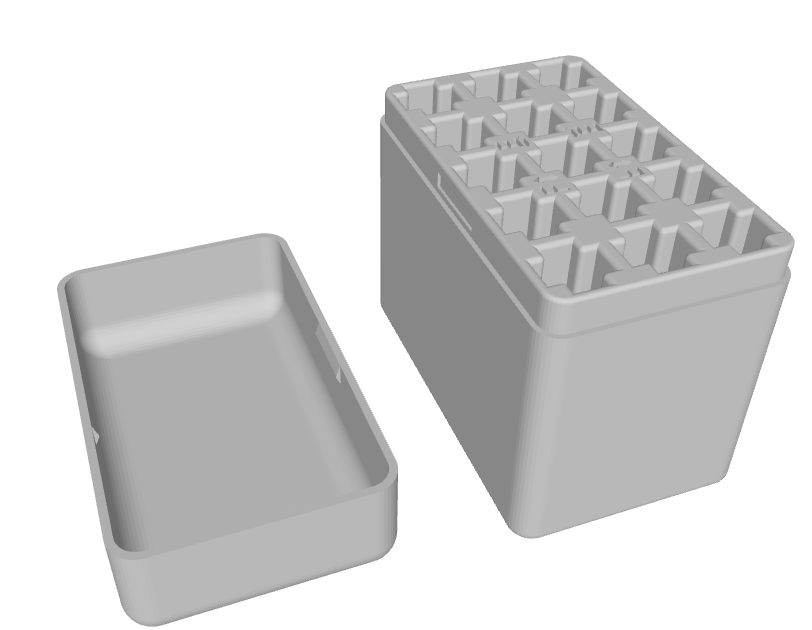
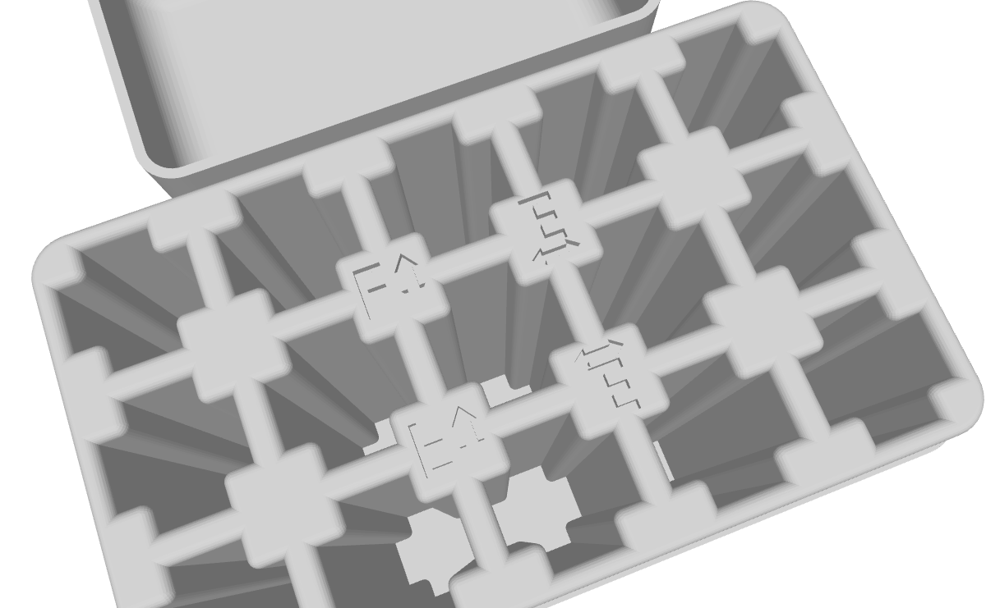

# Коробки для аккумуляторов

## Коробка для 15шт 1S 300mah  баток (3D-печать)

[Модель для печати(3mf)](300_battery_box - Copy.3mf)  автор `@vickas777`  
Печатать из PLA

Удобство коробки в том, что аккумуляторы можно вставлять в отсеки вертикально и горизонтально.  
Заряженные батки - вертикально, разряженные горизонтально

