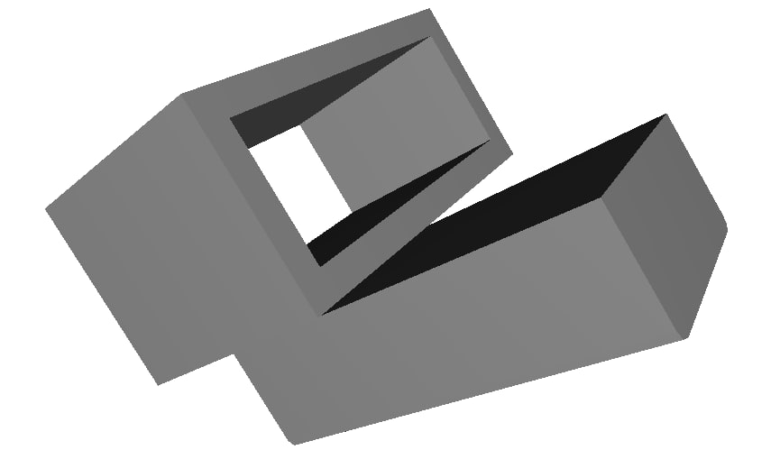

# 3D модели

## Сайты

[yeggi - 3D Printer Models Search Engine](http://yeggi.com) - 3D моlельный поисковик. Ищет на разных ресурсах.

[Thingiverse - Digital Designs for Physical Objects](http://thingiverse.com)

[3D models database _ Printables.com](http://printables.com)

[Сообщество владельцев 3D-принтеров — 3DToday](https://3dtoday.ru/3d-models) Есть раздел с 3D моделями

## Переходник баток на 1S вуп
Чтоб можно было к вупу цеплять батки по 450мах.  
Переходник вставляем в отсек на раме.  А в переходник вставляем батку бОльшего размера.
Ну... сама по себе идея вешать на вупчик толстую батку уже спорна. Но все же...

[BetaFPV_Air65_BatteryHolder.stl](BetaFPV_Air65_BatteryHolder.stl)  
[BetaFPV_Air65_BatteryHolder_NoScrew.stl](BetaFPV_Air65_BatteryHolder_NoScrew.stl)  

## Коробки (футляры)
Пользователь @srukak поделился своими разработками 3D моделей коробок для вупов, пультов и шлемов от @srukak  
[Профиль на thingiverse](https://www.thingiverse.com/wbkoks/designs#google_vignette)