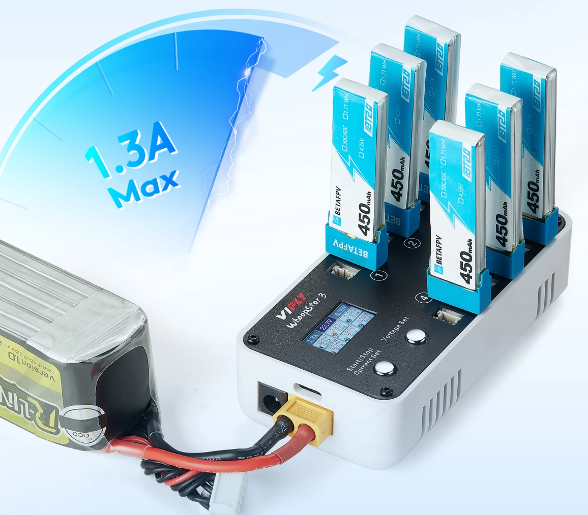
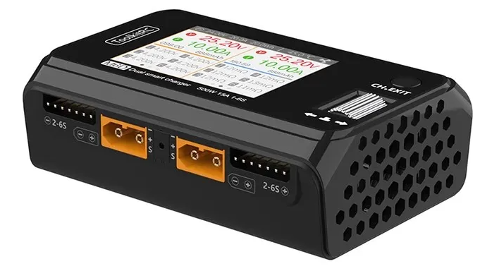
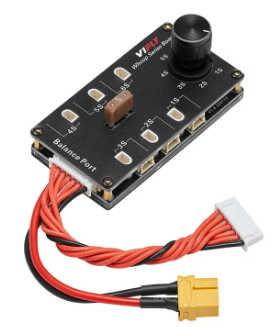

# Зарядные устройства

## Сравнительная таблица ЗУ от ToolkitRC


## Для аккумуляторов 1S с коннектором BT2.0 или PH2.0

### VIFLY WhoopStor v3
Одновременная зарядка шести 1S батарей зарядка с коннекторами BT2.0 или PH2.0.  

[На сайте производителя](https://viflydrone.com/products/vifly-whoopstor-6-ports-1s-battery-storage-charger-discharger?ref=i22jgskz)  
[На AliExpress.com](https://aliexpress.com/item/1005003791098261.html)

Позволяет:
- заряжать LiPO 4.20V / LiHV 4.35V
- Переводить в режим Storage  3.80V / 3.85V

  


**Внимание:** Для данной зарядки требуется докупить отдельный блок питания.  
Можно запитывать от USB Type-C блока питания, поддерживающего PD (Power Delivery) протокол.  
Так же можно запитывать от блока питания с выходом ХТ60. Вариант такого блока питания см. ниже.

### VIFLY WhoopStor v2
Имеет те же функции, но немного другой внешний вид. Снята с продажи.

[Обзор от Petrokey](https://www.youtube.com/watch?v=AE0Ll6I_feg)

**Внимание:** Для данной зарядки требуется докупить отдельный блок питания.  

Можно запитывать от блока питания для смартфона, подключенного к зарядке через USB Type-C разъем.  
Такой блок питания должен:    
- поддерживать протокол PD (Power Delivery) протокол, выдающий 12 вольт. 
- мощности блока питания от 25 ватт и выше достаточно для одновременной зарядки 6 аккумуляторов током 0.5А

Так же можно запитывать от блока питания с выходом ХТ60. Вариант такого блока питания см. ниже.

### GEPRC WooPower W63 1S Charger
[На сайте производителя](https://geprc.com/product/geprc-woopower-w63-1s-charger/)  


[GepRc WooPower - 1s зарядник с независимым управлением. YouTube: Петрокей](https://www.youtube.com/watch?v=gwvW7d6QmB0)

**Внимание:** Для данной зарядки требуется докупить отдельный блок питания.  

Можно запитывать от блока питания для смартфона, подключенного к зарядке через USB Type-C разъем.  
Такой блок питания должен:    
- поддерживать протокол PD (Power Delivery) протокол, выдающий 12 вольт. 
- мощности блока питания от 25 ватт и выше достаточно для одновременной зарядки 6 аккумуляторов током 0.5А

Так же можно запитывать от блока питания с выходом ХТ60. Вариант такого блока питания см. ниже.


### Плата параллельной зарядки  HobbyFly Charging Board
  
[1S LIPO Battery Balance Charging Board Plastic XT60 Input Balance Board 6 Port for PH2.0 BT2.0 / GNB27 1S FPV Tinywhoop](https://vi.aliexpress.com/item/1005005980558833.html)  

[1S Lipo LiHv Batteries Series Charging Board, Storage Charge and Discharge 1S LiPo for Standard Lipo Balance Charger](https://www.amazon.com/HOBBYFLY-Batteries-Discharge-Connector-Compatible/dp/B0BR2DNYZZ)

Опасность и особенности использования таких плат:  
Категорически не рекомендуется ставить одновременно на зарядку батареи разной степени "уставшести". Есть шанс возникновения пожара. 

Мнение одного из пользователей:
```
За 5 лет регулярного использования проблем не было ни разу,  
перед втыком сперва каждую проверяю на заряд через балансир, 
только из одной партии и с одинаковым сопротивлением. 
Говорю ж, халатность не простит)

Рядом всегда 2 металлические емкости, песок и огнетушитель. 
Только зарядка при визуальном контроле и периодически трогаю батки, 
чтобы контролировать температуру.
``` 

## Для аккумуляторов 2-4S с коннектором XT30 или XT60

### ToolkitRC Q4AC 
Одновременная зарядка **четырех** 1-4S батарей зарядка с коннектором XT60.  
[На сайте производителя](https://www.toolkitrc.com/q4ac)  
[На AliExpress.com](https://aliexpress.com/item/1005006086423161.html)

Позволяет:  
- заряжать LiPO 4.20V / LiHV 4.35V на ячейку  
- Переводить в режим Storage  3.80V / 3.85V на ячейку  
Имеется **встроенный** блок питания.  

  
  

Для заряда батарей с коннектором XT30 нужен переходник Female XT60 - Male XT30

## Для аккумуляторов 2-6S с коннектором XT30 или XT60

### ToolkitRC M7 
Одновременная зарядка **одной** 1-6S батареи с коннектором XT60.  
[На сайте производителя](https://toolkitrc.com/m7)  

Позволяет:  
- заряжать LiPO 4.20V / LiHV 4.35V на ячейку  
- Переводить в режим Storage  3.80V / 3.85V на ячейку  

  

**Внимание:** Для данной зарядки требуется докупить отдельный блок питания с выходом ХТ60. Вариант такого блока питания см. ниже.

### ToolkitRC M6D 
Одновременная зарядка **двух** 1-6S батарей с коннектором XT60.  
[На сайте производителя](https://www.toolkitrc.com/m6d)  
[На AliExpress.com](https://vi.aliexpress.com/item/1005006649168930.html)  
[На Ozon.ru](https://www.ozon.ru/product/toolkitrc-m6d-500w-15a-dvuhkanalnoe-intellektualnoe-zaryadnoe-ustroystvo-mini-dlya-batarey-lipo-1-6s-1470849116/)

Позволяет:  
- заряжать LiPO 4.20V / LiHV 4.35V на ячейку  
- Переводить в режим Storage  3.80V / 3.85V на ячейку  

  

Для заряда батарей с коннектором XT30 нужен переходник Female XT60 - Male XT30

**Внимание:** Для данной зарядки требуется докупить отдельный блок питания с выходом ХТ60. Вариант такого блока питания см. ниже.

### SkyRC Q200neo
Одновременная зарядка **четырех** 1-6S батарей с коннектором XT60.  
[На сайте производителя](https://www.skyrc.com/q200neo)  
[Ozon.ru](https://www.ozon.ru/product/q200neo-lipo-balansnoe-zaryadnoe-ustroystvo-razryadnoe-ustroystvo-ac200w-dc400w-dlya-1-6s-lipo-1549025824/)  
[Aliexpress.com](https://aliexpress.com/item/1005005986487800.html)  


Имеется **встроенный** блок питания.

### Ultra Power UP9
Одновременная зарядка **четырех** 1-6S батарей с коннектором XT60.  
[Aliexpress.com](https://vi.aliexpress.com/item/1005007422444413.html)  


### HOTA T6
[Aliexpress.com](https://vi.aliexpress.com/item/1005007681842725.html)  
  
[Обзор HOTA T6: мощная зарядка для FPV и не только. YouTube: DRONOFLY FPV](https://www.youtube.com/watch?v=d65bO4FVTdg)  

**Внимание:** Для данной зарядки требуется докупить отдельный блок питания с выходом ХТ60. Вариант такого блока питания см. ниже.

## Для аккумуляторов 2S с коннектором BT3.0
### VIFLY ToothStor - 4 Port 2S
[На сайте производителя](https://viflydrone.com/products/vifly-toothstor-4-port-2s-balance-charger-with-storage-mode?variant=48130105606440)
  
Также через него можно заряжать 2S аккумуляторы с балансировочным проводом XH2.54 (см. фото на сайте)

**Внимание:** Для данной зарядки требуется докупить отдельный блок питания.  
Можно запитывать от USB Type-C блока питания, поддерживающего PD (Power Delivery) протокол.  
Так же можно запитывать от блока питания с выходом ХТ60. Вариант такого блока питания см. ниже.

## Блок питания с выходом XT60
[ToolkitRC ADP100 AC/DC Adapter](https://www.toolkitrc.com/adp100/)  


## Альтернативное решение для XT30 XT60 2-6S
1. Любая однопортовая зарядку 2-6S

2. Плата параллельной зарядки (Charger Board) или "Multi 6 In 1 2S-6S Lipo Battery Parallel Charging Board With EC3/EC5/XT30/XT60/XT90/Tplug"  

Например:  
[VIFLY Whoop Series Board Balance Charging Board 6 Port 1S](https://aliexpress.com/item/1005007307774844.html)    


[Power-Genius 2 IN 1 PG Parallel Charging Board XT30 XT60](https://aliexpress.com/item/4000404668773.html)
  
[На AliExpress.ru](https://aliexpress.ru/item/4000946028794.html?sku_id=10000011449062681)  
[На AliExpress.com](https://aliexpress.com/item/4000946028794.html?sku_id=10000011449062681)

Еще вариант:  
[Lipo Battery Charging Board Parallel XT30 XT60 Plug 2‑6S Lithium Batteries for IMAX B6 Charger Electronic Components](https://vi.aliexpress.com/item/1005006729474501.html)  
  
[Плата для паралельної зарядки LiPo акумуляторів XT60/XT30: Огляд і Налаштування. YouTube: Фрукт FPV](https://www.youtube.com/watch?v=lJNPQyFgHeo)

## ЗУ IMax B6
Прототип всех современных зарядок. Всего один зарядный порт
  
[На AliExpress.com](https://vi.aliexpress.com/item/4000961827544.html)