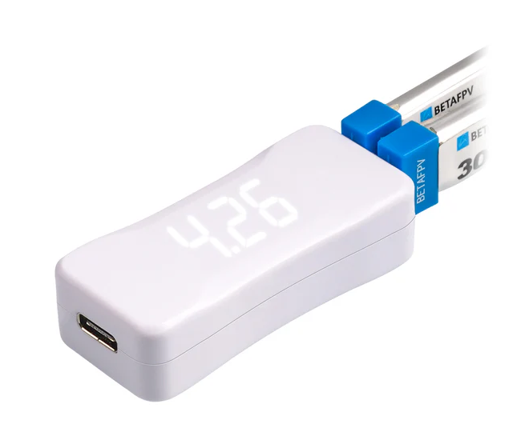
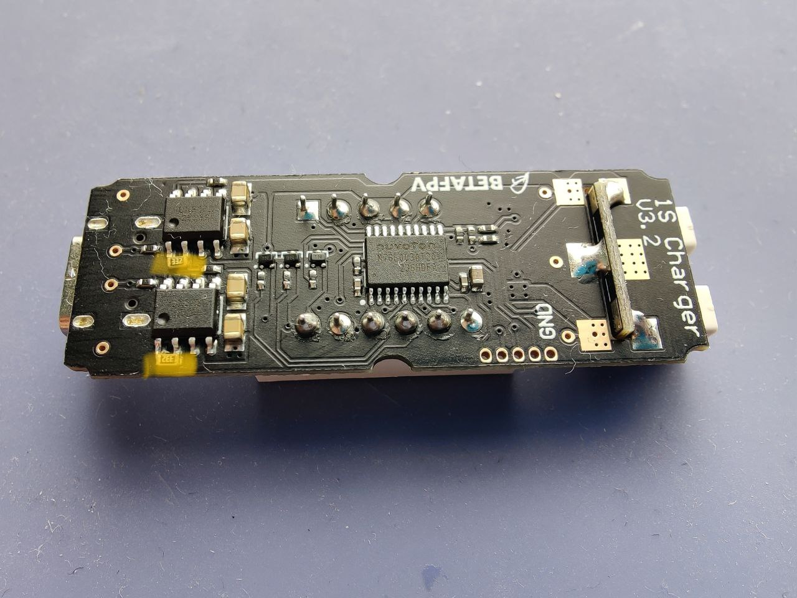
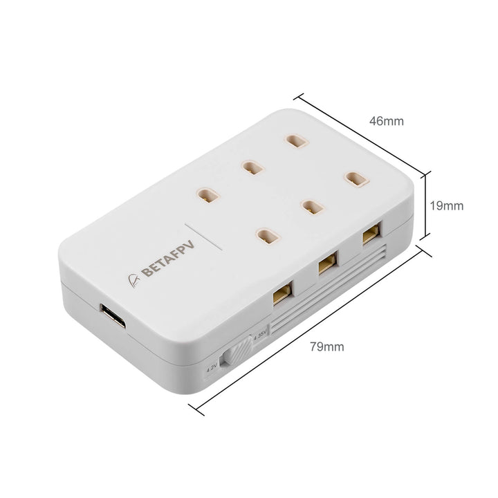

# Зарядные устройства от BETAFPV

## BT2.0 Battery Charger and Voltage Tester V2
[На сайте производителя](https://betafpv.com/products/bt2-0-battery-charger-and-voltage-tester-v2)  
  

**Внимание!!!  
С завода выставлен ток в 1A что пагубно влияет на долговечность аккумуляторов.**  
Как вариант, можно запитать зарядку от компа, либо от блока питания, не способного выдать ток более чем `500-600` миллиампер. И заряжайть при этом одновременно две батареи. Это уменьшит ток заряда до такого, что не будет убивать аккумулятор.

### Исправление зарядного устройства
Чтобы штатная зарядка цетусов/метеоров не убивала ваши батки током 1А, нужно заменить эти два резистора (отмечены желтым). Если поставить 2.4кОм, ток будет 500мА. Я поставил 3.3кОм, у меня ток 370мА - достаточно для зарядки GNB 380mah.

By Pavel Gavrilov

## BETAFPV 6 Ports 1S Battery Charger
[На сайте производителя](https://betafpv.com/products/bt2-0-ph2-0-1s-lipo-charger-adapter)  

**Внимание!!!  
С завода выставлен ток в 1A что пагубно влияет на долговечность аккумуляторов.**

