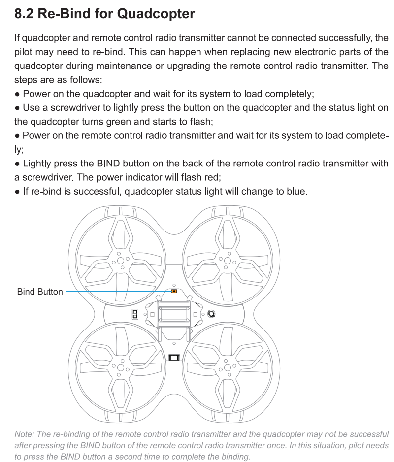

# Bind устройств с протоколом FrSky
Работа по протоколу FrSky позволяет связывать дрон и аппаратуру по нажатию кнопки. То есть сначала на дроне (приемнике) нужно нажать кнопку Bind. А потом нажать кнопку Bind на пульте. Таким образом один дрон может быть связан только с одним пультом.  

Выдержка из инструкции для `Cetus X FPV kit` и пультом `LiteRadio 3` на протоколе `FrSky`:  
