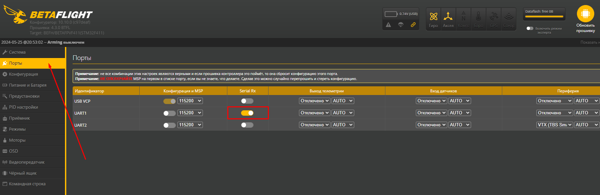
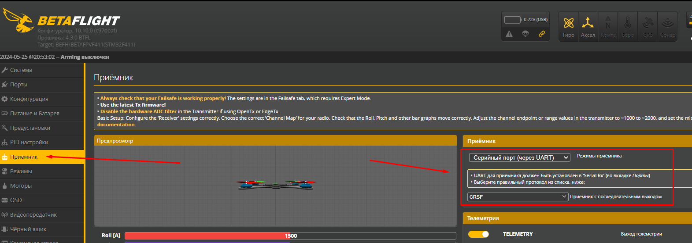
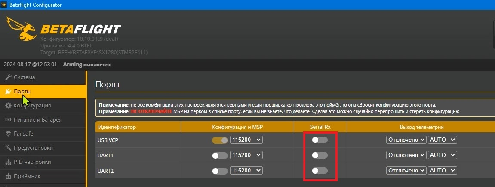

# Тип подключения ELRS приемника к полетнику
ELRS приемник может быть подключен к полетному контроллеру двумя способами: через **UART** порт или **SPI**. От этого зависит, каким образом биндить дрон.  
Проверить способ подключения можно подключив дрон к Betaflight:  

## Приемник подключен по UART:
На вкладке Порты на одном из портов включен `Serial Rx ` 
  
На вкладке Приемник в панели Приемник указан `Серийный порт (через UART)` и протокол `CRSF` (CrossFire)
  

## Приемник подключен по SPI
На вкладке Порты ни на одном из портов НЕ включен `Serial Rx`  
  
На вкладке Приемник в панели Приемник указан `SPI Rx` и ниже `EXPRESSLRS ` 
  
