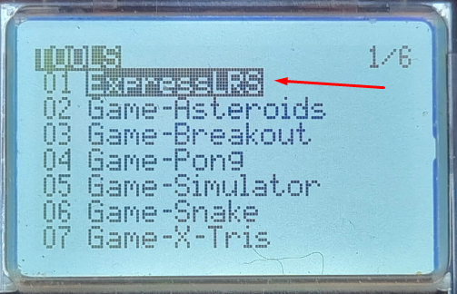
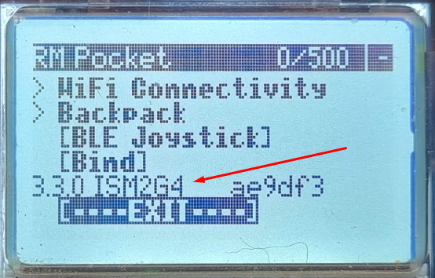
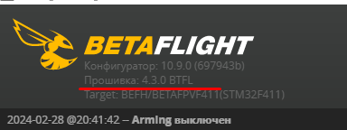

# Проверка версии ELRS

## Передатчик в аппаратуре

### Аппаратуре на EdgeTX
На пульте должен быть установлен Lua-скрипт `ExpressLRS`.  
Нажимаем кнопку `SYS`.  
Выбираем пункт `ExpressLRS`.  
  
Листаем скрипт в самый низ и смотрим версию.  

### BETAFPV LiteRadio
Согласно официальной [статье на сайте BETAFPV](https://support.betafpv.com/hc/en-us/articles/22404447195673-How-to-Update-ELRS-V2-to-ELRS-V3): начиная **с ноября 2023г** установлена прошивка 3.0.0.  
Ссылки на прошивки для ELRS 3.0.0 находятся в этой же статье.  
Про даунгрейт прошивки пульта до версии 2.0.0 можно посмотреть видео от Петра [Проблема с Betafpv Aquila. LiteRadio2se не работает с компом и симулятором](https://www.youtube.com/watch?v=1lq6xgl1Efk).  

## Дрон/приемник

### Подключен по UART
об этом можно прочитать в статье [Ввод Bind фразы на дроне с приемником на UART](44_Bind_fraza_drona_s_UART.md)  

### Подключен по SPI
Proshivka ELSR в таких полетниках является частью прошивки полетника Betaflight.  
Betaflight `4.3.x` идет с ELRS `2.x.x`  
Betaflight `4.4.x` идет с ELRS `3.x.x`  
Версию прошивки Betaflight можно узнать, подключив дрон к программе Betaflight Configurator.  

