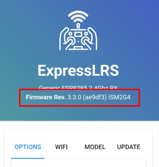

# Ввод Bind фразы на дроне с приемником ELRS на UART
!!!! Приведенная операция занимает время, поэтому нужно позаботиться, чтобы **не спалить видеопередатчик**.  
Можно включить вентилятор и направить его на дрон, сделав обдув.  
Еще можно перевести видеопередатчик в `PIT mode` в BetaFlight:   
 - Подключаем дрон.  
 - Заходим в раздел Видеопередатчик.  
 - В выпадающем списке мощности вместо значения мощности выбираем `PIT`.  
 - Нажимаем `Сохранить`.  

Теперь сам процесс:  
 - Подключаем к дрону батарею или USB кабелем к компьютеру.  
 - Ждем минуту, и светодиод на приемнике начинает мелко моргать. Это он перешел в режим WiFi.  
 - Ищем  WiFi сеть с именем  `ExpressLRS RX` и коннектимся с паролем `expresslrs`  
 - Идем браузером по адресу http://10.0.0.1  
 - На этой странице можно посмотреть версию прошивки:  
  
 - Вводим значение в поле `Binding Phrase`  
 - Нажимаем `Save`  

[Видео процесса на примере Meteor65pro](Rx_SetBindPhraseOverWiFi.mp4)

## Не видна WiFi точка приемника или передатчика.  
В ELRS на странице WiFi есть настройка, которая вместо поднятия своей WiFi точки доступа подсоединяется к домашнему WiFi и получил другой IP-адрес. Кто-то установил эту настройку ЗАРАНЕЕ.  
Нужно перепрошить приемник/передатчик или если удалось зайти через WiFi, изменить на закладке WiFi.  
  
