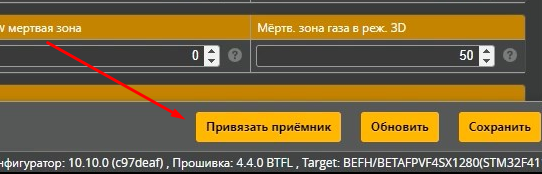

# Перевод дрона в режим Bind 
Можно использовать один из вариантов:  
 - В Betaflight на вкладке Приемник внизу нажать кнопку `Привязать приемник`  
    
 - тонким предметом нажать кнопку на полетнике (см. инструкцию к полетнику или приемнику)

Еще варианты [указаны в этой статье](https://support.betafpv.com/hc/en-us/articles/4403742839705-How-to-Bind-with-F4-Betaflight-FC-SPI-ExpressLRS-Receiver).

Если дрон перешел в режим Bind, светодиод на приемнике (полетнике) будет быстро мигать.  
