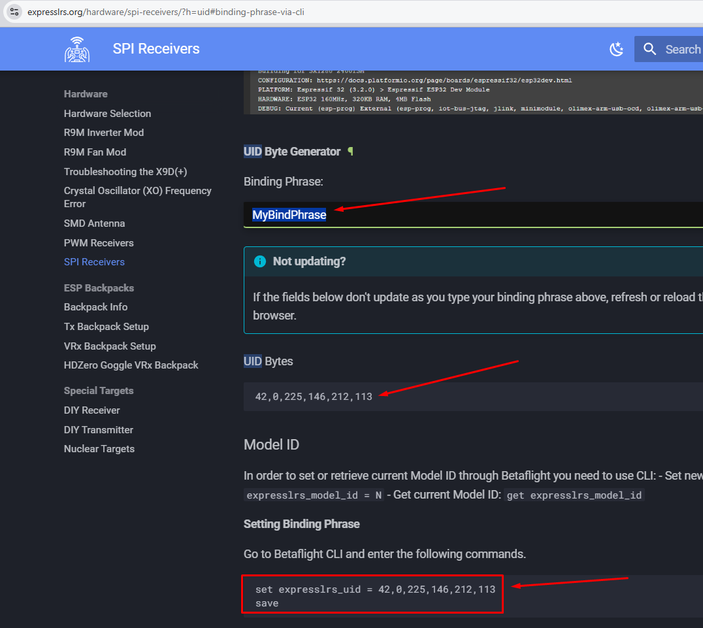

# Ввод Bind фразы на дроне с приемником ELRS на SPI
В Betaflight Configurator идем на вкладку Приемник и вводим Bind фразу в поле `Binding фраза`  
  

**Внимание!** На прошивках Betaflight `4.3.x` с ELRS `2.x.x` поля для ввода фразы может не быть и тогда бинд фразу нужно вводить через CLI.  
Сначала нужно превратить Bind фразу в коды и потом ввести ее.  
Для этого идем на страницу [UID Byte Generator сайта https://www.expresslrs.org](https://www.expresslrs.org/hardware/spi-receivers/?h=uid#uid-byte-generator).  
Там в поле Binding Phrase вводим свое слово. Ниже появятся нужные коды и команда, которую надо ввести в CLI.  

Пример можно посмотреть здесь:  
[Set Binding Phrase on Express LRS ELRS SPI receivers Happymodel Mobula6 Mobula7 : Betaflight CLI. YouTube: ay Dronez](https://www.youtube.com/watch?v=wPseYgx0SDM)
