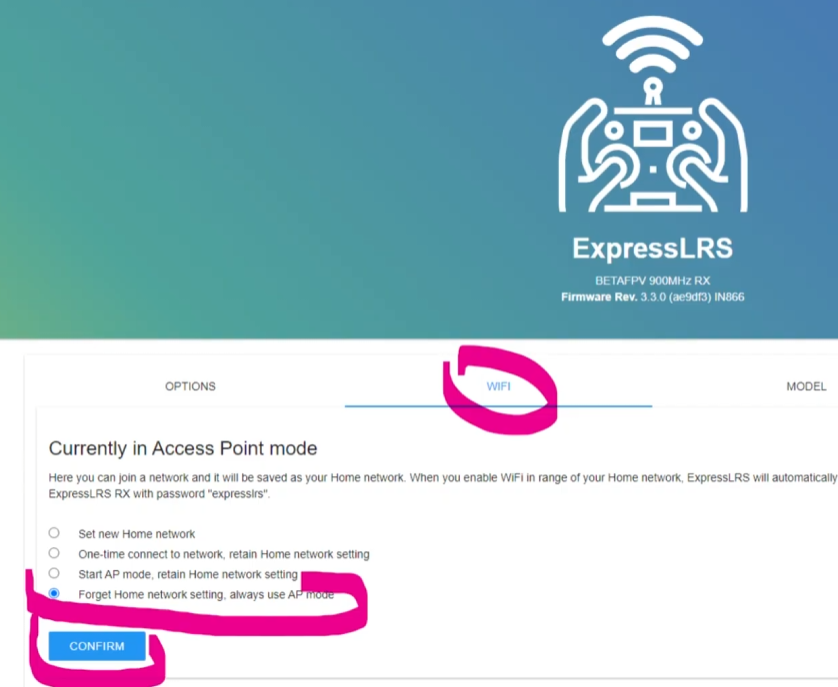

# Указание Bind фразы на аппаратуре с EdgeTX
- Нажимаем `SYS`  
- Заходим в `01 ExpressLRS`.  
Если на этом этапе пульт как бы "зависает", значит в модели не выбран передатчик (внутренний или внешний). О решении этой проблемы можно [прочитать здесь](./../10_RC/29_Пульт_зависает.md)  
- Заходим в `WiFi connectivity`  
- Заходим в `Enable WiFi`  
- На телефоне или ноутбуке ищем WiFi точку с именем `ExpressLRS TX`   
- Коннектимся с паролем `expresslrs`  
- Идем по адресу http://10.0.0.1  
- Прописываем значение в поле `Binding Phrase`  
- Нажимаем `Save`  

[Видео процесса на примере RadioMaster Pocket](Tx_SetBindPhraseOverWiFi.mp4)

## Не видна WiFi точка приемника или передатчика.  
В ELRS на странице WiFi есть настройка, которая вместо поднятия своей WiFi точки доступа подсоединяется к домашнему WiFi и получил другой IP-адрес. Кто-то установил эту настройку ЗАРАНЕЕ.  
Нужно перепрошить приемник/передатчик или если удалось зайти через WiFi, изменить на закладке WiFi.  
  