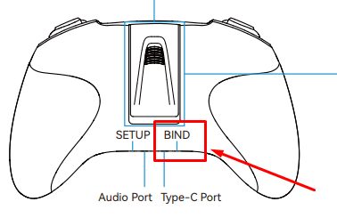

# Режим Bind в аппаратуре BETAFPV LiteRadio 3
- Включаем пульт и дожидаемся пока он загрузится. Синий светодиод должен непрерывно гореть.  
- Нажимаем `Bind` кнопку на обратной стороне пульта. Должен начать мигать красный светодиод.  
  
- Выход из режима бинд произойдет через 5 секунд. и синий светодиод начнет опять гореть непрерывно.  
