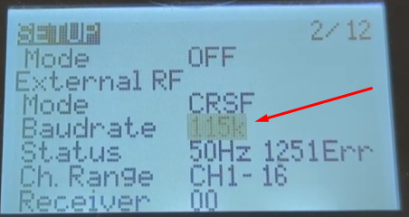
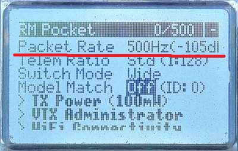
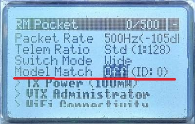

# Проблемы при бинде

## Приемник не переходит в режим Bind
При тройной подаче питания приемник не переходит в режим bind. Такое происходит на последних версиях ELRS, если у дрона уже установлена Bind фраза. Нужно сделать сброс настроек приемника.  

## Не поднимается точка WiFi приемника или передатчика

- В ELRS на странице WiFi есть настройка, которая вместо поднятия своей WiFi точки доступа подсоединяется к домашнему WiFi и получил другой IP-адрес. Кто-то установил эту настройку ЗАРАНЕЕ.  
Нужно перепрошить приемник/передатчик или если удалось зайти через WiFi, изменить на закладке WiFi.  
  

- На некоторых приемниках на прошивке ELRS 3.5.2 не поднимается точка WiFi. Надо перепрошить на 3.6.0

## Почему не происходит Bind
- Разные версии ELRS на приемнике и передатчике. 2.x и 3.x   

- Если приемник и передатчик имеют разные частоты, например 2.4ГГц или 915МГц, дрон и пульт не свяжутся.  

- Приемник и передатчик на разных прошивках (стандартная и модифицированная.  

- Разные bind фразы. Нужно зайти в приемник и передатчик и сверить значения UID.  

- Не совпадают регионы (regulatory domain), например на приемнике FCC915, а на передатчике AU915.  
.  

- Неправильный или несовпадающий Baud rate.  
В приемнике настраивается через WiFi. На первой вкладке, в поле UART baud  
В передатчике в настройках модели пульта.  
  

- Включена динамическая мощность. Если режим ARM дрона назначен не на AUX1 (5-й канал) и включена динамическая мощность передатчика, дрон будет терять с пультом отлетев недалеко. Когда ARM дрона назначен на AUX1, то при арме пульт автоматически поднимает мощность. Если другой канал, то дрон взлетает, а пульт не знает об арме и мощность не поднимает. И тогда дрон теряет связь отлетев недалеко.  
Можно выключить динамическую мощность в пульте. Запускаем ELRS Lua script. Заходим в пункт `TX Power` и выставляем в `Off` строку `Dynamic`. Подробности в статье [Dynamic Transmit Power](https://www.expresslrs.org/software/dynamic-transmit-power/)  

- также смотри раздел `Бинд есть, но в Betaflight ничего не шевелится`

## После бинда дрон перестал моргать, но столбики не появились
На пульте завышенная частота Packet Rate. В частности для приемников на SPI Packet rate должен быть не выше 500Hz.  

Посмотреть в пульте на EdgeTX можно после запуска ELRS Lua script в поле `Packet Rate`
  
В LiteRadio 2/3 пульте можно посмотреть через BETAFPV Configurator. Поле `Pkt Rate`.

Подробнее можно почитать [в этой статье](./../10_Аппаратура(Пульты)/10_Модели/10_Radiomaster/01_Pocket/12_Bind_с_Meteor85.md)  

## Бинд есть, но в Betaflight ничего не шевелится
- Проверяем что приемник (если он внешний) соединен с полетником и обязательно tx-rx/rx-tx,  

- В Betaflight должен быть правильно указан порт, к которому подключен приемник  

- В Betaflight должен быть правильно указан протокол `CRSF` на странице приемника. В этом случае на закладке приемника вообще не будет столбиков с каналами. Также в прошивку может быть не включен сам протокол `CRSF`.  
Подробнее в этом видео:  
[Receiver Tab Channel Bars Are Blank! Betaflight Mixer Mode Problem! Here's The Fix! - FPV Questions. YouTube: Joshua Bardwell Livestream Clips](https://www.youtube.com/watch?v=m8J4SILuNFI)  

- Если аппаратура на EdgeTX, проверяем отключен ли `Model Match`, зайдя в ExpressLRS. Отключаем (поможет сделать ON потом OFF с сохранением).  
  

## Бинд происходит но с большой задержкой до полуминуты
Не совпадает Packet Rate значение на пульте и в приемнике. Таким образом приемник начинает перебирать разные значения packet rate пока не зацепится к пульту. Это и занимает время.  

В пульте с прошивкой Edge TX значение Packet Rate указывается в ExpressLRS LUA скрипте.  
В приемнике Packet rate (INIT_RATE) можно было установить через Web страницу, но потом такую возможность убрали. Есть такой способ установить Packet Rate в приемнике:  
- Дождаться пока произойдет Bind  
- Зайти в ExpressLRS LUA скрипт и выбрать какой нибудь другой Packet Rate. После этого вернуть старое значение. При этой операции пульт посылает значение в приемник и там оно сохраняется.

Подробнее можно посмотреть в видео [Faster ExpressLRS connection with INIT_RATE. YouTube: Joshua Bardwell](https://www.youtube.com/watch?v=5O_yVANwYys)

## Видео
[Чому не працює ExpressLRS? 13 типових випадків #fpv #українською. YouTube: FPV питаннячка (укр.)](https://www.youtube.com/watch?v=ffJMgkCRWZk)

