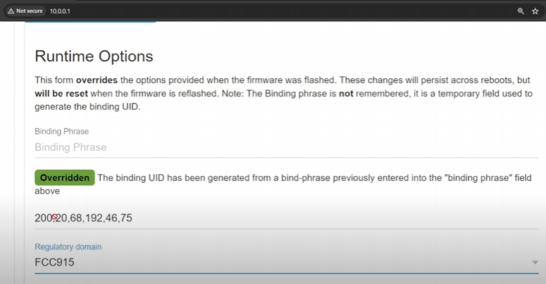
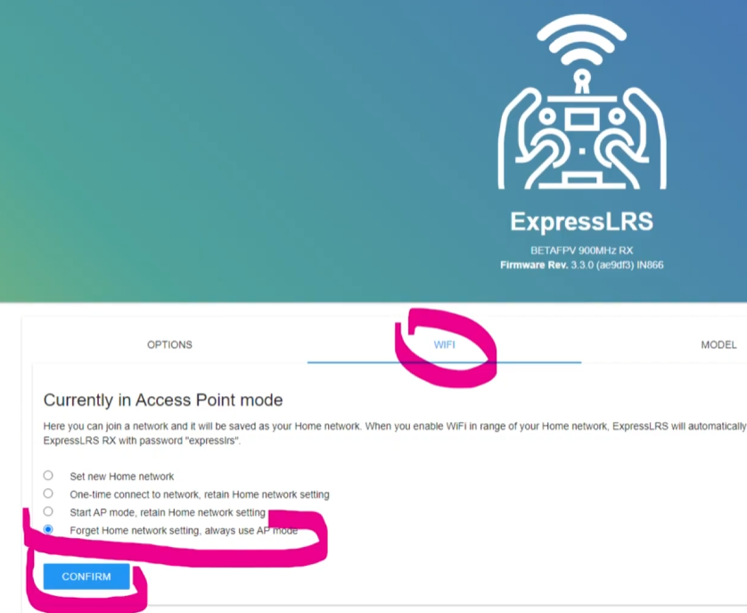
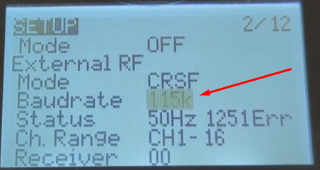

# Проблемы при бинде

## После бинда дрон перестал моргать, но столбики не появились
На пульте завышенная частота Packet Rate. Должно быть не выше 500.  
  
Подробнее можно почитать [в этой статье](./../10_Аппаратура(Пульты)/10_Модели/10_Radiomaster/01_Pocket/12_Bind_с_Meteor85.md)  

## Бинд есть, но в Betaflight ничего не шевелится:
- Проверяем что приемник (если он внешний) соединен с полетником и обязательно tx-rx/rx-tx,  
- В Betaflight должен быть правильно указан порт, к которому подключен приемник  
- В Betaflight должен быть правильно указан протокол `CRSF` на странице приемника. В этом случае на закладке приемника вообще не будет столбиков с каналами. Также в прошивку может быть не включен сам протокол `CRSF`.  
Подробнее в этом видео:  
[Receiver Tab Channel Bars Are Blank! Betaflight Mixer Mode Problem! Here's The Fix! - FPV Questions. YouTube: Joshua Bardwell Livestream Clips](https://www.youtube.com/watch?v=m8J4SILuNFI)  
- Если аппаратура на EdgeTX, проверяем отключен ли `Model Match`, зайдя в ExpressLRS. Отключаем (поможет сделать ON потом OFF с сохранением).  
  

## 

## Почему не работает ELRS
[Чому не працює ExpressLRS? 13 типових випадків #fpv #українською. YouTube: FPV питаннячка (укр.)](https://www.youtube.com/watch?v=ffJMgkCRWZk)

1. Неправильно припаяны контакты между полетником и приемником. Должно быть tx к rx, а rx к tx,  
2. Разные bind фразы. Нужно зайти в приемник и передатчик и сверить значения UID.  
3. При тройной подаче питания приемник не переходит в режим bind. Такое происходит на последних версиях ELRS, если у дрона уже установлена Bind фраза. Нужно сделать сброс настроек приемника.  
4. Не совпадают регионы (regulatory domain), например на приемнике FCC915, а на передатчике AU915.  
.  
5. В Betaflight должен быть правильно указан протокол `CRSF` на странице приемника. В этом случае на закладке приемника вообще не будет столбиков с каналами. Также в прошивку может быть не включен сам протокол `CRSF`. Также CRSF должен стоять в пульте, в модели на странице SETUP.   
6. Включен `Model Match`. Проверить в приемнике, зайдя через WiFi. Убрать галочку `Model Match`.  
7. Разные версии ELRS на приемнике и передатчике. 2.x и 3.x   
8. Не видна WiFi точка приемника или передатчика. В ELRS на странице WiFi есть настройка, которая вместо поднятия своей WiFi точки доступа подсоединяется к домашнему WiFi и получил другой IP-адрес. Кто-то установил эту настройку ЗАРАНЕЕ.  
Нужно перепрошить приемник/передатчик или если удалось зайти через WiFi, изменить на закладке WiFi.  
  
9. Приемник и передатчик на разных прошивках (стандартная и модифицированная.  
10. Неправильный или несовпадающий Baud rate.  
В приемнике настраивается через WiFi. На первой вкладке, в поле UART baud  
В передатчике в настройках модели пульта.  
  
11. Включена динамическая мощность. Если режим ARM дрона назначен не на AUX1 (5-й канал) и включена динамическая мощность передатчика, дрон будет терять с пультом отлетев недалеко. Когда ARM дрона назначен на AUX1, то при арме пульт автоматически поднимает мощность. Если другой канал, то дрон взлетает, а пульт не знает об арме и мощность не поднимает. И тогда дрон теряет связь отлетев недалеко.  
Можно выключить динамическую мощность в пульте. Запускаем ELRS Lua script. Заходим в пункт `TX Power` и выставляем в `Off` строку `Dynamic`. Подробности в статье [Dynamic Transmit Power](https://www.expresslrs.org/software/dynamic-transmit-power/)  
12. Если приемник и передатчик имеют разные частоты, например 2.4ГГц или 915МГц, дрон и пульт не свяжутся.  
13. Неподдерживаемая частота пакетов `Packet Rate` у приемника. В пульте, после запуска ELRS Lua script в `Packet Rate` стоит значение больше 500Hz. В вупах частота 500 и ниже.  

