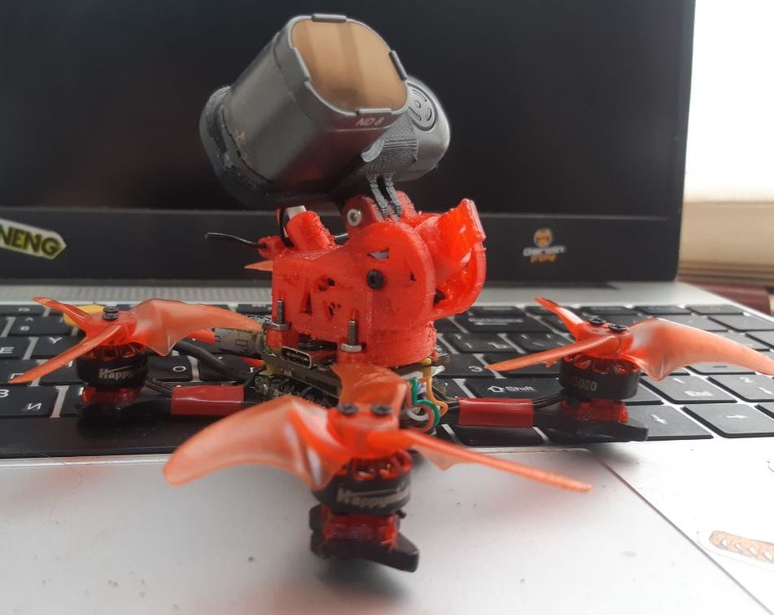

# Тема постоянных споров: с чего начинать новичку, что купить или собрать

RTF набор или самосбор (кратко). Подготовлено @V8787
## Ready To Fly kit (RTF) наборы 
Плюсы:  
- летает из коробки  
- перекрывает большинство потребностей  
- востребован на вторичном рынке. Наигравшись можно продать  
Минусы:  
- посредственного качества  
- Зачастую ограниченный функционал

## Самостоятельная подборка FPV комплекта
Отдельно покупается аппаратура(пульт), шлем, дрон, батареи, зарядное устройство к ним, зип.  
Для работы потребуется комп или ноут, отвертки и паяльник.  
Плюсы:  
- собираешь набор под свои задачи  
- по деньгам выходит не сильно дороже готового набора (на начальном этапе)  

Минусы:  
- требует времени и погружения в тему с головой  
- Не исключены танцы с бубном

Как выбрать:  
1. Есть желание летать, но нет желания разбираться что там как коннектить и связывать - RTF набор.  
2. Есть желание летать, но страшно, вдруг не пойдет. Деньги то не малые - RTF набор или просто аппаратура, без дрона.  
3. Есть желание летать, готов тратить часы и дни чтобы познать все тонкости и нюансы - только самосбор. 

### Какой дрон выбрать для начала

1. Определяемся **где будем летать**: дом или улица (не забываем про запреты и ограничения в своем регионе проживания).  
**Если дом** - смотрим на вупы 6/65 и 7/75. На больших размерах в квартире будет тесно, равно как и с открытыми пропеллерами. Безопасность на первом месте!  
**Если улица** - из вупов 7/75 и 8/85 и далее все остальное. Так же не забываем про безопасность и адекватно оцениваем свой скилл!!  

Типичный вопрос: **а почему нет универсального дрона и для дома и для улицы?**   
Во-первых есть разница в масштабах территории для полетов.  
Летая по квартире ты имеешь условно 10-30 метров для полета, и метра 3 высоты до потолка.  
Поэтому скорость и мощность у дрона должна быть такой, чтобы ты не пролетал эти метры за мгновенье. А все же помедленнее.  
На улице же другой масштаб. На площади в сотни метров а то и километры, и всем небом над головой квартирный дрон будет ощущаться как черепаха.  
Поэтому уличные дроны гоняют на других скоростях. Даже 2S вуп разгоняется до 60 км/ч. Ему просто тесно в квартире. А уж 4S дроны и до сотни а то и полторы разгоняются

Второй момент - вес. Легкий квартирный вуп практически не имеет инерции. Его легко затормозить в квартире. Зато его будет сдувать на улице от легкого ветра.  
А уличный дрон имеет большую инерцию и ее тяжелее и дольше гасить. Но и ветра он меньше боится.

2. Определяемся **с задачами**: просто научиться летать и набираться опыта, фристайл, гонки, синематик (сьемка видео), Лонг рейндж (полеты на дальние расстояния).  
Для каждой задачи свой дрон. **Универсального дрона нет**.

Обучаться лучше на дронах класса мобула/метеор. Они относительно дешевые, ремонтопригодные, с закрытыми пропами, поэтому безопасные (!!!), самое главное - трудно убиваемые. Реально крепкие и надежные. Хотя есть умельцы, мда…. перекрывают основные желания и хотелки.

Дрон под задачи лучше собирать имея навык пилотирования. Это могут быть не сколько дорогие, сколько социально опасные аппараты. Пол кило массы с четырьмя открытыми пропеллерами как ножами на скорости 100-150 кмч - это не шутка. Новичку, тем более без опыта, я бы такое в руки не дал даже на закрытой от посторонних территории. 

### Симулятор. 
Начать лучше с него. Независимо от того какой путь выбран. 
Перед первым запуском настоятельно рекомендую потратить на симулятор хотя бы часов 10. В идеале - 30-50. Но тут все индивидуально.  
Основная задача - обеспечить контролируемый полет: взлет посадка, пролет по прямой, удержание высоты, повороты и развороты. Без этих базовых элементов я бы реальный дрон даже не пробовал запускать. Иначе полеты закончатся очень быстро. Настолько быстро, что будет даже обидно.  

Конечно, не у всех есть комп и возможность. Просто нужно понимать, что в симуляторе (компьютерной игре) можно разбить хоть миллион дронов. А в реальной жизни каждый краш может стать последним.  
Разумно ли потратить 200 баксов на набор, полетать 30 секунд, и пойти покупать новый дрон за 100 долларов… вопрос риторический. 

Соответственно покупая RTF набор - цепляем аппу к компу и учимся летать, пока дрон лежит на полке.

Идя по пути самосбора - первое что нужно купить - аппаратуру (желательно правильную, т.е именно ту, с которой пойдешь дальше по жизни, хотя бы первые полгода-год). Далее летаешь в симуляторе, обучаешься, и параллельно покупаешь все остальное.

И именно летая в симуляторе, ты для себя начнешь понимать, как ты хочешь летать, что тебе интересно, и в каком направлении ты хочешь развиваться. Поэтому первый дрон уже будет осознанным выбором, под задачи и цели, а значит принесет больше восторга и удовольствия. 

Это разумный подход, проверенный сотнями и тысячами людей. Но совсем не обязательный.

### Варианты FPV комплектов

Начальный сетап на DJI цифре:

[Как собрать FPV комплект - пошаговая инструкция. Сравнение с Cetus X kit. YouTube: Петрокей](https://www.youtube.com/watch?v=G06lMb3Cs3A)

#### Мнение №1
 - аппаратура **Radiomaster Pocket ELRS FCC** версию,  
 - шлем можно и **BETAFPV VR03** взять как самый дешёвый, но можно и **Eachine ev800dm**, либо **Skyzone cobra** (тут по бюджету).  
 - дрон на аналоге(в описании написано, да и как правило большинство недорогих дронов на нем), с протоколом связи ELRS,  
 - батарейки смотри по дрону, его разъёмам и фото этих разъемов(может быть например 2s на одном разъёме а30-это надо брать 2s аккум с этим разьемом, может и на двух по 1s, например как на цетусе 2s на bt2 разьеме-подключаются две 1s батарейки.  
 
 Ну и по дронам нужно понимать, где летать собрался:  
 Если на улице - от двух дюймов и выше бери. Можешь **HGLRC Draknight**  взять (сам дрон, но не RTF набор).  
 Для дома **BETAFPV Air65/Meteor65** или **BETAFPV Air75/Meteor75**. Можно **Happymodel  Mobula 6** или **Happymodel Mobula 7**.
 
В общей сложности, дешевле выходит собирать комплект, чем сразу брать готовый набор. А учитывая, что все в наборе придется менять или улучшать ставя недешевые плюшки - лучше реально сначала разобраться и собрать, чем потом карманы выскребать.

#### Мнение №2
Дрон: BETAFPV Meteor75 pro или Air75 (на ELRS)  
Аппа: RadioMaster Pocket ELRS, M2, FCC   
Шлем: Eachine ev800dm или BETAFPV VR03  
Зарядка для баток: VIFLY Whoopstor V3  
Батки: GNB 550 (красные на бт2.0) или Tattu 550 на коннекторе BT2.0 (также подойдут 450).  

#### Мнение пользователя @V8787
Пульт (аппаратура) общается с дроном на протоколе ELRS 2,4ГГц (или 915, или 868, или кроссфаер, или вообще не дай бог frsky).  
Нужно определиться со стандартом и под него все собирать.

Если ты сейчас соберешь комплект на ELRS 2,4 - ты сможешь к нему подцепить любое устройство поддерживающее данный формат связи.

ELRS 2.4 - это популярный и распространенный формат связи для любительского дрона.
Под него много железа и всегда можно что то купить, как новое так и б/у.

Что касается аналогового видео - оно вещает на частоте 5.8 ГГц.   
Поэтому для аналоговой видеосистемы подходит абсолютно любой шлем или очки, способные принимать картинку на частотах от 5.6 до 5.9 ГГц (там 40 каналов)

Ты можешь придти где летают другие люди, включить шлем, просканировать эфир и поймать чей то сигнал, посмотреть как они летают.
Это как телевизор.

Поэтому шлем не нужно как-то биндить, привязывать, коннектить… просто включай и смотри.

А если ты захочешь дрон с цифровой видеосистемой - тут сложнее. Под каждую видеосистему свои очки. Есть не то чтобы универсальные, но те которые подходят к разным видеосистемам. А есть такие, которые работали только со своим железом и все. Поэтому когда для себя решишь «хочу цифру» - нужно решить какую, и какие очки под нее покупать отдельно.

#### Мнение пользователя Эдуард (turboeggs)
Я тоже начинал с Cetus Pro, после нескольких месяцев полетов взял:  
- шлем Skyzone Cobra X V4  
- аппу Radiomaster Zorro (Она хорошая, но выбирал из того, что было в наличии, потому что очень хотелось. Сейчас бы взял TX12 или TX16, т.к. мне удобнее держать стики “щипком”. Для управления большими пальцами Zorro идеальна)  
 - дрон Meteor75 2022 (но версия Pro лучше)  

Всё на ELRS, аналог

Метеор после цетуса ОЧЕНЬ приятно управляется и на нём лучше угол обзора (по крайней мере по ощущениям). И в целом считаю его намного более удачным вариантом.

Потом, имея этот шлем и аппу спокойно можно брать любой дрон и чувствовать себя с ним комфортно. У меня есть дача, поэтому для полетов там взял сначала Cinerace20, потом Cinelog35. Если бы мог летать только дома - ограничился бы метеором, может быть посмотрел бы ещё в сторону Air65 (для пущего комфорта дома) или Meteor85 (для понимания, а каков он этот 2s и насколько он подвижнее)

## Варианты RTF наборов
  
[Cetus X FPV Kit](https://betafpv.com/collections/all-drone/products/cetus-x-fpv-kit)    
/01_Модели/Betafpv/10_Cetus_X/CetusXFpvKit.png)   
Почитать [можно здесь](./00_Дроны(Квадрокоптеры)/01_Модели/Betafpv/10_Cetus_X/10_Общее.md)

[GEPRC TinyGO 4K FPV Whoop RTF](https://geprc.com/product/geprc-tinygo-4k-fpv-whoop-rtf/)  
  
[Amazing FPV Drone all in one Kit for Beginners - GEPRC TinyGo Review. YouTube: CAPTAIN DRONE
](https://www.youtube.com/watch?v=UMm_j2-KR_I)

[Sub250 Whoopfly16 RTF Combo](https://sub250.com/collections/new-arrival/products/whoopfly16-rtf-combo)

## Готовые дроны

### Для помещений (с дактами)
[BETAFPV Meteor65 Pro](./00_Дроны(Квадрокоптеры)/01_Модели/Betafpv/Meteor65_Pro.md)  
[BETAFPV Air65](./00_Дроны(Квадрокоптеры)/01_Модели/Betafpv/Air65.md)  
[BETAFPV Meteor75 Pro](./00_Дроны(Квадрокоптеры)/01_Модели/Betafpv/Meteor75_Pro.md)  
[BETAFPV Air75 Pro](./00_Дроны(Квадрокоптеры)/01_Модели/Betafpv/Air75.md)  
[Happymodel Mobeetle6](./00_Дроны(Квадрокоптеры)/01_Модели/Happymodel/Mobeetle6.md)  

### Для улицы
[BETAFPV Meteor85 (2022) (с дактами)](./00_Дроны(Квадрокоптеры)/01_Модели/Betafpv/Meteor85/10_Общее.md)  
[HGLRC Draknight 2-inch toothpick (без дактов)](./00_Дроны(Квадрокоптеры)/01_Модели/HGLRC/Draknight_2-inch.md)  
[Darwin Baby Ape Pro V2 FPV Drone 3-inch (без дактов)](./00_Дроны(Квадрокоптеры)/01_Модели/DarwinFPV/BabyApe_Pro_V2.md)

## Самосбор

Отличный сайт, где люди размещают свои самосборные дроны с подробностями по комплектующим и сборке:
[RotorBuilds](https://rotorbuilds.com/)   

### Для помещений

#### На базе Happymodel Mobula 6 
- Дрон Mobula 6 2024 V2.0  
- Полетный контролер SuperX V2.0  
- Рама Mobula 6 2024 (черная)    
- Подшипниковые моторы 0702 VCI 25 | 27 | 29 k kv ( комплект 4 мотора)  
- Аккумулятор 1s DOGCOM 320    

#### На базе Meteor air65 
- Рама BETAFPV 65 air  
- Canopy BETAFPV meteor    
- Полетный контроллер BETAFPV f4 aio  
- VTX BETAFPV m03   
- Камера C02 BetaFpv    
- Моторы vci 0802 25000 kv   

#### На базе рамы Meteor65
- Полетный контроллер HappyModel Diamond F4 5 шт 1
- Камера CADDX Ant lite
- Моторы VCI Spark 0702 1S 25000KV
- Рама Meteor65
- Батки DOGCOM 320mAh 1S 

### Для улицы

#### На базе BETAFPV Meteor85
- [Рама от BETAFPV Meteor 85](https://betafpv.com/products/meteor85-brushless-whoop-frame?variant=40024037654662)  
- [Моторы BETAFPV 1103 11000KV-2S](https://betafpv.com/collections/motors/products/1103-brushless-motors?variant=14762596007980)  
- [Полетный контроллер BETAFPV F4 1S 12A AIO SPI ELRS 2.4G](https://betafpv.com/products/f4-1s-12a-flight-controller)  
- [Камера Caddx Ratel 2 Baby](https://caddxfpv.com/products/caddxfpv-baby-ratel2-analog-camera)  
- [Видеопередатчик RUSH TINY TANK Nano VTX](https://rushfpv.net/products/tank-tiny-vtx)  
- [Пропеллеры Gemfan 2015 2-Blade Propellers 4PCS (1.5mm Shaft)](https://betafpv.com/products/gemfan-2015-2-blade-propellers-4pcs-1-5mm-shaft)  
- [Батарея LAVA 2S3S4S 450mAh 75C](https://betafpv.com/products/lava-2s-3s-4s-450mah-75c-battery-2pcs)  

#### 2,5" чертолет от @Тимура
- Speedybee f405 mini(лучше aio взять, этот полетник вообще запаска для трешки и с этой рамой не очень совместим)  
- Моторы happymodel 1204 5000kv  
- VTX hglrc zeus nano  
- Курсовая камера caddx baby rattle 2  
- Пишущая камера runcam thumb pro w  
- Пропеллеры emax avan 2,5"(есть и на 2") или gemfan 2540   
- Антенна rush cherry 2  
- Приемник ELRS 2,4 jhemcu rx24t  
- Рама eyas 100  
- Кастомные подкладки под моторы, дабы их поднять над стаком  
- Кастомная канопа 20х20, ибо с таким стаком туда вообще ничего другого либо не лезет  

#### 2,5" дрон от @Соуп МакТаVиш
AIO - Argus f722 aio 40a with shell  
Motor - 1203 6500kv любые   
Frame - Sologood Apex 2  
VTX - Caddx Vista Nebula Pro Nano   
RX - Radiomaster RP1  
Пропы хз 

## Видеообзоры и мнения
[Заход в FPV в 2025 для новичка (2 года опыта)| Flywoo Flytimes 85 2S O4Pro. YouTube: Alexander Goncharov](https://www.youtube.com/watch?v=-tH1bS7eAF4)