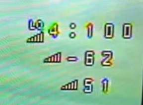

# Что такое LQ и RSSI

Дисклеймер: все описанное ниже может относиться к приему и передаче любого радиосигнала.  
Однако в применении к пилотированию дронов, речь будет идти **только про связь между дроном и аппаратурой управления**.

## Краткое объяснение  
  

Верхняя строчка: `LQ` - Link Quality или качество сигнала от аппаратуры. Насколько четко дрон слышит аппу.  
Чуть ниже: `RSSI` -  Received Signal Strength или мощность (громкость) сигнала. Нужно следить чтобы RSSI не опускался ниже -100.  
Самая нижняя: шкала RSSI в попугаях. Можно выключить. Она - не информативна.

Аналогия  
- Ты слушаешь человека, находящегося с тобой в одной комнате. В комнате тихо. LQ = 100, RSSI - 25.  
- Включается перфоратор. Тебе говорят на той же громкости, но ты не слышишь... RSSI тот же, а LQ упал в ноль....
- Человек, которого ты слушаешь, уходит в другую комнату. Его голос становится тише. Значение RSSI увеличивается в отрицательную сторону.

## Объяснение от ChatGPT

### LQ (Link Quality)
LQ – это показатель качества сигнала связи между твоим дронов и передатчиком. Он выражается в процентах и отражает надежность соединения. Значения LQ обычно выглядят так:

- 100%: Отличное качество соединения. Все параметры на высшем уровне, можешь летать активно.
- 75-99%: Хорошее качество. Летать можно, но полезно следить за показаниями.
- 50-74%: Удовлетворительное качество. Возможно, стоит подумать о снижении дистанции.
- 25-49%: Низкое качество. Время поворачивать обратно.
- 0-24%: Очень плохое качество. Есть риск потерять связь. Обязательно вернись!

### RSSI  (Received Signal Strength)
Индикатор уровня принимаемого сигнала. Это значение показывает громкость приёма. Для понимания RSSI должен быть выше уровня чувствительности. Единицы измерения — дБм, начиная с 0 и уменьшаясь по мере уменьшения громкости (жёсткий предел -130 дБм).

### dBm (Decibels Milliwatts)
dBm – это единица измерения мощности сигнала. Это логарифмическая шкала, где 0 dBm соответствует 1 милливатту мощности. Параметр dBm важен для оценки того, насколько сильным является сигнал на принимающей стороне. Обычно значения могут колебаться от -120 dBm до 0 dBm:

- 0 dBm: Максимальная мощность сигнала, указывающая на очень близкое расположение передатчика — это, в общем, нереалистичный показатель для FPV.
- -30 dBm до -50 dBm: Отменная связь, ты совсем рядом с передатчиком.
- -50 dBm до -70 dBm: Хорошая связь. Можно летать с большим комфортом.
- -70 dBm до -90 dBm: Уровень сигнала становится менее устойчивым. Нужно быть осторожным.
- -90 dBm и ниже: Сигнал очень слабый, и есть риск потери связи.

Так что, наблюдая за LQ и RSSI в dBm, ты сможешь более точно оценить качество соединения и, соответственно, управлять своим полетом. 

## [Объяснение LQ и RSSI для ExpressLRS и Crossfire(перевод)](https://artline.ua/blogs/obyasnenie-lq-i-rssi-dlya-expresslrs-i-crossfire)   
На случай, если не откроется [та же статья в виде PDF файла](Объяснение_LQ_и_RSSI.pdf)

[LQ and RSSI Explained for ExpressLRS and Crossfire Radio Links (oscarliang.com)](https://oscarliang.com/lq-rssi/)

[Signal Health (expresslrs.org)](https://www.expresslrs.org/info/signal-health/)