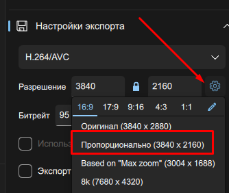
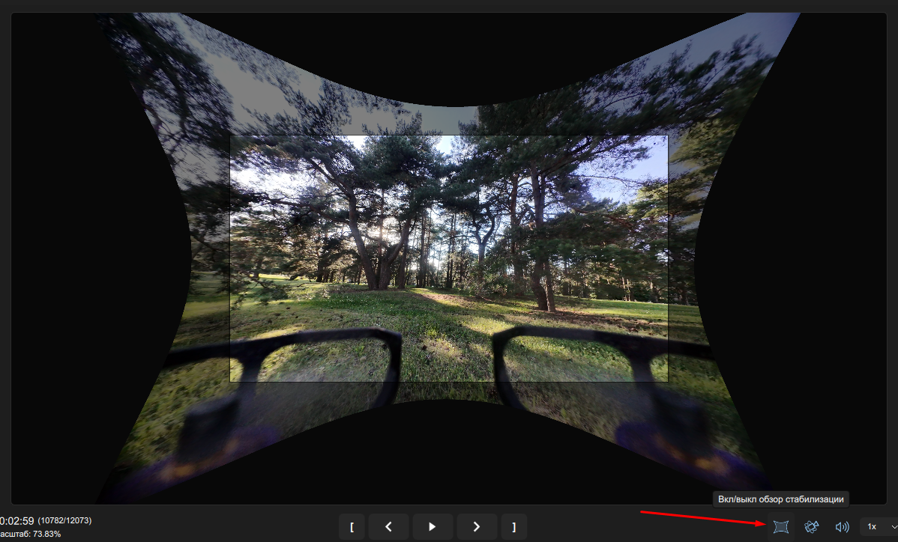

# Gyroflow

[Домашняя страница](https://gyroflow.xyz/)

[Gyroflow documentation](https://docs.gyroflow.xyz/app)  

Запускаем программу.

Загружаем видео

Если видеофайл содержит в себе гироданные, то автоматически подгрузится профиль объектива и произойдет стабилизация

Настройки камеры для [DJI O4, чтобы были гироданные, находятся здесь](../00_Drones/30_CameraDJI_O4/CameraSettings.md).

Если камера DJI O4 имеет кастомную линзу, то нужно загрузить профиль под нее.  
Например для `Flywoo 04 Wide lens` нужно в поиске найти профиль `DJI 04 Lite 4k 4:3 Flywoo 04 Wide lens normal 3840x2880 59.94fps`.

Если стабилизация прошла и нет нареканий, то можно выгрузить стабилизированное видео.

## Раздел `Настройки экспорта`

Видео может выводиться по умолчанию 3840х2880 в пропорциях 4:3, НО стабилизация пропорционально урезает и увеличивает изображение по всем сторонам, чтобы не было видно черных полей. При этом слева и справа есть урезанные области, которые не затронуты черными полями. Тем самым оставляя 4х3 мы теряем часть изображения слева и справа. Можно выставить `16:9 Пропорционально (3840х2160)` и тогда в выходном видео будет пропорция 16:9 и попадет больше изображения.

## Дополнительные настройки

Чтобы увидеть все изображение с обрезанными частями нужно нажать кнопку `Вкл/выкл обзор стабилизации`  

### Раздел `Стабилизация`

#### Тип сглаживания

В самом верху выпадающий список со следующими значениями

* Без сглаживания  

В этом случае изображение не будет стабилизироваться, а просто подкорректируется согласно профилю линзы для убирания "рыбьего глаза"

* По умолчанию - основной способ стабилизации  

Появляется ползунок `Плавность`. Позволяет корректировать степень стабилизации.

#### Зумирование

Это выпадающий список со следующими значениями

* Без зума  

Из изображения будет четко вырезан центральный кусок вне зависимости используется стабилизация или нет.

* Динамический зум  

Степень приближения будет меняться в зависимости от силы стабилизации. Но могут появиться некрасивые приближения или удаления когда дрон стоит на месте

* Статический зум  

Степень зума будет зависеть только от значения ползунка `Угол обзора(FOV)` в скрытом разделе `Дополнительно`.

#### Скрытый раздел `Дополнительно`

Ползунок `Угол обзора(FOV)` позволяет менять степень зума. Если значение больше единицы, могут появиться черные поля стабилизации по краям изображения на динамичных сценах.

## Видео
[Не падай в обморок от стабилизации! Релиз Gyroflow 1.0.0. YouTube Олег Стельмах](https://www.youtube.com/watch?v=HGvttNQavx4)

[Как работает Gyroflow - подробная инструкция. YouTube Petrokey](https://www.youtube.com/watch?v=0rqx8EiBAkw)  

[Стабилизация RunCam Thumb в Gyroflow. YouTube  
Lesha Rodin](https://www.youtube.com/watch?v=ecghQCALSxM)  

